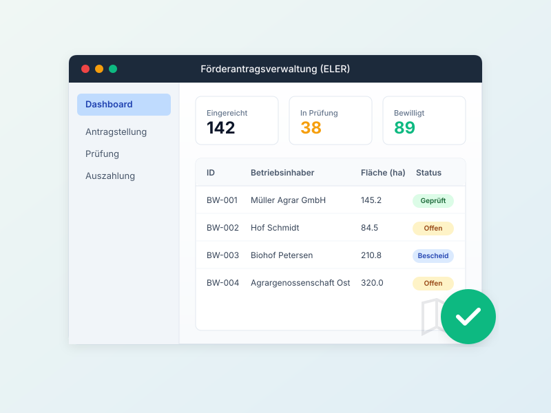
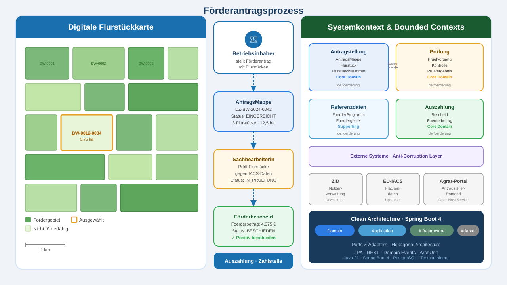

# Modul 01 - Willkommen & Einführung

---

## Vorstellungsrunde

### Erzählt uns kurz:

1. Euer Name und eure aktuelle Rolle
2. Erfahrung mit Spring Boot: Einsteiger / Fortgeschritten / Experte?
3. Hattet ihr bereits Berührungspunkte mit DDD?
4. Was ist eure größte architektonische Herausforderung im aktuellen Projekt?
5. Was erhofft ihr euch konkret von diesem Workshop?

---

### Zeitrahmen

| | |
|---|---|
| Beginn | 09:00 Uhr |
| Kaffeepausen | ca. alle 90 Minuten |
| Mittagspause | 12:00 - 13:00 Uhr |
| Ende | 16:00 Uhr |

> Fragen jederzeit - bitte nicht aufsparen!

---

## Tools & Setup

- IDE: IntelliJ IDEA (empfohlen) oder VS Code mit Java Extensions
- JDK: Java 21
- Build-Tool: Maven 3.9+
- Git-Repository: wird zu Beginn geteilt

> Wir prüfen die Arbeitsumgebung direkt zu Beginn von Tag 1 gemeinsam.

---

## Herzlich Willkommen!

### DDD & Clean Architecture mit Spring Boot 4

Ein praxisorientierter Workshop für Java-Entwickler und
Software-Architekten, die ihre Spring-Boot-Projekte auf ein solides
architektonisches Fundament stellen wollen.

- Durchgängige Übungsdomäne: Förderantragsverwaltung
- Theorie und Praxis im stetigen Wechsel

---

## Übungsdomäne: Förderantragsverwaltung

Eine Förderagentur benötigt ein System, das den gesamten
Antragsprozess abbildet - von der Antragstellung durch den Betriebsinhaber
über die Kontrolle der Flurstücke bis zur Bescheidung des Förderantrags.

---

---

## Workshop-Methodik

### Ausgewogener Mix aus Theorie und Praxis

---

## Agenda - 5-Tage-Überblick

| Tag | Schwerpunkt | Slides                                                              | Labs |
|-----|------------|---------------------------------------------------------------------|------|
| 1 | Fundament legen | 01 Intro · 02 Spring Boot · 03 DDD · 04 Event Storming              | Lab 01-02b |
| 2 | Architektur gestalten | 05 Strategic Design · 06 Building Blocks · 07 Clean Architecture    | Lab 03-04 |
| 3 | Implementierung starten | 08 Paketstruktur · 09 Use Cases · 10 REST Adapter                   | Lab 05-07 |
| 4 | Qualität sichern | 11 ArchUnit · 12 Context Integration · 13 Modulith · 14 Querschnitt | Lab 08-11 |
| 5 | Vertiefen & Reflektieren | 15 Teststrategie · 16 Zustand, Koordination & Resilienz             | Lab 12-13 |

---

## DDD ist bereits unsere Strategie

> Aus einer **internen Architekturdokumentation**:
>
> *„Ein Modul beschreibt eine klar umrissene Fachlichkeit und entspricht
> einem **Bounded Context** im Domain Driven Design."*
>
> *„Fange mit einem großen Modul an! Sammle Erfahrungen. Spalte bei Bedarf
> Module ab, die einen **fachlich motivierten Bounded Context** beschreiben."*

Dieser Workshop macht explizit, was in der Praxis bereits als Architekturprinzip
dokumentiert ist — und gibt euch die Werkzeuge, es konsequent umzusetzen.

---

## Lernziele des Gesamtworkshops

Nach diesen 5 Tagen könnt ihr:

- Die Prinzipien von DDD erklären und gezielt einsetzen
- Bounded Contexts identifizieren und über eine Context Map abgrenzen
- Eine Clean Architecture mit Spring Boot 4 umsetzen (Ports & Adapters)
- Building Blocks (Entity, Value Object, Aggregate) idiomatisch in Java implementieren
- Architekturregeln mit ArchUnit automatisiert durchsetzen
- Spring Modulith für modulare Monolithen nutzen
- Anwendungen zustandslos und Kubernetes-ready gestalten

---

## Software als gemeinsames Modell

> *„Die größte Herausforderung bei Softwareprojekten ist nicht die Technologie.
> Es ist das fehlende gemeinsame Verständnis davon, was gebaut werden soll."*

DDD beantwortet eine fundamentale Frage:
**Wie können Fachexpertinnen und Entwickler ein gemeinsames Modell der Wirklichkeit aufbauen?**

- Ein **Bounded Context** ist nicht nur eine Codeeinheit — er ist der Bereich,
  in dem eine bestimmte Sicht auf die Welt gilt und in der eine Gruppe von Menschen dieselbe Sprache spricht.
- **Event Storming** ist kein Analyse-Workshop — es ist ein Format, in dem ein Team
  gemeinsam ein Bild seiner eigenen Arbeit entwickelt.
- **Hot Spots** zeigen nicht nur Unklarheiten im Code — sie zeigen,
  wo Widersprüche im Verständnis zwischen Teams oder Rollen bestehen.

> Wenn ihr im Workshop auf einen Hot Spot stoßt, ist das keine Schwäche des Prozesses —
> es ist die wertvollste Information, die der Workshop erzeugen kann.

---

## Weiterführende Perspektive

Wer über die Implementierung hinaus denken will:
**„Architecture for Flow"** (Susanne Kaiser, 2025) verbindet DDD mit Wardley Mapping
(strategische Positionierung) und Team Topologies (Organisationsdesign) zu einem
ganzheitlichen Ansatz für adaptive Software-Systeme.

---

## Diskussion: Eure Erwartungen

Welche konkreten Probleme in euren Projekten erhofft ihr euch
durch DDD und Clean Architecture zu lösen?

- Nehmt euch 2 Minuten Zeit zum Nachdenken
- Teilt eure Gedanken in der Runde
- Wir sammeln die Punkte auf dem Whiteboard und greifen sie im Workshop auf

---

## Lab 01 - Setup und Warmup

### Ziel: Technische Basis

- Starter-Projekt aus `labs/lab-01-setup-und-warmup/initial-project` importieren
- Build und Start lokal prüfen: `mvn clean verify` und `mvn spring-boot:run`
- Danach eine einfache Förderantrag-CRUD-API umsetzen
- Zusatzblöcke je nach Zeit: Geschäftsregeln, `Foerderbetrag` als Record, `@SoftDelete`,
  `ProblemDetail`, Virtual Threads
