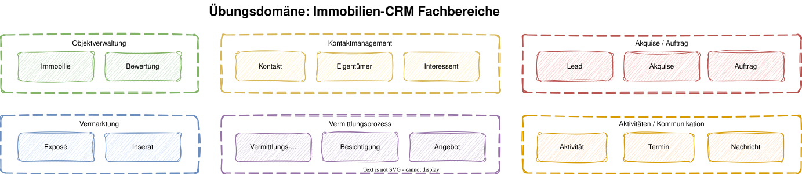
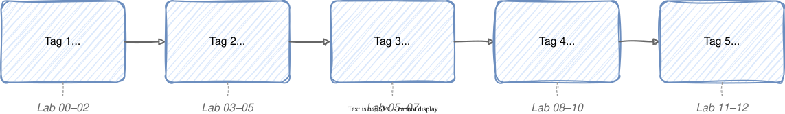

# Modul 01 – Willkommen & Einführung

**Geschätzte Dauer: 45 Minuten**

### Lernziele

- Überblick über den Workshop-Aufbau und die 5 Tage gewinnen
- Die Übungsdomäne „Immobilien-CRM" kennenlernen
- Erwartungen und Vorkenntnisse der Teilnehmer abgleichen
- Organisatorische Rahmenbedingungen und Methodik verstehen

---

## 💬 Vorstellungsrunde

### Erzählt uns kurz:

1. Euer **Name** und eure aktuelle **Rolle**
2. Erfahrung mit **Spring Boot**: Einsteiger / Fortgeschritten / Experte?
3. Hattet ihr bereits Berührungspunkte mit **DDD**?
4. Was ist eure größte **architektonische Herausforderung** im aktuellen Projekt?
5. Was erhofft ihr euch **konkret** von diesem Workshop?

> Wir sammeln eure Herausforderungen und greifen sie gezielt im Workshop auf.

---

### Zeitrahmen

| | |
|---|---|
| **Beginn** | 09:00 Uhr |
| **Kaffeepausen** | ca. alle 90 Minuten |
| **Mittagspause** | 12:00 – 13:00 Uhr |
| **Ende** | 16:00 Uhr |

> Fragen jederzeit – bitte nicht aufsparen!

---

## Herzlich Willkommen!

### DDD & Clean Architecture mit Spring Boot 4

Ein praxisorientierter Workshop für Java-Entwickler und
Software-Architekten, die ihre Spring-Boot-Projekte auf ein solides
architektonisches Fundament stellen wollen.

- Durchgängige Übungsdomäne: **Immobilien-CRM für Makler**
- Jeder Tag endet mit **funktionierendem, getestetem Code**
- Theorie und Praxis im stetigen Wechsel

---

## Übungsdomäne: Immobilien-CRM

Ein Maklerunternehmen benötigt ein CRM-System, das den gesamten
Vermittlungsprozess abbildet – vom ersten Kontakt mit dem Eigentümer
bis zum Notartermin.

---

---

## Die sechs Fachbereiche im Überblick

| Fachbereich | Was passiert hier? |
|---|---|
| **Objektverwaltung** | Immobilien erfassen, bewerten, Stammdaten pflegen |
| **Kontaktmanagement** | Eigentümer, Interessenten, Kontakthistorie |
| **Akquise / Auftrag** | Maklerverträge anbahnen und abschließen |
| **Vermarktung** | Exposés erstellen, Inserate auf Portalen schalten |
| **Vermittlungsprozess** | Besichtigungen, Angebote, Notartermine (Deal Pipeline) |
| **Aktivitäten** | Termine, Aufgaben, E-Mails und Telefonate protokollieren |

> Diese Kontexte ziehen sich als roter Faden durch alle 5 Tage.

---

## Workshop-Methodik

### Ausgewogener Mix aus Theorie und Praxis

---

## Agenda – 5-Tage-Überblick

| Tag | Schwerpunkt | Slides | Labs |
|-----|------------|--------|------|
| **1** | Fundament legen | 01 Intro · 02 Spring Boot · 03 DDD · 04 Event Storming | Lab 01–02 |
| **2** | Architektur gestalten | 05 Strategic Design · 06 Building Blocks · 07 Clean Architecture | Lab 03–05 |
| **3** | Implementierung starten | 08 Paketstruktur · 09 Use Cases · 10 REST Adapter | Lab 05–07 |
| **4** | Qualität sichern | 11 ArchUnit · 12 Modulith · 13 Context Integration · 14 Querschnitt | Lab 08–10 |
| **5** | Vertiefen & Reflektieren | 15 Teststrategie · 16 Reflexion & Ausblick | Lab 11–12 |

---

## Tag 1 – Fundament legen

### Vormittag

- **Spring Boot 4 Recap** – Was ist neu in SB4? Jakarta EE 11, Spring Framework 7
- **Lab 01** – Setup und Warmup: Projekt starten und CRUD-API bauen (45 Min)

### Nachmittag

- **DDD Einführung** – Warum DDD? Anemic Domain Model, Ubiquitous Language
- **Event Storming** – Domäne gemeinsam erkunden
- **Lab 02** – Event Storming für das Immobilien-CRM (90 Min)

### 🎯 Tagesziel: Gemeinsames Domänenverständnis und technische Basis

---

## Tag 2 – Architektur gestalten

### Vormittag

- **Strategic Design** – Bounded Contexts definieren, Context Map zeichnen
- **Lab 03** – Bounded Contexts und Context Map erarbeiten (60 Min)

### Nachmittag

- **Building Blocks** – Entity, Value Object, Aggregate, Domain Event
- **Clean Architecture** – Dependency Rule, Ports & Adapters
- **Lab 04** – Building Blocks implementieren (90 Min)
- **Lab 05** – Clean Architecture Refactoring (Start, 60 Min)

### 🎯 Tagesziel: Architekturentscheidungen getroffen, erster Domain-Code steht

---

## Tag 3 – Implementierung starten

### Vormittag

- **Paketstruktur** – Package by Feature, hexagonale Ordnung in Spring Boot
- **Lab 05** – Clean Architecture Refactoring (Fortsetzung)
- **Use Cases** – Application Services als Orchestratoren

### Nachmittag

- **REST Adapter** – Controller, DTOs, Mapping, ProblemDetail (RFC 9457)
- **Lab 06** – Use Case implementieren (45 Min)
- **Lab 07** – REST-Adapter bauen (45 Min)

### 🎯 Tagesziel: Vollständiger Vertical Slice vom REST-Endpoint bis zur Domäne

---

## Tag 4 – Qualität sichern

### Vormittag

- **ArchUnit** – Architekturregeln als ausführbare JUnit-Tests
- **Spring Modulith** – Modulare Monolithen, Event-basierte Kommunikation
- **Lab 08** – ArchUnit-Regeln schreiben (45 Min)

### Nachmittag

- **Context Integration** – Events zwischen BCs, Anti-Corruption Layer
- **Querschnittsthemen** – Optimistic Locking, Exception Handling, Auditing
- **Lab 09** – Bounded Contexts verbinden (60 Min)
- **Lab 10** – Querschnittsthemen implementieren (60 Min)

### 🎯 Tagesziel: Architekturregeln automatisiert, zwei BCs kommunizieren

---

## Tag 5 – Vertiefen & Reflektieren

### Vormittag

- **Teststrategie** – Testpyramide für Clean DDD Architecture
- **Lab 11** – Tests auf allen Ebenen schreiben (60 Min)

### Nachmittag

- **Lab 12** – Freie Implementierung (120 Min)
  - Eigenes Feature wählen: weiterer Use Case, CQRS, Spring Modulith, Kafka …
- **Reflexion & Ausblick** – Lessons Learned, Buchempfehlungen, nächste Schritte

### 🎯 Tagesziel: Gelerntes festigen und in den Projektalltag übertragen

---

## Lernziele des Gesamtworkshops

Nach diesen 5 Tagen könnt ihr:

- Die **Prinzipien von DDD** erklären und gezielt einsetzen
- **Bounded Contexts** identifizieren und über eine Context Map abgrenzen
- Eine **Clean Architecture** mit Spring Boot 4 umsetzen (Ports & Adapters)
- **Building Blocks** (Entity, Value Object, Aggregate) idiomatisch in Java implementieren
- **Application Services** als Use-Case-Orchestratoren schreiben
- **Architekturregeln** mit ArchUnit automatisiert durchsetzen
- **Spring Modulith** für modulare Monolithen nutzen
- Eine durchdachte **Teststrategie** für DDD-Projekte aufsetzen

---

## Der Lernpfad: Vom CRUD zur Clean Architecture

> Jeder Tag baut auf dem vorherigen auf – am Ende steht ein vollständiges,
> architektonisch sauberes System.

---

## 💬 Diskussion: Eure Erwartungen

> Welche konkreten Probleme in euren Projekten erhofft ihr euch
> durch DDD und Clean Architecture zu lösen?

- Nehmt euch **2 Minuten** Zeit zum Nachdenken
- Teilt eure Gedanken in der Runde
- Wir sammeln die Punkte auf dem Whiteboard und greifen sie im Workshop auf

---

## Tools & Setup

- **IDE:** IntelliJ IDEA (empfohlen) oder VS Code mit Java Extensions
- **JDK:** Java 17+ (empfohlen: Java 21)
- **Build-Tool:** Maven 3.9+
- **Git-Repository:** wird zu Beginn geteilt

---

## Lab 01 – Setup und Warmup

### Projekt starten und CRUD-API bauen

1. Projekt aus `labs/lab-01-setup-und-warmup/initial-project/` in die IDE importieren
2. `mvn clean verify` und `mvn spring-boot:run` ausführen
3. Health-Check: `http://localhost:8080/actuator/health` → `{"status":"UP"}`
4. Immobilien-CRUD-API implementieren (Entity, Repository, Service, Controller)

> **Dauer:** ca. 45 Minuten – danach starten wir mit DDD.
