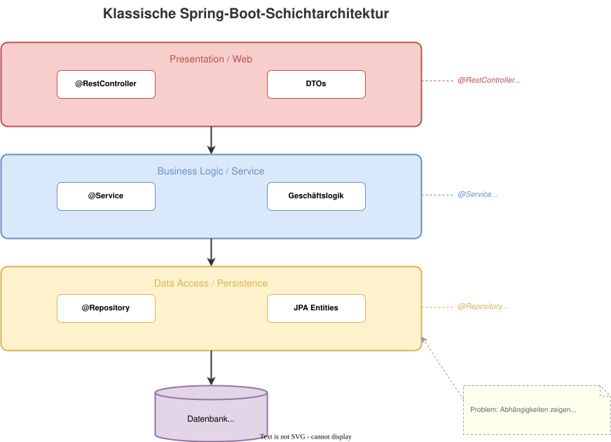

# Modul 01 – Spring Boot 3 Basics

**Geschätzte Dauer: 90 Minuten**

### Lernziele

- Spring Boot 3 kennen lernen
- Auto-Configuration und den Spring Application Context verstehen
- Dependency Injection mit Constructor Injection anwenden
- Spring Data JPA für einfache Persistenz nutzen
- Bean Validation zur Eingabeprüfung einsetzen
- REST-Endpoints mit Spring Web MVC erstellen

---
<style scoped>section { font-size: 1.8em; }</style>

## Warum Spring Boot?

### Das Problem ohne Spring Boot

- Viel Boilerplate für Konfiguration (XML, Java Config)
- Abhängigkeitsversionen manuell koordinieren
- Server separat aufsetzen und deployen

### Spring Boot löst das durch

- **Opinionated Defaults** – sinnvolle Vorkonfiguration
- **Starter-Dependencies** – kuratierte Dependency-Sets
- **Embedded Server** – Tomcat/Jetty eingebaut
- **Auto-Configuration** – Beans automatisch basierend auf Classpath
- **Actuator** – Health Checks, Metriken, Monitoring

---

<style scoped>section { font-size: 1.8em; }</style>

## Spring Boot 3 – Was ist neu?

### Die drei großen Änderungen

| Änderung | Detail |
|----------|--------|
| **Jakarta EE 10** | `javax.*` → `jakarta.*` (Persistence, Validation, Servlet) |
| **Java 17+ Baseline** | Records, Sealed Classes, Text Blocks, Pattern Matching |
| **GraalVM Native Image** | Ahead-of-Time Compilation für Startup < 100 ms |

### Weitere Highlights

- **Micrometer Observability API** – einheitliches Tracing und Metrics
- **Problem Details (RFC 9457)** – standardisiertes Fehlerformat
- **Verbesserte Docker-Image-Erstellung** – Cloud Native Buildpacks
- **Virtual Threads** (ab Spring Boot 3.2) – Project Loom Support

---

<style scoped>section { font-size: 1.8em; }</style>

## Jakarta EE 10 – Namespace-Migration

### Vorher (Spring Boot 2.x)

```java
import javax.persistence.Entity;
import javax.validation.constraints.NotBlank;
import javax.servlet.http.HttpServletRequest;
```

### Nachher (Spring Boot 3.x)

```java
import jakarta.persistence.Entity;
import jakarta.validation.constraints.NotBlank;
import jakarta.servlet.http.HttpServletRequest;
```

> **Tipp:** IntelliJ IDEA bietet automatisierte Migration an:
> *Refactor → Migrate Packages and Classes*

---

## Auto-Configuration – Die "Magie" hinter Spring Boot

### Wie funktioniert es?

1. Spring Boot scannt den **Classpath** nach verfügbaren Libraries
2. Für jede Library existiert eine `@AutoConfiguration`-Klasse
3. Diese registriert **Beans**, wenn bestimmte Bedingungen erfüllt sind

### Beispiel: H2 im Classpath

```
spring-boot-starter-data-jpa  →  DataSource, EntityManagerFactory
h2 (runtime)                  →  H2 DataSource (jdbc:h2:mem:...)
```

---

## Wichtige Conditional-Annotationen

| Annotation | Wirkt wenn… |
|-----------|-------------|
| `@ConditionalOnClass` | Klasse ist im Classpath |
| `@ConditionalOnMissingBean` | Kein eigener Bean definiert |
| `@ConditionalOnProperty` | Property hat bestimmten Wert |

> Eigene Beans überschreiben Auto-Configuration – **Convention over Configuration**.

---

## Spring Application Context

### Der IoC Container


---

### Der IoC Container

- Spring verwaltet Objekte als **Beans** im Application Context
- Abhängigkeiten werden automatisch aufgelöst (**Inversion of Control**)
- Default-Scope: **Singleton** – eine Instanz pro Bean

---
<style scoped>section { font-size: 1.8em; }</style>

## Stereotyp-Annotationen

### Beans im Context registrieren

| Annotation | Semantik | Typischer Einsatz |
|-----------|---------|-------------------|
| `@Component` | Allgemeine Bean | Hilfsklassen, Mapper |
| `@Service` | Geschäftslogik | Business-Services |
| `@Repository` | Datenzugriff | DAO, Repository-Adapter |
| `@Controller` | Web-Controller | MVC Controller |
| `@RestController` | REST-Controller | `@Controller` + `@ResponseBody` |
| `@Configuration` | Konfigurations-Klasse | Bean-Factory-Methoden |

---

## Classpath Scanning

```java
@SpringBootApplication  // contains @ComponentScan
public class RealEstateCrmApplication {
    public static void main(String[] args) {
        SpringApplication.run(RealEstateCrmApplication.class, args);
    }
}
```

> `@SpringBootApplication` = `@Configuration` + `@EnableAutoConfiguration` + `@ComponentScan`

---

## Constructor Injection – Best Practice

```java
@Service
public class PropertyService {

    private final PropertyRepository repository;
    private final ValuationService valuationService;

    // With a single constructor, @Autowired is optional
    public PropertyService(PropertyRepository repository,
                           ValuationService valuationService) {
        this.repository = repository;
        this.valuationService = valuationService;
    }
}
```

---


## Warum Constructor Injection?

- Felder sind `final` → **unveränderlich** nach Konstruktion
- **Pflichtabhängigkeiten** sind sofort sichtbar
- Einfach **testbar**: Abhängigkeiten direkt im Test übergeben
- Kein Reflection nötig (anders als `@Autowired` auf Feldern)

---

<style scoped>section { font-size: 1.8em; }</style>

## Spring Data JPA – Entity definieren

```java
@Entity
@Table(name = "properties")
public class Property {

    @Id
    @GeneratedValue(strategy = GenerationType.IDENTITY)
    private Long id;

    @Column(nullable = false)
    private String title;

    private String street;
    private String postalCode;
    private String city;
    private BigDecimal livingArea;
    private BigDecimal purchasePrice;

    protected Property() {} // JPA requires no-arg constructor
}
```

---

## Spring Data JPA – Entity definieren

- `jakarta.persistence.*` – JPA-Annotationen im Jakarta-Namespace
- No-Arg-Konstruktor kann `protected` sein (nicht zwingend `public`)
- Jede `@Entity` braucht ein `@Id`-Feld

---

<style scoped>section { font-size: 1.8em; }</style>

## Spring Data JPA – Repository

```java
public interface PropertyRepository
        extends JpaRepository<Property, Long> {

    List<Property> findByCity(String city);

    List<Property> findByPurchasePriceLessThan(BigDecimal maxPrice);

    Optional<Property> findByTitle(String title);

    @Query("SELECT p FROM Property p WHERE p.purchasePrice BETWEEN :min AND :max")
    List<Property> findInPriceRange(@Param("min") BigDecimal min,
                                    @Param("max") BigDecimal max);
}
```

- Spring **generiert die Implementierung** automatisch zur Laufzeit
- **Query Methods** folgen einer Namenskonvention (`findBy…`, `countBy…`, `existsBy…`)
- `@Query` für komplexere JPQL-Abfragen

---
<style scoped>section { font-size: 1.7em; }</style>

## H2 In-Memory-Datenbank

### `application.yml`

```yaml
spring:
  datasource:
    url: jdbc:h2:mem:realestate
    driver-class-name: org.h2.Driver
  jpa:
    hibernate:
      ddl-auto: create-drop
    show-sql: true
  h2:
    console:
      enabled: true
      path: /h2-console
```

- Ideal für **Entwicklung und Tests** – kein DB-Server nötig
- H2 Console unter `http://localhost:8080/h2-console`
- `create-drop` – Schema wird bei jedem Start neu erstellt
- Für Produktion: PostgreSQL, MySQL oder andere

---

<style scoped>section { font-size: 1.6em; }</style>

## Bean Validation – Eingaben prüfen

### Request als Java Record (Spring Boot 3 / Java 17+)

```java
public record PropertyRequest(
        @NotBlank(message = "Title must not be blank")
        String title,

        @NotBlank String street,
        @NotBlank String postalCode,
        @NotBlank String city,

        @Positive(message = "Living area must be positive")
        BigDecimal livingArea,

        @NotNull @Positive(message = "Purchase price must be positive")
        BigDecimal purchasePrice
) {}
```

- Annotations aus `jakarta.validation.constraints.*`
- **Records** statt Klassen: immutabel, kompakt, kein Boilerplate
- Validierung wird durch `@Valid` am Controller-Parameter aktiviert

---

<style scoped>section { font-size: 1.6em; }</style>

## REST-Controller – GET-Endpunkte

```java
@RestController
@RequestMapping("/api/properties")
public class PropertyController {

    private final PropertyService service;

    public PropertyController(PropertyService service) {
        this.service = service;
    }

    @GetMapping
    public List<PropertyResponse> findAll() {
        return service.findAll();
    }

    @GetMapping("/{id}")
    public ResponseEntity<PropertyResponse> findById(
            @PathVariable Long id) {
        return service.findById(id)
                .map(ResponseEntity::ok)
                .orElse(ResponseEntity.notFound().build());
    }
}
```

---

## REST-Controller – POST mit Validation

```java
@PostMapping
public ResponseEntity<PropertyResponse> create(
        @Valid @RequestBody PropertyRequest request) {

    PropertyResponse response = service.create(request);

    URI location = URI.create("/api/properties/" + response.id());
    return ResponseEntity.created(location).body(response);
}
```

---

## HTTP-Statuscodes

| Methode | Erfolg | Fehler |
|---------|--------|--------|
| `GET /` | 200 OK | – |
| `GET /{id}` | 200 OK | 404 Not Found |
| `POST /` | 201 Created + Location | 422 Validation Error |
| `PUT /{id}` | 200 OK | 404 Not Found |
| `DELETE /{id}` | 204 No Content | 404 Not Found |

---



---

## Zusammenspiel der Schichten


- **Controller** empfängt HTTP-Request, validiert Eingabe, delegiert
- **Service** enthält Geschäftslogik (im klassischen Spring-Stil)
- **Repository** abstrahiert Datenbankzugriff über JPA
- **Entity** bildet die Datenbanktabelle ab

---

## Grenzen dieser Architektur

### Was passiert, wenn die Geschäftslogik wächst?


- Services werden zu **God Classes** mit hunderten Zeilen
- **Geschäftslogik** mischt sich mit Transaktions- und Infrastrukturcode
- Domain-Objekte sind **anämisch** – reine Datencontainer
- Abhängigkeiten zeigen nur nach unten → **Domain ist an JPA gekoppelt**

> Im weiteren Workshop werden wir diese Struktur hinterfragen
> und durch **Clean Architecture** ersetzen.

---

## Zusammenfassung

| Thema | Kernpunkte |
|-------|-----------|
| **Spring Boot 3** | Jakarta EE 10, Java 17+, Native Image, Auto-Configuration |
| **IoC Container** | Application Context, Beans, Stereotyp-Annotationen |
| **DI** | Constructor Injection, `final` Felder, testbar |
| **Spring Data JPA** | `@Entity`, `JpaRepository`, Query Methods, H2 |
| **Bean Validation** | `@Valid`, `jakarta.validation.constraints.*`, Records |
| **Spring Web MVC** | `@RestController`, `ResponseEntity`, Statuscodes |

---

## 🎯 Hands-on: Lab 01

### Immobilien-CRUD mit Spring Boot

- Eine `Property`-Entity mit JPA-Annotations anlegen
- Ein `PropertyRepository` mit Query Methods erstellen
- Einen `PropertyService` mit CRUD-Methoden implementieren
- Einen `@RestController` mit GET, POST, PUT, DELETE bauen
- Bean Validation für Pflichtfelder einbauen

> **Dauer:** ca. 45 Minuten

---

## 💬 Diskussion: Klassische Schichtarchitektur

> Wo liegen die Grenzen des klassischen Ansatzes?

- Ist die Trennung Controller / Service / Repository **ausreichend**?
- Was passiert, wenn **mehrere Services** sich gegenseitig aufrufen?
- Wo leben die **Geschäftsregeln** – im Service oder in der Entity?
- Wie **testbar** ist diese Struktur ohne Spring-Kontext?

> Diese Fragen beantworten wir in den nächsten Modulen –
> beginnend mit **DDD** als Alternative zum Anemic Domain Model.
