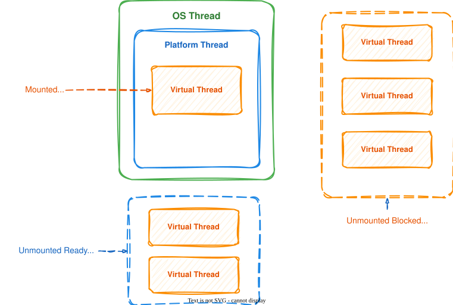
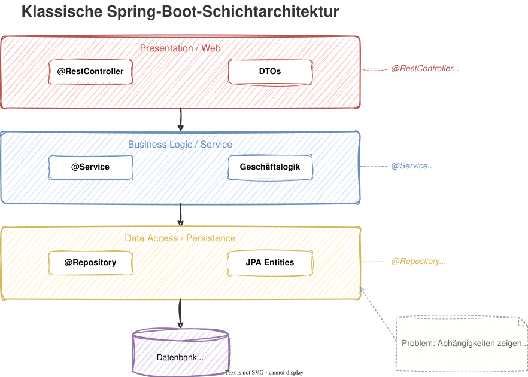
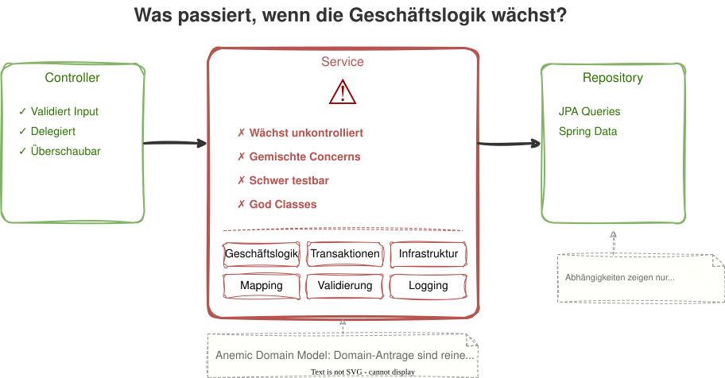

# Modul 02 - Spring Boot 4 - Neuerungen

---

## Lernziele

- Die Neuerungen in Spring Boot 4 gegenüber 3.x kennen
- RestClient, Virtual Threads und ProblemDetail einsetzen können
- Das Zusammenspiel der klassischen Schichten verstehen
- Die Grenzen der klassischen Schichtarchitektur erkennen

---

## Ausgangspunkt

Wir können bei Bedarf gerne eine Wiederholung der
Kernkonzepte von Spring Boot machen:

- IoC Container, Stereotyp-Annotationen (`@Service`, `@Repository`, ...)
- Constructor Injection mit `final`-Feldern
- Spring Data JPA - `@Entity`, `JpaRepository`, Query Methods
- Bean Validation - `@Valid`, `@NotBlank`, `@Positive`
- Spring Web MVC - `@RestController`, `ResponseEntity`

---
<style scoped>section { font-size: 1.8em; }</style>

## Spring Boot 4 - Die großen Änderungen

| Änderung                   | Detail                                          |
|----------------------------|-------------------------------------------------|
| Spring Framework 7     | Neues Major-Release als Basis                   |
| Jakarta EE 11          | Servlet 6.1, JPA 3.2, Bean Validation 3.1       |
| Virtual Threads        | Stabil und produktionsreif                      |
| RestClient             | Moderner Ersatz für RestTemplate                |
| ProblemDetail          | RFC 9457 out of the box                         |
| @MockBean entfernt     | Ersetzt durch `@MockitoBean` (Spring Framework) |

---

## Jakarta EE 11 - Namespace-Migration

```java
// Vorher (Spring Boot 2.x)
import javax.persistence.Entity;
import javax.validation.constraints.NotBlank;
import javax.servlet.http.HttpServletRequest;

// Seit Spring Boot 3.x / 4.x (Jakarta EE)
import jakarta.persistence.Entity;
import jakarta.validation.constraints.NotBlank;
import jakarta.servlet.http.HttpServletRequest;
```

> Tipp: IntelliJ IDEA bietet automatisierte Migration an:
> *Refactor → Migrate Packages and Classes*

---

### Hibernate 7 (Auszug aus den Neuerungen)

- Soft Deletes mit `@SoftDelete` - logisches Löschen ohne Custom-Implementierung
- Java Records als Embeddable - `@Embeddable` Records ohne Workaround
- Verbesserte `@IdClass`-Unterstützung für zusammengesetzte Schlüssel

---

## Virtual Threads - Überblick


---


### Das Problem mit Platform Threads

```
1 Request = 1 Thread = ~1 MB Stack
10.000 gleichzeitige Requests = 10 GB RAM nur für Stacks
```

### Virtual Threads (Project Loom, seit Java 21)

```
1 Request = 1 Virtual Thread = ~wenige KB
Millionen gleichzeitiger Virtual Threads möglich
```

- Virtual Threads sind leichtgewichtig - vom JDK verwaltet, nicht vom OS
- Blockierende I/O (DB, HTTP, File) gibt den Carrier Thread automatisch frei
- Kein reaktiver Programmierstil nötig - normaler, synchroner Code

---



---

## Virtual Threads in Spring Boot 4

Die Aktivierung erfolgt über die Konfiguration:

```properties
spring.threads.virtual.enabled=true
```

**Folgen:**
- Tomcat nutzt Virtual Threads für alle eingehenden Requests
- `@Async`-Methoden laufen auf Virtual Threads
- Spring Data Repositories profitieren bei blockierenden DB-Calls
- `@Scheduled`-Tasks können auf Virtual Threads laufen

---

## Virtual Threads - Wann (nicht) sinnvoll?

Virtual Threads sind ideal für:

- I/O-lastige Anwendungen - DB-Queries, REST-Calls, File I/O
- Hohe Parallelität - viele gleichzeitige, aber kurze Requests
- Einfacher Code - synchron schreiben, trotzdem gut skalieren

... aber weniger geeignet bei:

- CPU-intensive Aufgaben - Virtual Threads bringen hier keinen Vorteil
- ThreadLocal-Abhängigkeiten - manche Libraries nutzen ThreadLocal exzessiv

---

## RestClient - Der moderne HTTP-Client

HTTP-Clients habe eine Geschichte hinter sich in Spring:

| Generation | Klasse         | Stil                 | Status                      |
|------------|----------------|----------------------|-----------------------------|
| 1.         | `RestTemplate` | Synchron, imperativ  | Maintenance in SB 4      |
| 2.         | `WebClient`    | Reaktiv (Mono/Flux)  | Weiterhin für reaktive Apps |
| 3.         | `RestClient`   | Synchron, fluent | Empfohlen ab SB 4       |

---

## RestClient - Beispiel

```java
@Configuration
public class RestClientConfig {

    @Bean
    public RestClient portalRestClient(RestClient.Builder builder) {
        return builder
                .baseUrl("https://api.immoportal.de/v2")
                .defaultHeader(HttpHeaders.ACCEPT, MediaType.APPLICATION_JSON_VALUE)
                .build();
    }
}
```

---

```java
@Component
public class PortalAdapter {

    private final RestClient restClient;

    public PortalAdapter(RestClient restClient) {
        this.restClient = restClient;
    }

    public PortalListing fetchListing(String listingId) {
        return restClient.get()
                .uri("/listings/{id}", listingId)
                .retrieve()
                .body(PortalListing.class);
    }
}
```

---

## RestClient - Fehlerbehandlung

```java
public PortalListing fetchListing(String listingId) {
    return restClient.get()
            .uri("/listings/{id}", listingId)
            .retrieve()
            .onStatus(HttpStatusCode::is4xxClientError, (request, response) -> {
                throw new PortalNotFoundException(
                        "Listing %s not found".formatted(listingId));
            })
            .onStatus(HttpStatusCode::is5xxServerError, (request, response) -> {
                throw new PortalUnavailableException(
                        "Portal returned " + response.getStatusCode());
            })
            .body(PortalListing.class);
}
```

---

## RestClient - POST und Exchange

```java
// POST mit Body
public PortalListing createListing(PortalListingRequest request) {
    return restClient.post()
            .uri("/listings")
            .contentType(MediaType.APPLICATION_JSON)
            .body(request)
            .retrieve()
            .body(PortalListing.class);
}
```

---

```java
// Exchange für volle Kontrolle über die Response
public ResponseEntity<PortalListing> createListingWithHeaders(
        PortalListingRequest request) {
    return restClient.post()
            .uri("/listings")
            .body(request)
            .exchange((req, res) -> {
                var listing = res.bodyTo(PortalListing.class);
                return ResponseEntity
                        .status(res.getStatusCode())
                        .headers(res.getHeaders())
                        .body(listing);
            });
}
```

---

## ProblemDetail - RFC 9457

`ProblemDetail` bietet **Standardisierte Fehlerantworten**.

Spring Boot 4 unterstützt RFC 9457 (Problem Details for HTTP APIs) nativ.

```json
{
  "type": "https://api.realestate.de/errors/property-not-found",
  "title": "Property not found",
  "status": 404,
  "detail": "No property with ID 42 exists",
  "instance": "/api/properties/42"
}
```

---

### Aktivierung von ProblemDetails

Für die Aktivierung ist nur eine Einstellung erforderlich:

```yaml
spring:
  mvc:
    problemdetails:
      enabled: true
```

---

## ProblemDetail - Im Controller verwenden

```java
@RestControllerAdvice
public class GlobalExceptionHandler {

    @ExceptionHandler(PropertyNotFoundException.class)
    public ProblemDetail handleNotFound(PropertyNotFoundException ex) {
        ProblemDetail problem = ProblemDetail.forStatusAndDetail(
                HttpStatus.NOT_FOUND, ex.getMessage());
        problem.setTitle("Property not found");
        problem.setType(URI.create("https://api.realestate.de/errors/not-found"));
        problem.setProperty("propertyId", ex.getPropertyId());
        return problem;
    }
}
```

---
<style scoped>section { font-size: 1.6em; }</style>

## @MockitoBean - Ersatz für @MockBean

Migriert man von Spring Boot 3 auf 4 muss man einige Annotations umziehen:

```java
// Spring Boot 3
@SpringBootTest
class PropertyServiceTest {
    @MockBean  // aus spring-boot-test
    private PropertyRepository repository;
}

// Spring Boot 4
@SpringBootTest
class PropertyServiceTest {
    @MockitoBean  // aus spring-framework-test
    private PropertyRepository repository;
}
```

Die Funktionalität ist identisch - nur der Import ändert sich.

---



---

## Grenzen der Schichtarchitektur

> Was passiert, wenn die Geschäftslogik wächst?


---



---

## Was passiert, wenn die Geschäftslogik wächst?

- Services werden zu God Classes mit hunderten Zeilen
- Geschäftslogik mischt sich mit Transaktions- und Infrastrukturcode
- Domain-Objekte sind anämisch - reine Datencontainer
- Abhängigkeiten zeigen nur nach unten → Domain ist an JPA gekoppelt

> Im weiteren Workshop werden wir diese Struktur hinterfragen
> und durch Clean Architecture ersetzen.

---

## Diskussion: Klassische Schichtarchitektur

> Wo liegen die Grenzen des klassischen Ansatzes?

- Ist die Trennung Controller / Service / Repository ausreichend?
- Was passiert, wenn mehrere Services sich gegenseitig aufrufen?
- Wie testbar ist diese Struktur ohne Spring-Kontext?
