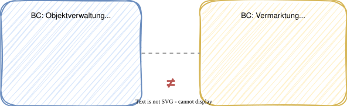

# Modul 03 - DDD Einführung

---

## Lernziele

- Typische Probleme ohne DDD benennen können
- Die Kernideen von Eric Evans verstehen
- Ubiquitous Language als Konzept erklären und anwenden
- Den Unterschied zwischen Strategic und Tactical Design kennen
- Anemic vs. Rich Domain Model unterscheiden
- Einschätzen können, wann DDD sinnvoll ist und wann nicht

---

## Typische Probleme in Software-Projekten

### Welche Probleme versucht DDD zu verhindern?

- Anemic Domain Model - Entities sind reine Datencontainer ohne Verhalten
- Big Ball of Mud - keine erkennbare Architektur, alles hängt zusammen
- Verstreute Geschäftslogik - Regeln in Controllern, Services, Utils, DB-Queries
- Technisch getriebene Struktur - Pakete nach Schichten statt nach Fachlichkeit
- Kommunikationsprobleme - Entwickler und Fachexperten sprechen verschiedene Sprachen
- Wachsende Komplexität - kleine Änderungen haben unvorhersehbare Seiteneffekte

---


---

## Big Ball of Mud

- Jede Komponente kennt jede andere
- Keine klaren Modulgrenzen
- Änderungen erzeugen Kaskaden
- Tests sind schwer zu schreiben

> *"A Big Ball of Mud is a haphazardly structured, sprawling, sloppy,
> duct-tape-and-baling-wire, spaghetti-code jungle."*
> - Brian Foote & Joseph Yoder, 1999

---
<style scoped>section { font-size: 1.4em; }</style>

## Das Anemic Domain Model


### Entities als reine Datensäcke

```java
@Entity
public class Property {
    @Id @GeneratedValue
    private Long id;
    private String title;
    private BigDecimal purchasePrice;
    private String status; // "NEW", "APPRAISED", "PUBLISHED"

    // Only getters and setters - no behavior!
}
```

### Was fehlt?

- Kein Schutz vor ungültigen Zustandsübergängen
- `status` kann auf beliebige Strings gesetzt werden
- Alle Regeln liegen im Service

---
<style scoped>section { font-size: 1.4em; }</style>

## Negativbeispiel: Alle Logik im Service

```java
@Service
public class PropertyService {

    public void publish(Long id) {
        Property property = repo.findById(id).orElseThrow();
        if (!"APPRAISED".equals(property.getStatus())) {
            throw new IllegalStateException("Only appraised properties!");
        }
        if (property.getPurchasePrice() == null) {
            throw new IllegalStateException("Purchase price missing!");
        }
        property.setStatus("PUBLISHED");
        repo.save(property);
        emailService.sendNotification(property);
    }
}
```

- Geschäftsregeln sind an den Service gekoppelt, nicht an das Objekt
- Entity ist ein dummes Datenobjekt → Anemic Domain Model
- Wird die Regel auch in einem anderen Service geprüft? → Duplikation

---
<style scoped>section { font-size: 1.4em; }</style>

## Das Gegenbeispiel: Rich Domain Model

```java
public class Property {
    private PropertyId id;
    private Title title;
    private PurchasePrice purchasePrice;
    private PropertyStatus status;

    public void publish() {
        if (this.status != PropertyStatus.APPRAISED) {
            throw new PropertyNotReadyException(this.id);
        }
        Objects.requireNonNull(this.purchasePrice, "Purchase price missing");
        this.status = PropertyStatus.PUBLISHED;
        registerEvent(new PropertyPublished(this.id));
    }
}
```

- Geschäftslogik lebt im Objekt, nicht im Service
- Invarianten werden vom Objekt selbst geschützt
- Value Objects (`PurchasePrice`, `Title`) statt primitiver Typen
- Domain Events signalisieren fachlich relevante Zustandsänderungen

---

## Diskussion: Eure Code-Basis

> Wo lebt die Geschäftslogik in euren aktuellen Projekten?

- In den Entities? In den Services? In den Controllern?
- Wie viele Zeilen hat euer größter Service?
- Was passiert, wenn eine Geschäftsregel an mehreren Stellen gilt?

---
<style scoped>section { font-size: 1.6em; }</style>

## Eric Evans - Domain-Driven Design (2003)

### Das "blaue Buch"

"Domain-Driven Design: Tackling Complexity in the Heart of Software"

Erschienen 2003, bis heute das Standardwerk.

### Die vier Kernideen

1. Die Domäne steht im Mittelpunkt, nicht die Technik
2. Enge Zusammenarbeit zwischen Entwicklern und Fachexperten
3. Ein gemeinsames Modell als Grundlage für Code und Kommunikation
4. Komplexität wird durch Modularisierung (Bounded Contexts) beherrschbar

> *"The heart of software is its ability to solve domain-related problems
> for its user."* - Eric Evans

---
<style scoped>section { font-size: 1.4em; }</style>

## Was ist eine Domäne?

### Begriffserklärung

- Domäne = der Fachbereich, für den die Software entwickelt wird
- Subdomäne = ein abgegrenzter Teil der Gesamtdomäne

### Unser Beispiel: Immobilien-CRM für Makler

| Subdomäne           | Typ            | Beschreibung                                           |
|---------------------|----------------|--------------------------------------------------------|
| Vermittlungsprozess | Core       | Differenzierungsmerkmal, höchster Geschäftswert        |
| Akquise / Auftrag   | Core       | Direkte Umsatzrelevanz                                 |
| Vermarktung         | Supporting | Unterstützt den Kern, aber kein Alleinstellungsmerkmal |
| Objektverwaltung    | Supporting | Stammdaten, wichtig aber nicht differenzierend         |
| Kontaktmanagement   | Generic    | Standardfunktionalität, könnte zugekauft werden        |
| Aktivitäten         | Generic    | Kalender/Aufgaben - generisches Problem                |

---

## Core, Supporting, Generic - Warum das wichtig ist

### Wo investieren wir unsere DDD-Energie?


> Nicht jede Subdomäne braucht volle DDD-Umsetzung.
> Die Kunst liegt in der richtigen Zuordnung.

---
<style scoped>section { font-size: 1.3em; }</style>

## Ubiquitous Language

### Die gemeinsame Sprache

- Eine Sprache für Fachexperten, Entwickler, Dokumentation und Code
- Begriffe werden im Team definiert und konsistent verwendet
- Änderungen an der Sprache = Änderungen am Modell und Code

### Glossar für das Immobilien-CRM

| Fachbegriff             | Bedeutung im Kontext                                      |
|-------------------------|-----------------------------------------------------------|
| Maklervertrag       | Exklusive Vereinbarung zwischen Eigentümer und Makler     |
| Exposé              | Strukturierte Verkaufsunterlage für eine Immobilie        |
| Besichtigung        | Terminierter Vor-Ort-Termin mit einem Interessenten       |
| Provision           | Prozentuale Vergütung bei erfolgreichem Verkaufsabschluss |
| Vermittlungsvorgang | Der gesamte Prozess von Akquise bis Notartermin           |
| Preisvorstellung    | Gewünschter Verkaufspreis des Eigentümers                 |

---
<style scoped>section { font-size: 1.2em; }</style>

## Ubiquitous Language im Code

### Technisch / generisch

```java
public class DataObject {
    private String type;
    private Map<String, Object> properties;
}

public void processItem(Long itemId) { ... }
public void updateStatus(Long id, String newStatus) { ... }
```

### Fachlich / ausdrucksstark

```java
public class BrokerageProcess {
    private AskingPrice askingPrice;
    private Address address;
    private Commission commission;
}

public void conductViewing(ViewingId id) { ... }
public void acceptOffer(OfferId id) { ... }
```

> Der Code liest sich wie ein Fachgespräch. Neue Teammitglieder
> verstehen die Domäne durch das Lesen des Codes.

---

## Ubiquitous Language - Warnsignale


---

<style scoped>section { font-size: 1.6em; }</style>

### Wann stimmt die Sprache nicht?

| Warnsignal | Beispiel |
|-----------|---------|
| Technische Begriffe im Domain-Code | `DataProcessor`, `EntityManager`, `Helper` |
| Abkürzungen statt Fachbegriffe | `prop`, `bp`, `val` statt `Property`, `BrokerageProcess`, `Valuation` |
| Gleicher Begriff, verschiedene Bedeutung | "Objekt" meint in der Akquise etwas anderes als in der Vermarktung |
| Unterschiedliche Begriffe, gleiche Sache | "Kunde", "Interessent", "Kontakt" für dieselbe Person |

> Wenn Entwickler und Fachexperten aneinander vorbeireden,
> stimmt die Ubiquitous Language nicht.

---

<style scoped>section { font-size: 1.4em; }</style>

## DDD als Antwort auf Komplexität

### Der Kern von DDD

- Fachliche Komplexität in den Griff bekommen
- Nicht primär technische Infrastruktur lösen
- Das Domänenmodell ist das wertvollste Artefakt

### Die DDD-Gleichung

```
Gutes Domänenmodell  +  Gute Architektur  =  Wartbare Software
        ▲                      ▲
        │                      │
   Taktisches DDD        Clean Architecture
   (Modul 06)            (Modul 07)
```

- Das Modell entwickelt sich iterativ weiter
- Refactoring ist ein fester Bestandteil des Prozesses
- Das Modell wird durch Tests geschützt

---

## Strategic Design - Überblick

---

### Die Makro-Ebene

- Bounded Context - klar abgegrenzter Bereich mit eigenem Modell
- Context Map - Beziehungen zwischen Bounded Contexts
- Subdomänen - Core, Supporting, Generic

> Wird in Modul 05 ausführlich behandelt.

---

## Bounded Context - Die zentrale Idee

### Ein Modell gilt innerhalb seiner Grenze



- Derselbe Begriff kann in verschiedenen BCs verschiedene Dinge bedeuten
- Jeder BC hat sein eigenes Modell - keine "Über-Entity", die alles kennt
- Grenzen werden durch die Ubiquitous Language sichtbar

---
<style scoped>section { font-size: 1.7em; }</style>

## Tactical Design - Überblick

### Die Mikro-Ebene (Building Blocks)

| Building Block     | Beschreibung                           | Java-Umsetzung         |
|--------------------|----------------------------------------|------------------------|
| Entity         | Objekt mit Identität und Lebenszyklus  | Klasse mit ID-Feld     |
| Value Object   | Unveränderlich, durch Werte definiert  | Java `record`          |
| Aggregate      | Konsistenzgrenze mit einer Root-Entity | Klasse mit Invarianten |
| Repository     | Abstraktion für Aggregate-Persistenz   | Java Interface (Port)  |
| Domain Event   | Etwas fachlich Relevantes ist passiert | Java `record`          |
| Domain Service | Logik, die keiner Entity gehört        | Klasse ohne State      |

> Wird in Modul 06 ausführlich behandelt mit Code-Beispielen.

---
<style scoped>section { font-size: 1.6em; }</style>

## Wann macht DDD Sinn?

### DDD ist gut geeignet, wenn:

- Die Domäne komplex ist und viele Geschäftsregeln hat
- Es häufige Änderungen an den fachlichen Anforderungen gibt
- Fachexperten verfügbar sind und eingebunden werden können
- Das Projekt langfristig gewartet und weiterentwickelt wird
- Mehrere Teams an verschiedenen Teilbereichen arbeiten

### DDD ist vermutlich Overkill, wenn:

- Es sich um einfache CRUD-Anwendungen handelt
- Die Domäne trivial ist (wenig Geschäftsregeln)
- Das Projekt kurzlebig ist (Prototyp, Wegwerf-Software)
- Kein Zugang zu Fachexperten besteht

---

## Zusammenfassung

- Das Rich Domain Model verankert Geschäftsregeln im Objekt selbst
- Eric Evans (2003): Die Fachdomäne gehört ins Zentrum der Software
- Ubiquitous Language: Eine gemeinsame Sprache für alle Beteiligten
- Strategic Design: Bounded Contexts definieren die Makro-Architektur
- Tactical Design: Building Blocks strukturieren die Mikro-Ebene
- DDD ist kein Dogma - gezielt dort einsetzen, wo Komplexität herrscht

> Im nächsten Modul erkunden wir unsere Domäne mit Event Storming.
