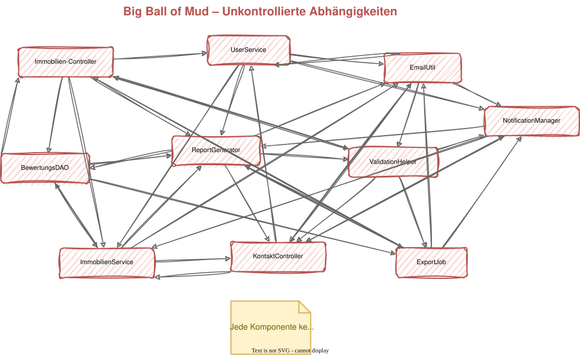
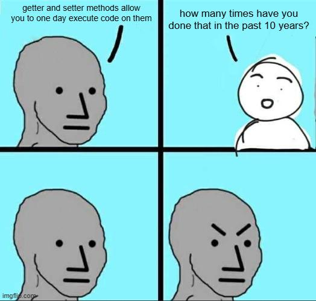
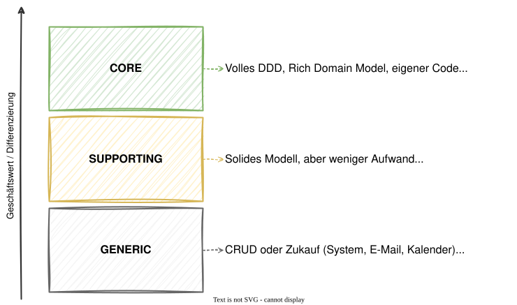
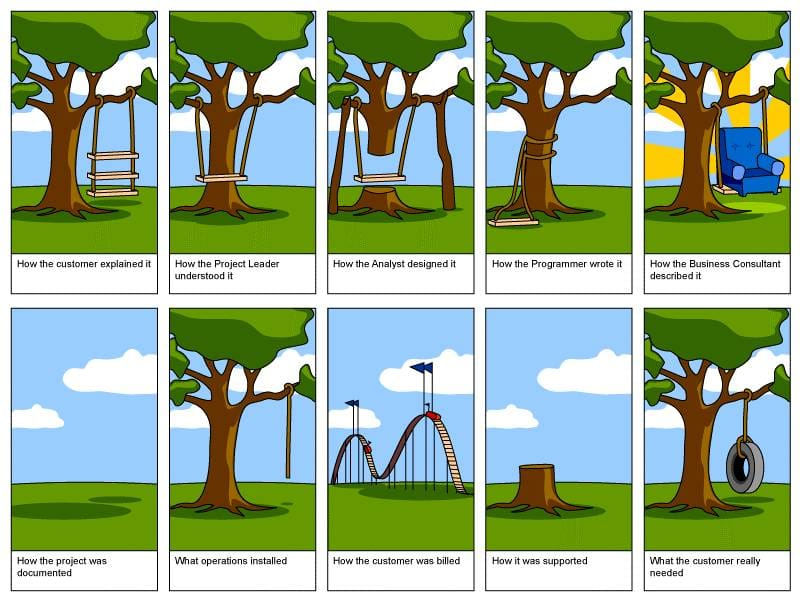
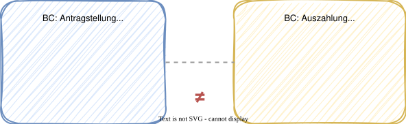

# Modul 03 - DDD Einführung

---

## Lernziele

- Typische Probleme ohne DDD benennen können
- Die Kernideen von Eric Evans verstehen
- Ubiquitous Language als Konzept erklären und anwenden
- Den Unterschied zwischen Strategic und Tactical Design kennen
- Anemic vs. Rich Domain Model unterscheiden
- Einschätzen können, wann DDD sinnvoll ist und wann nicht

---

## Typische Probleme in Software-Projekten

### Welche Probleme versucht DDD zu verhindern?

- **Anemic Domain Model** - Entities sind reine Datencontainer ohne Verhalten
- **Big Ball of Mud** - keine erkennbare Architektur, alles hängt zusammen
- **Verstreute Geschäftslogik** - Regeln in Controllern, Services, Utils, DB-Queries
- **Technisch getriebene Struktur** - Pakete nach Schichten statt nach Fachlichkeit
- **Kommunikationsprobleme** - Entwickler und Fachexperten sprechen verschiedene Sprachen
- **Wachsende Komplexität** - kleine Änderungen haben unvorhersehbare Seiteneffekte

---



---

## Big Ball of Mud

- Jede Komponente kennt jede andere
- Keine klaren Modulgrenzen
- Änderungen erzeugen Kaskaden
- Tests sind schwer zu schreiben

> *"A Big Ball of Mud is a haphazardly structured, sprawling, sloppy,
> duct-tape-and-baling-wire, spaghetti-code jungle."*
> - Brian Foote & Joseph Yoder, 1999

---
<style scoped>section { font-size: 1.4em; }</style>

## Das Anemic Domain Model



### Entities als reine Datensäcke

```java
@Entity
public class Antrag {
    @Id @GeneratedValue
    private Long id;
    private String titel;
    private BigDecimal foerderbetrag;
    private String status; // "ERFASST", "GEPRUEFT", "EINGEREICHT"

    // Only getters and setters - no behavior!
}
```

### Was fehlt?

- Kein Schutz vor ungültigen Zustandsübergängen
- `status` kann auf beliebige Strings gesetzt werden
- Alle Regeln liegen im Service

---
<style scoped>section { font-size: 1.4em; }</style>

## Negativbeispiel: Alle Logik im Service

```java
@Service
public class AntragService {

    public void einreichen(Long id) {
        Antrag antrag = repo.findById(id).orElseThrow();
        if (!"ERFASST".equals(antrag.getStatus())) {
            throw new IllegalStateException("Only erfasst antraege!");
        }
        if (antrag.getFoerderbetrag() == null) {
            throw new IllegalStateException("Foerderbetrag missing!");
        }
        antrag.setStatus("EINGEREICHT");
        repo.save(antrag);
        emailService.sendNotification(antrag);
    }
}
```

- Geschäftsregeln sind an den Service gekoppelt, nicht an das Objekt
- Entity ist ein dummes Datenobjekt → Anemic Domain Model
- Wird die Regel auch in einem anderen Service geprüft? → Duplikation

---
<style scoped>section { font-size: 1.4em; }</style>

## Das Gegenbeispiel: Rich Domain Model

```java
public class AntragsMappe {
    private AntragId id;
    private List<Flurstueck> flurstuecke = new ArrayList<>();
    private Foerderbetrag foerderbetrag;
    private AntragStatus status;

    public void einreichen() {
        if (this.flurstuecke.isEmpty()) {
            throw new IllegalStateException(
                "Antrag muss mindestens ein Flurstück enthalten");
        }
        Objects.requireNonNull(this.foerderbetrag, "Foerderbetrag fehlt");
        this.status = AntragStatus.EINGEREICHT;
        registerEvent(new AntragsmappeEingereicht(this.id));
    }
}
```

- Geschäftslogik lebt im Objekt, nicht im Service
- Invarianten werden vom Objekt selbst geschützt
- Value Objects (`PurchasePrice`, `Title`) statt primitiver Typen
- Domain Events signalisieren fachlich relevante Zustandsänderungen

---

## Diskussion: Eure Code-Basis

Wo lebt die Geschäftslogik in euren aktuellen Projekten?

- In den Entities? In den Services? In den Controllern?
- Wie viele Zeilen hat euer größter Service?
- Was passiert, wenn eine Geschäftsregel an mehreren Stellen gilt?

---

## Eric Evans - Domain-Driven Design (2003)

**Die vier Kernideen**

1. Die Domäne steht im Mittelpunkt, nicht die Technik
2. Enge Zusammenarbeit zwischen Entwicklern und Fachexperten
3. Ein gemeinsames Modell als Grundlage für Code und Kommunikation
4. Komplexität wird durch Modularisierung (Bounded Contexts) beherrschbar

> *"The heart of software is its ability to solve domain-related problems for its user."*
> — Eric Evans, „Domain-Driven Design", Seite 4

### Die Standardwerke

| Buch | Autor | Schwerpunkt |
|------|-------|-------------|
| „Domain-Driven Design" (2003) | Eric Evans | Strategisches + taktisches DDD, Ubiquitous Language |
| „Implementing Domain-Driven Design" (2013) | Vaughn Vernon | Konkretes Java/Scala, Aggregates, Events |
| „Einführung in Domain-Driven Design" (2022) | Vlad Khononov | Moderner Einstieg, strategisch + taktisch, C# |
| „Architecture for Flow" (2025) | Susanne Kaiser | DDD + Wardley Mapping + Team Topologies — adaptive Systeme |
| „Domain-Driven Design with Java" (2026) | Otavio Santana | Java 21, jMolecules, ArchUnit, Testing-Patterns |

> Die Evans- und Vernon-Bücher gelten auch in internen Architekturdokumentationen als Standardwerke.

---

## Was ist eine Domäne?

### Begriffserklärung

- Domäne: Fachbereich, für den die Software entwickelt wird
- Subdomäne: Abgegrenzter Teil der Gesamtdomäne

Jede Domäne ist entweder eine **Kerndomäne** (Core Domain), eine **unterstützende Domäne** (Supporting Domain) oder eine **generische**, wenig fachliche Domäne (Generic Domain).

---

## Core, Supporting, Generic - Warum das wichtig ist

Wo investieren wir unsere DDD-Energie?



Nicht jede Subdomäne braucht volle DDD-Umsetzung. Die Kunst liegt in der richtigen Zuordnung.

---

## Ubiquitous Language


*xkcd.com/927 — CC BY-NC 2.5*

### Eine gemeinsame Sprache

- Sprache für Fachexperten, Entwickler, Dokumentation und Code
- Begriffe werden im Team definiert und konsistent verwendet
- Änderungen an der Sprache = Änderungen am Modell und Code

---

## Beispiel: Glossar für die Förderantragsverwaltung

| Fachbegriff             | Bedeutung im Kontext                                                  |
|-------------------------|-----------------------------------------------------------------------|
| AntragsMappe        | Gesamtheit aller Unterlagen eines Förderantrags eines Betriebsinhabers |
| Betriebsinhaber     | Natürliche oder juristische Person, die den Förderantrag stellt       |
| Flurstück           | Landwirtschaftliche Teilfläche, für die Förderung beantragt wird      |
| Foerderbetrag       | Berechneter Geldbetrag, der dem Antragsteller zusteht                 |
| Foerderquote        | Prozentualer Anteil der förderfähigen Fläche am Gesamtbetrag          |
| Bescheidung         | Behördliche Entscheidung über Bewilligung oder Ablehnung des Antrags  |

---

## Ubiquitous Language im Code

Eher ungünstig ist eine technische Beschreibung von Daten
im Domain Driven Design.

```java
public class DataObject {
    private String type;
    private Map<String, Object> properties;
}

public void processItem(Long itemId) { ... }
public void updateStatus(Long id, String newStatus) { ... }
```

---

## Ubiquitous Language im Code

Fachlich getriebene Modellierung ist im Domain Driven Design sinnvoller:

```java
public class AntragsMappe {
    private Foerderbetrag foerderbetrag;
    private Foerderquote foerderquote;
    private List<Flurstueck> flurstuecke;
}

public void flurstueckHinzufuegen(FlurstueckNummer nummer, BigDecimal flaeche) { ... }
public void einreichen() { ... }
```

Der Code liest sich wie ein Fachgespräch. Neue Teammitglieder verstehen die Domäne durch das Lesen des Codes.

---

## Ubiquitous Language: Deutsche Sprache im Code

> Aus dem Projekt-Styleguide:
> *„Nutze deutsche Sprache im Quellcode! Auch wenn das im Java-Umfeld ungewöhnlich wirkt —
> die Ubiquitous Language unserer Fachdomäne ist deutsch."*

### Warum Deutsch?

- Fachbegriffe wie `Betriebsinhaber`, `Flurstück`, `Bescheidung` haben keine präzisen englischen Entsprechungen
- Englische Übersetzungen (`ApplicationForm`, `FieldParcel`) verlieren Präzision und Fachlichkeit
- Der Code soll für Fachexperten lesbar sein — nicht nur für Entwickler
- Konsistenz zwischen Fachgespräch und Quellcode minimiert Übersetzungsfehler

### Das Prinzip in der Praxis

```java
// ❌ Technisch englisch — Domäne geht verloren
public class ApplicationService {
    public void submitApplication(Long formId) { ... }
}

// ✅ Fachlich deutsch — Domäne wird sichtbar
public class AntragEinreichenService {
    public void einreichen(AntragsmappeId mappenId) { ... }
}
```

> Gilt für: Klassen, Methoden, Felder, Packages, Tests — überall dort,
> wo Domänenbegriffe auftauchen. Technische Infrastruktur (HTTP, JPA, Kafka)
> bleibt englisch.

---

## Ubiquitous Language - Warnsignale



---

<style scoped>section { font-size: 1.8em; }</style>

### Wann stimmt die Sprache nicht?

| Warnsignal | Beispiel |
|-----------|---------|
| Technische Begriffe im Domain-Code | `DataProcessor`, `EntityManager`, `Helper` |
| Abkürzungen statt Fachbegriffe | `am`, `bi`, `fb` statt `AntragsMappe`, `Betriebsinhaber`, `Foerderbetrag` |
| Gleicher Begriff, verschiedene Bedeutung | "Antrag" meint im Antragseingang etwas anderes als in der Bescheidung |
| Unterschiedliche Begriffe, gleiche Sache | "Landwirt", "Betriebsinhaber", "Antragsteller" für dieselbe Person |

---

## Strategic Design

Das strategische Design bezeichnet die grobe Strukturierung unserer Software in abgegrenzte Bereiche, die wir aus den Domänen ableiten.
Diese Bereiche nennen sich **Bounded Contexts**.

Bounded Contexts gehören zum **Lösungsraum** der Probleme, die durch die Domäne beschrieben werden.

---

## Bounded Context - Die zentrale Idee

### Ein Modell gilt innerhalb seiner Grenze



Derselbe Begriff kann in verschiedenen BCs verschiedene Dinge bedeuten. Jeder BC hat sein eigenes Modell - keine "Über-Entity", die alles kennt. Die Grenzen werden durch die Ubiquitous Language sichtbar

---
<style scoped>section { font-size: 1.8em; }</style>

## Tactical Design - Überblick

Der Begriff taktisches Design bezeichnet die konkrete Umsetzung unserer Strategien in Code. Sie bestehen aus Elementen, die sich konkret in Programmiersprachen umsetzen lassen.

**Beispiele (mehr in Modul 6):**

| Building Block     | Beschreibung                           | Java-Umsetzung         |
|--------------------|----------------------------------------|------------------------|
| Entity         | Objekt mit Identität und Lebenszyklus  | Klasse mit ID-Feld     |
| Value Object   | Unveränderlich, durch Werte definiert  | Java `record`          |
| Aggregate      | Konsistenzgrenze mit einer Root-Entity | Klasse mit Invarianten |

---

## Wann macht DDD Sinn?

**DDD ist gut geeignet, wenn:**

- Die Domäne komplex ist und viele Geschäftsregeln hat
- Es häufige Änderungen an den fachlichen Anforderungen gibt
- Fachexperten verfügbar sind und eingebunden werden können
- Das Projekt langfristig gewartet und weiterentwickelt wird
- Mehrere Teams an verschiedenen Teilbereichen arbeiten

---

### DDD ist vermutlich Overkill, wenn:

- Es sich um einfache CRUD-Anwendungen handelt
- Die Domäne trivial ist (wenig Geschäftsregeln)
- Das Projekt kurzlebig ist (Prototyp, Wegwerf-Software)
- Kein Zugang zu Fachexperten besteht

---

## Wie genau hilft DDD? — Nicht-funktionale Anforderungen

DDD-Muster adressieren nicht nur fachliche Komplexität — sie haben direkte Auswirkungen
auf nicht-funktionale Anforderungen wie Zuverlässigkeit, Konsistenz und Skalierbarkeit.

<style scoped>table { font-size: 0.75em; }</style>

| NFR | Problem ohne DDD | DDD-Lösung |
|-----|-----------------|------------|
| **Zuverlässigkeit** | Events gehen bei Systemabsturz verloren | Transactional Outbox Pattern (→ Modul 12) |
| **Konsistenz** | Parallele Updates überschreiben sich | Aggregate als Konsistenzgrenze + Optimistic Locking |
| **Skalierbarkeit** | Lese- und Schreibpfade blockieren sich | CQRS: getrennte Read- und Write-Modelle (→ Modul 9) |
| **Wartbarkeit** | Änderung in Modul A bricht Modul B | Bounded Contexts + Anti-Corruption Layer |
| **Testbarkeit** | Tests brauchen vollständigen Spring Context | Domäne frei von Frameworks → reine Unit Tests |
| **Asynchronität** | Direkte Abhängigkeiten bei modulübergreifenden Vorgängen | Domain Events entkoppeln Sender und Empfänger |
| **Auditierbarkeit** | Zustandsänderungen nicht nachvollziehbar | Domain Events = unveränderliches Protokoll der Geschäftsvorgänge |

> Das Entscheidende: DDD zwingt dazu, Verantwortlichkeiten explizit zu machen.
> Explizite Grenzen ermöglichen explizite Garantien — auch für nicht-funktionale Anforderungen.

---

## Reflexion: Prüft euer Verständnis

Beantwortet kurz für euch:

1. Was unterscheidet ein Rich Domain Model von einem Anemic Domain Model?
2. Warum heißt es "Ubiquitous" Language — und nicht einfach "Glossar"?
3. In welchem Fall wäre DDD *Overkill*?

> Tipp: Wenn ihr bei Frage 2 unsicher seid — genau das klären wir im Event Storming (nächstes Modul).

---

## Zusammenfassung

- Das Rich Domain Model verankert Geschäftsregeln im Objekt selbst
- Eric Evans (2003): Die Fachdomäne gehört ins Zentrum der Software
- Ubiquitous Language: Eine gemeinsame Sprache für alle Beteiligten
- Strategic Design: Bounded Contexts definieren die Makro-Architektur
- Tactical Design: Building Blocks strukturieren die Mikro-Ebene
- DDD ist kein Dogma - gezielt dort einsetzen, wo Komplexität herrscht
- DDD-Muster adressieren NFRs direkt: Zuverlässigkeit, Konsistenz, Testbarkeit

> Im nächsten Modul erkunden wir unsere Domäne mit Event Storming.
