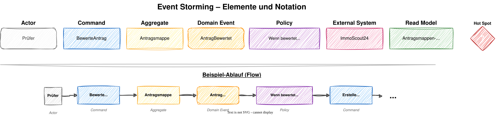
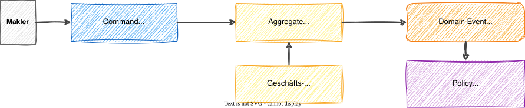
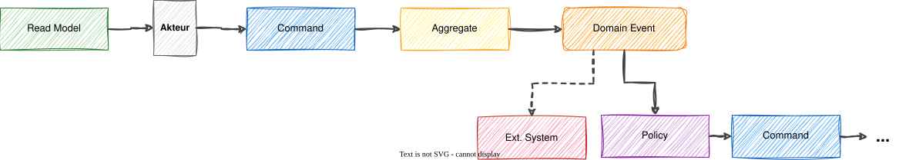

# Modul 04 - Event Storming

---

## Lernziele

- Das Format Event Storming nach Alberto Brandolini kennen
- Die Farben und Elemente korrekt einsetzen können
- Den Ablauf einer Event-Storming-Session leiten können
- Events, Commands und Aggregates für das Immobilien-CRM identifizieren
- Den Übergang von Event Storming zu Bounded Contexts verstehen

---

## Was ist Event Storming?

### Ein Workshop-Format zur Domänenexploration

- Erfunden von Alberto Brandolini (2013)
- Bringt Fachexperten und Entwickler an einen Tisch
- Visualisiert Geschäftsprozesse als Abfolge von Ereignissen
- Nutzt farbige Sticky Notes auf einer großen Papierbahn

> *"It is not the domain expert's knowledge that goes into production,
> it is the developer's assumption of that knowledge."*
> - Alberto Brandolini

---

## Warum Event Storming?

### Vorteile gegenüber klassischen Analyse-Methoden

- Gemeinsames Verständnis entsteht in kurzer Zeit (Stunden statt Wochen)
- Implizites Wissen der Fachexperten wird sichtbar gemacht
- Konflikte und Unklarheiten werden früh erkannt (Hot Spots)
- Ermöglicht Bottom-Up-Entdeckung von Bounded Contexts
- Basis für Ubiquitous Language und das Domänenmodell
- Kein technisches Vorwissen nötig - alle können mitmachen

---

## Die Elemente - Farbübersicht

---

## Farbübersicht

| Farbe | Element | Frage, die es beantwortet               |
|-------|---------|-----------------------------------------|
| 🟧 Orange | Domain Event | Was ist passiert?                       |
| 🟦 Blau | Command | Was hat jemand ausgelöst?               |
| 🟨 Gelb | Aggregate | Wer entscheidet und schützt die Regeln? |
| 🟪 Lila | Policy | Was passiert als Folge?                 |
| 🩷 Rosa | External System | Welches System ist beteiligt?           |
| 🟩 Grün | Read Model | Welche Daten braucht der Akteur?        |
| 🟥 Rot | Hot Spot | Wo gibt es Unklarheiten?                |

---

## Domain Event (Orange)

### Etwas ist passiert - in der Vergangenheitsform

- Formulierung: Substantiv + Partizip oder Passivform
- Beschreibt ein fachliches Ergebnis, kein technisches
- Zeitlich geordnet von links nach rechts

### Beispiele aus dem Immobilien-CRM

> Tipp: Zuerst Events sammeln - Reihenfolge und Details später klären.
> Menge vor Präzision!

---

## Command (Blau)

### Eine Absicht, die ein Event auslöst

- Formulierung: Imperativ (Befehlsform)
- Wird von einem Akteur (Person oder System) ausgelöst
- Steht links neben dem zugehörigen Event

### Beispiele

| Command | → | Domain Event |
|---------|---|-------------|
| `KontaktiereEigentümer` | → | `EigentümerKontaktiert` |
| `BewerteObjekt` | → | `ObjektBewertet` |
| `ErstelleExposé` | → | `ExposéErstellt` |

> Command = die Absicht, Event = das Ergebnis.

---

## Aggregate (Gelb)

### Die Konsistenzgrenze - entscheidet, ob ein Command erlaubt ist

- Empfängt einen Command, prüft Regeln und erzeugt ein Event
- Schützt Geschäftsregeln (Invarianten)
- Steht zwischen Command und Event

### Beispiele

| Aggregate | Verantwortlich für | Beispiel-Regel |
|-----------|-------------------|----------------|
| `Immobilie` | Objektdaten, Bewertung | Kann nur bewertet werden, wenn erfasst |
| `Maklerauftrag` | Vertragskonditionen | Nur ein aktiver Vertrag pro Objekt |
| `Vermittlungsvorgang` | Besichtigungen, Angebote | Notartermin nur mit angenommenem Angebot |
| `Exposé` | Inhalte, Freigabe | Nur bewertete Objekte bekommen ein Exposé |

---

## Der Kernflow: Command → Aggregate → Event

### So hängen die Elemente zusammen

> Die Policy löst den nächsten Command aus →
> so entsteht eine Kette von Events durch den Geschäftsprozess.

---

## Policy (Lila)

### Automatische Reaktion auf ein Event

- Formulierung: "Wenn ... dann ..." oder "Immer wenn ..."
- Löst einen neuen Command aus - verknüpft Events miteinander
- Steht unterhalb des auslösenden Events

### Beispiele aus dem Immobilien-CRM

| Auslösendes Event | Policy | Resultierender Command |
|-------------------|--------|----------------------|
| `ObjektBewertet` | Wenn bewertet → Exposé vorbereiten | `ErstelleExposé` |
| `MaklervertragUnterschrieben` | Wenn Vertrag → Vermarktung starten | `StarteVermarktung` |
| `ExposéErstellt` | Wenn Exposé fertig → veröffentlichen | `VeröffentlicheInserat` |
| `AngebotAngenommen` | Wenn angenommen → Notar planen | `VereinbareNotartermin` |

> Policies sind der Klebstoff zwischen den Phasen eines Geschäftsprozesses.

---

## External System (Rosa) & Read Model (Grün)

### External System - Systeme außerhalb unserer Domäne

- Beispiele: ImmoScout24-API, Grundbuchamt, E-Mail-Provider, Notar-Portal, Bank
- Können Events empfangen oder Commands auslösen

### Read Model - Daten, die ein Akteur für seine Entscheidung braucht

- Steht links vor dem Command (der Akteur schaut sich Daten an, bevor er handelt)

### Konkretes Beispiel

> Der Makler sieht die Übersicht (Read Model) → entscheidet → löst Command aus.

---

## Hot Spot (Rot)

### Unklarheiten und offene Fragen markieren

- Steht an Stellen mit Diskussionsbedarf
- Nicht sofort lösen - sammeln und später klären!

### Typische Hot Spots

- Widersprüchliche Aussagen von Fachexperten
- Unklare Geschäftsregeln oder Grenzfälle
- Fehlende Informationen
- Stellen, an denen sich die Ubiquitous Language ändert (→ BC-Grenze!)

### Beispiele aus dem Immobilien-CRM

- "Kann ein Objekt mehrere Maklerverträge gleichzeitig haben?"
- "Wann genau gilt ein Exposé als fertig?"
- "Wer darf den Angebotspreis ändern - der Makler oder der Eigentümer?"
- "Was passiert, wenn ein Kaufinteressent sein Angebot zurückzieht?"

---

## Vorbereitung: Setup für die Session

### Physisch (empfohlen)

- 5-8 Meter Papierbahn an der Wand
- Sticky Notes in allen 7 Farben + dicke Marker
- Kein Beamer, keine Laptops - alle stehen und kleben
- Raum mit genug Platz zum Stehen

### Digital (Alternative)

- Miro, FigJam oder Excalidraw
- Vorbereitetes Board mit farbigen Vorlagen
- Gut für Remote-Teams, aber weniger Dynamik

### Wer sollte dabei sein?

- Fachexperten (Makler, Vermarktungsleiter, Backoffice)
- Entwickler und Architekten
- Facilitator (lenkt, stellt Fragen, sorgt für Fokus)

---

## Session-Ablauf - 5 Phasen

---

## Phase 1: Chaotische Exploration (15-20 Min.)

### Alle schreiben Domain Events auf orange Sticky Notes

- Keine Diskussion - einfach alles aufschreiben, was im Prozess passiert
- Auf die Papierbahn kleben, grobe zeitliche Ordnung (links = früh, rechts = spät)
- Menge vor Qualität - auch "falsche" Events sind wertvoll
- Duplikate sind okay, werden später zusammengeführt

### Facilitator-Tipps

- "Schreibt auf, was passiert, nicht was jemand tut"
- "Vergangenheitsform verwenden!"
- "Jede Note = ein Event"
- Ruhige Teilnehmer aktiv ansprechen

---

## Phase 2-3: Timeline ordnen & Hot Spots (20-25 Min.)

### Phase 2: Timeline sortieren

- Events in chronologische Reihenfolge bringen
- Duplikate zusammenführen
- Lücken identifizieren: "Was passiert zwischen X und Y?"
- Parallele Stränge untereinander anordnen

### Phase 3: Hot Spots markieren

- Rote Sticky Notes auf Unklarheiten kleben
- Kurze Diskussion zu den wichtigsten Punkten
- Hot Spots sind wertvoll - nicht sofort lösen wollen!

> Hot Spots an Stellen, wo sich die Sprache ändert, deuten
> auf Bounded-Context-Grenzen hin.

---

## Phase 4-5: Commands, Akteure, Aggregates & Policies (30 Min.)

### Phase 4: Commands und Akteure

- Blaue Sticky Notes für Commands links neben die Events
- Akteure identifizieren: Wer löst den Command aus?
  - Makler, Eigentümer, Interessent, System, Zeitablauf

### Phase 5: Aggregates und Policies

- Gelbe Notes für Aggregates zwischen Command und Event
- Lila Notes für Policies unterhalb der Events
- Rosa Notes für External Systems am Rand

---

### Das Board sieht dann so aus:

