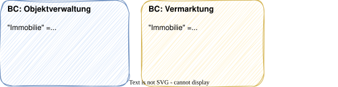
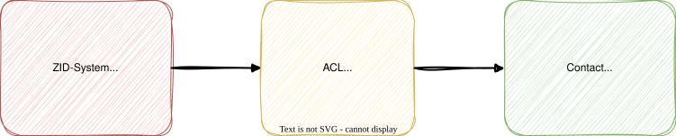
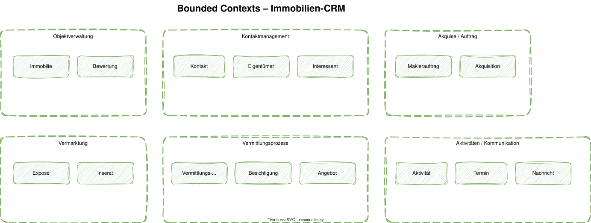

# Modul 05 - Strategic Design

## Bounded Contexts & Context Mapping

---

### Lernziele

- Bounded Contexts definieren und abgrenzen können
- Den Unterschied zwischen Subdomain und Bounded Context verstehen
- Alle Context-Map-Patterns kennen und anwenden
- Conway's Law und seine Auswirkungen auf BC-Schnitte verstehen
- Strategic Design auf das Immobilien-CRM anwenden

---

## Was ist ein Bounded Context?

- Ein explizit abgegrenzter Bereich, in dem ein bestimmtes Modell gilt
- Innerhalb eines BC haben Begriffe eine eindeutige Bedeutung
- Außerhalb kann derselbe Begriff etwas völlig anderes meinen

---

## Beispiel: Der Begriff "Immobilie"

"Immobilie" bedeutet in der Verwaltung etwas anderes
als in der Vermarktung!



> Eric Evans: *"A Bounded Context delimits the applicability
> of a particular model."*

---
<style scoped>section { font-size: 1.7em; }</style>

## Bounded Context vs. Subdomain

|                | Subdomain                         | Bounded Context              |
|----------------|-----------------------------------|------------------------------|
| Raum       | Problemraum                       | Lösungsraum                  |
| Was?       | Fachlicher Bereich                | Softwaregrenze               |
| Entdeckung | Wird entdeckt / analysiert        | Wird bewusst geschnitten     |
| Existenz   | Existiert unabhängig von Software | Ist ein Architektur-Artefakt |
| Mapping    | 1 Subdomain → 1 oder N BCs        | 1 BC ← 1 Subdomain (ideal)   |

- Idealerweise: 1 Subdomain = 1 Bounded Context
- In der Praxis: Legacy-Systeme erzwingen manchmal Abweichungen
- Ein BC sollte nie mehrere Subdomains abdecken (→ Big Ball of Mud)
- Für das Lab: Erst fachliche Teilbereiche / Subdomains erkennen, dann
  bewusst Bounded Contexts schneiden

---
<style scoped>section { font-size: 1.7em; }</style>

## Conway's Law

### Die Organisationsstruktur bestimmt die Softwarearchitektur

> *"Any organization that designs a system will produce a design whose
> structure is a copy of the organization's communication structure."*
> - Melvin Conway, 1968

### Konsequenz für BC-Schnitte

- Ein BC sollte von einem Team verantwortet werden
- Team-Grenzen und BC-Grenzen sollten übereinstimmen
- Zwei Teams, ein BC → Abstimmungsoverhead, Konflikte
- Ein Team, viele BCs → möglich bei kleinen BCs

### Inverse Conway Maneuver

Organisiere Teams entlang der gewünschten Architektur, nicht umgekehrt.

---

## Context Map - Überblick

- Eine Context Map zeigt, wie Bounded Contexts zueinander stehen
- Sie dokumentiert Integrations-Beziehungen und Machtverhältnisse
- Es geht um Team- und Systembeziehungen, nicht nur Technik

---
<style scoped>section { font-size: 1.7em; }</style>

### Die 8 Patterns

| Pattern | Kurzbeschreibung |
|---------|-----------------|
| Customer / Supplier | Downstream stellt Anforderungen an Upstream |
| Conformist | Downstream übernimmt Upstream-Modell 1:1 |
| Anti-Corruption Layer | Downstream schützt sich mit Übersetzungsschicht |
| Shared Kernel | Geteilter Modellkern, gemeinsame Verantwortung |
| Published Language | Dokumentiertes, versioniertes Datenformat |
| Open Host Service | Offene API für viele Consumer |
| Partnership | Zwei Teams entwickeln gemeinsam, keine U/D-Hierarchie |
| Separate Ways | Bewusst keine Integration |

---

## Pattern: Customer / Supplier (U/D)

### Downstream stellt Anforderungen an Upstream


- Upstream liefert Daten oder Services
- Downstream konsumiert und kann Anforderungen stellen
- Beide Teams stimmen sich aktiv ab
- Wann? Klare Lieferbeziehung, Downstream hat Einfluss

---
<style scoped>section { font-size: 1.7em; }</style>

## Pattern: Conformist

### Downstream übernimmt das Upstream-Modell unverändert

- Wie Customer/Supplier, aber Downstream hat keinen Einfluss
- Das Downstream-Team übernimmt das Modell 1:1
- Kein eigenes Domänenmodell für die integrierten Daten

### Wann einsetzen?

- Integration mit externen Systemen, die man nicht ändern kann
- Kosten einer Übersetzung übersteigen den Nutzen
- Beispiel: Übernahme des OpenImmo-XML-Standards

> Risiko: Das eigene Modell wird vom Upstream-Modell "infiziert".
> Alternative: ACL, wenn der Aufwand vertretbar ist.

---

<style scoped>section { font-size: 1.7em; }</style>

## Pattern: Anti-Corruption Layer (ACL)

### Schützt das eigene Modell mit einer Übersetzungsschicht



- Übersetzt eingehende Daten in die eigene Ubiquitous Language
- Wann? Integration mit Legacy-Systemen oder externen APIs
  deren Modell nicht zum eigenen passt

---

## Beispiel für einen Anti-Corruption-Layer

```java
@Component
public class ExternalCrmTranslator {
    public Contact translate(CrmCustomerDto dto) {
        return new Contact(
            ContactId.generate(),
            dto.getFirstName(), dto.getLastName(),
            ContactType.from(dto.getType()));
    }
}
```

---

<style scoped>section { font-size: 1.7em; }</style>

## Pattern: Shared Kernel

### Geteilter Modellkern zwischen zwei BCs

- Zwei BCs teilen sich einen gemeinsamen Modellteil
- Änderungen müssen abgestimmt werden - enger Kopplungsgrad
- Nur bei engem Team-Alignment sinnvoll

### Wann einsetzen?

- Gemeinsame Kernkonzepte, die identisch bleiben müssen
- Beispiel: Gemeinsame Value Objects `Address`, `MonetaryAmount`

> Vorsicht: Shared Kernel ist die engste Kopplung zwischen BCs.
> Je größer der Kernel, desto mehr Abstimmungsaufwand.
> Alternative: Published Language oder ACL.

---
<style scoped>section { font-size: 1.7em; }</style>

## Pattern: Published Language & Open Host Service

### Published Language

- Ein dokumentiertes, versioniertes Datenformat für Kommunikation
- Unabhängig von der internen Modellierung beider Seiten
- JSON-Schemas, XML-Schemas, Protobuf, Avro

### Open Host Service (OHS)

- Ein BC stellt eine offene, wohldefinierte API bereit
- Mehrere andere BCs können darüber zugreifen
- Oft kombiniert mit Published Language

### Beispiel

- Ein Stammdaten-BC bietet eine REST-API (OHS) mit
  versioniertem JSON-Schema (Published Language), die
  von mehreren anderen BCs genutzt wird

---
<style scoped>section { font-size: 1.7em; }</style>

## Pattern: Partnership & Separate Ways

### Partnership

- Zwei Teams entwickeln gemeinsam ohne Upstream/Downstream-Hierarchie
- Erfolg oder Misserfolg betrifft beide gleichermaßen
- Erfordert enge Abstimmung und gegenseitiges Vertrauen
- Wann? Zwei BCs, die so eng verbunden sind, dass sie quasi co-entwickelt werden

### Separate Ways

- Bewusste Entscheidung: keine Integration
- Jeder BC löst das Problem eigenständig (evtl. mit Duplikation)
- Wann? Integrations-Kosten übersteigen den Nutzen
- Beispiel: Jeder BC pflegt seine eigene einfache Adress-Verwaltung,
  statt ein gemeinsames Kontaktmanagement zu integrieren

---
<style scoped>section { font-size: 1.5em; }</style>

## Wie manifestiert sich ein BC im Code?

### Vorgeschmack auf Modul 08 (Paketstruktur)

```
de.realestate/
├── brokerage/            ← BC: Brokerage
│   ├── domain/
│   ├── application/
│   ├── infrastructure/
│   └── adapter/
├── acquisition/          ← BC: Acquisition
│   ├── domain/
│   ├── application/
│   ├── infrastructure/
│   └── adapter/
└── contact/              ← BC: Contact Management
    ├── domain/
    └── ...
```

- Jeder BC ist ein Top-Level-Package (oder Maven-Modul)
- BCs kommunizieren nur über definierte Schnittstellen (Events, APIs)
- Kein direkter Import von `brokerage.domain` in `acquisition.domain`!

---
<style scoped>section { font-size: 1.7em; }</style>

## Wie schneidet man Bounded Contexts?

### Fünf Heuristiken

1. Ubiquitous Language - Wo ändert sich die Bedeutung eines Begriffs?
2. Pivot Events - Welche Events markieren Phasenübergänge?
3. Akteurwechsel - Wo übernimmt eine andere Person/Rolle?
4. Daten-Kohäsion - Welche Daten ändern sich gemeinsam?
5. Conway's Law - Welches Team verantwortet welchen Bereich?

---

## Hands-on: Lab 03

### Context Map für das Immobilien-CRM erstellen

---



---
<style scoped>section { font-size: 1.7em; }</style>

## Mögliche Auswertung: Sechs Bounded Contexts

| Bounded Context         | Kernverantwortung                       | Aggregate(s)         |
|-------------------------|-----------------------------------------|----------------------|
| Objektverwaltung    | Immobilien-Stammdaten, Merkmale, Fotos  | Immobilie, Bewertung |
| Kontaktmanagement   | Eigentümer, Interessenten, Kontaktdaten | Kontakt              |
| Akquise / Auftrag   | Maklerverträge, Auftragserteilung       | Maklerauftrag        |
| Vermarktung         | Exposés, Portale, Inserate              | Exposé, Inserat      |
| Vermittlungsprozess | Besichtigungen, Angebote, Abschluss     | Vermittlungsvorgang  |
| Aktivitäten         | Termine, Telefonate, E-Mails, Aufgaben  | Aktivität, Termin    |

---
<style scoped>section { font-size: 1.7em; }</style>

## Mögliche Auswertung: Beziehungen im Immobilien-CRM

| Upstream | Downstream | Primäres Muster | Zusätzliche Kennzeichnung | Warum? |
|----------|-----------|-----------------|---------------------------|--------|
| Objektverwaltung | Vermarktung | Customer/Supplier | - | Vermarktung braucht Immobiliendaten |
| Kontaktmanagement | Akquise | Customer/Supplier | OHS + PL | Viele Consumer, stabile API und definiertes Austauschformat |
| Kontaktmanagement | Vermittlung | Customer/Supplier | OHS + PL | Viele Consumer, stabile API und definiertes Austauschformat |
| Akquise | Vermittlung | Customer/Supplier | - | Vertrag löst Vermittlung aus |
| Ext. Immobilienportal | Objektverwaltung | ACL | - | Fremdes Modell übersetzen |

- `Domain Events` sind ein Integrationsmechanismus, aber kein eigenes
  Context-Mapping-Pattern
- Trennt bei der Bewertung bewusst Beziehungsmuster und
  Integrationscharakteristik
