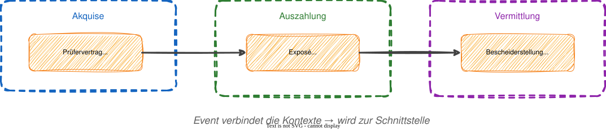

# Modul 05 - Strategic Design

## Bounded Contexts & Context Mapping

---

### Lernziele

- Bounded Contexts definieren und abgrenzen können
- Den Unterschied zwischen Subdomain und Bounded Context verstehen
- Alle Context-Map-Patterns kennen und anwenden
- Conway's Law und den Inverse Conway Maneuver verstehen
- Team Topologies als Organisationsrahmen für Bounded Contexts einsetzen
- Wardley Mapping für Build-or-Buy-Entscheidungen nutzen
- Strategic Design auf die Förderantragsverwaltung anwenden

---

## Was ist ein Bounded Context?

Ein Bounded Context ist ein explizit **abgegrenzter Bereich, in dem ein bestimmtes Modell gilt**. Er beschreibt den **Lösungsraum** einer Sub-Domäne.

Innerhalb eines Contexts haben Begriffe eine eindeutige Bedeutung. Außerhalb kann derselbe Begriff etwas **völlig anderes bedeuten**.

---

## Vom Event Storming zum Bounded Context

**Drei Signale für eine Context-Grenze**

1. Sprachliche Grenze - gleiche Begriffe, andere Bedeutung
> "Antrag" in der Antragstellung ≠ "Antrag" in der Auszahlung (Zahlungsantrag)

2. Grenz-Events ("Pivots") - Events, die eine neue Phase einleiten
> `AntragsmappeEingereicht` → Grenze zwischen Antragstellung und Fachlicher Prüfung
> `AntragPositivBeschieden` → Grenze zwischen Fachlicher Prüfung und Auszahlung

3. Akteurwechsel - andere Person übernimmt
> Antragsteller (Antragstellung) → Sachbearbeiterin (Fachliche Prüfung)

---

## Vom Event Storming zu Bounded Contexts

### Schnittstellen erkennen



---

## Beispiel: Der Begriff "Antrag"

"Antrag" bedeutet in der Antragstellung etwas anderes als in der Auszahlung!

| | BC: Antragstellung | BC: Auszahlung |
|---|---|---|
| Begriff | `AntragsMappe` | `Zahlungsantrag` |
| Kern-Daten | Flurstücke, Status, Einreichdatum | Förderbetrag, Kontonummer, Auszahlungsstatus |
| Aggregate | `AntragsMappe`, `Flurstück` | `Zahlungsantrag`, `Kautionsverwaltung` |
| Akteur | Antragsteller, GIS-Bearbeiterin | Zahlstelle, Buchhaltung |

> Eric Evans: *"A Bounded Context delimits the applicability of a particular model."*
> — "Domain-Driven Design", S. 335

---
<style scoped>section { font-size: 1.8em; }</style>

## Bounded Context vs. Subdomain

|                | Subdomain                         | Bounded Context              |
|----------------|-----------------------------------|------------------------------|
| Raum       | Problemraum                       | Lösungsraum                  |
| Was?       | Fachlicher Bereich                | Softwaregrenze               |
| Entdeckung | Wird entdeckt / analysiert        | Wird bewusst geschnitten     |
| Existenz   | Existiert unabhängig von Software | Ist ein Architektur-Artefakt |

Idealerweise existiert für jede Subdomäne genau ein Context. Aber in der Praxis zwingen uns Legacy-Systeme manchmal zu Abweichungen.

Ein Context sollte aber nie mehrere Subdomains abdecken (→ Big Ball of Mud).

---

## Conway's Law

### Die Organisationsstruktur bestimmt die Softwarearchitektur

> *"Any organization that designs a system will produce a design whose
> structure is a copy of the organization's communication structure."*
> Melvin Conway, 1968

### Konsequenz für Context-Schnitte

Ein Context sollte von einem Team verantwortet werden, aber nicht von mehreren. Nur bei kleinen Contexten sollte ein Team mehrere verantworten!

Organisiere Teams entlang der gewünschten Architektur, nicht umgekehrt.

### Conway's Law als Diagnosewerkzeug

Wenn ihr auf eine unerwartete Kopplung zwischen zwei Bounded Contexts stoßt,
lohnt sich die Frage: **Welche Teams kommunizieren heute intensiv miteinander?**

Oft ist die Kopplung im Code ein Abbild der Kopplung in der Organisation.
Eine Architekturverbesserung ohne Organisationsveränderung ist meist kurzlebig —
und umgekehrt.

> *„You can't change the architecture without changing the organization that produces it,
> and you can't change the organization without changing the architecture."*
> — Susanne Kaiser, „Architecture for Flow" (2025)

---

## Inverse Conway Maneuver

### Teams bewusst zur Architektur hin gestalten

> *"If the architecture of the system and the architecture of the organization
> are at odds, the architecture of the organization wins."*
> — Ruth Malan

- **Conway (passiv):** Team-Struktur → Architektur entsteht zufällig
- **Inverse Conway (aktiv):** Zielarchitektur → Team-Design bewusst gestalten

### Unsere Bounded Contexts → Team-Empfehlung

| Bounded Context | Subdomain-Typ | Team-Empfehlung |
|---|---|---|
| Antragstellung | Core | Stream-Aligned Team |
| Fachliche Prüfung | Core | Stream-Aligned Team |
| Auszahlung | Supporting | Stream-Aligned Team |
| Referenzdaten | Generic | Platform Team |

---
<style scoped>section { font-size: 1.6em; }</style>

## Team Topologies: Vier Team-Typen

### (Skelton & Pais, 2019 — Synthese: Kaiser, 2025)

| Team-Typ | Zweck | DDD-Zuordnung |
|---|---|---|
| **Stream-Aligned** | End-to-End Verantwortung für einen Wertestrom | Core / Supporting Domains |
| **Platform** | Self-Service Infrastruktur für andere Teams | Generic Domains / Querschnitt |
| **Enabling** | Coaching & Upskilling für Stream-Aligned Teams | — (temporär) |
| **Complicated Subsystem** | Spezialisiertes Wissen für komplexe Teilsysteme | Besonders komplexe Subdomains |

> **Faustregel:** Ein Bounded Context = ein Stream-Aligned Team.
> Conway's Law in Aktion: Team-Grenzen ≡ Bounded-Context-Grenzen.

---
<style scoped>section { font-size: 1.5em; }</style>

## Wardley Mapping: Build or Buy?

### Evolution-Stage entscheidet die Investitionsstrategie

| Evolution Stage | Charakteristik | Subdomain-Typ | Empfehlung |
|---|---|---|---|
| **Genesis** | Neu, unsicher, experimentell | Core Domain | Selbst entwickeln |
| **Custom-Built** | Lernend, marktformend | Core / Supporting | Selbst entwickeln |
| **Product** | Off-the-shelf verfügbar | Supporting / Generic | Kaufen / Open Source |
| **Commodity** | Industrialisiert, Utility | Generic | Cloud-Service / Outsourcen |

### Unsere Bounded Contexts — Evolution einschätzen

| BC | Evolution | Empfehlung |
|---|---|---|
| Antragstellung (Flurstück-Logik, IACS) | Custom-Built | Selbst — fachliches Differenzierungsmerkmal |
| Referenzdaten (GIS-Stammdaten) | Product | Integration externer GIS-Dienste |
| Bescheidversand (PDF, Druck) | Product → Commodity | SaaS / Cloud-Dienst prüfen |
| Authentifizierung / IAM | Commodity | OpenID Connect / Keycloak |

---

## Context Map - Überblick

Eine Context Map zeigt, wie Bounded Contexts zueinander stehen.
Sie dokumentiert Integrations-Beziehungen und Machtverhältnisse

Es geht dabei auch um Team- und Systembeziehungen, nicht nur um Technik.

---
<style scoped>section { font-size: 1.7em; }</style>

## Die 8 Patterns

| Pattern | Kurzbeschreibung |
|---------|-----------------|
| Customer / Supplier | Downstream stellt Anforderungen an Upstream |
| Conformist | Downstream übernimmt Upstream-Modell 1:1 |
| Anti-Corruption Layer | Downstream schützt sich mit Übersetzungsschicht |
| Shared Kernel | Geteilter Modellkern, gemeinsame Verantwortung |
| Published Language | Dokumentiertes, versioniertes Datenformat |
| Open Host Service | Offene API für viele Consumer |
| Partnership | Zwei Teams entwickeln gemeinsam, keine U/D-Hierarchie |
| Separate Ways | Bewusst keine Integration |

---

## Pattern: Customer / Supplier (U/D)

### Downstream stellt Anforderungen an Upstream


- Upstream liefert Daten oder Services
- Downstream konsumiert und darf Anforderungen stellen
- Beide Teams stimmen sich aktiv ab

---

## Pattern: Conformist

In diesem Pattern übernimmt der Downstream die Konzepte des Upstreams ohne Einfluss.

Man setzt dieses Pattern ein, wenn externe Systeme eingebunden werden
müssen und wir an ihnen nichts ändern können.

Beispiel: Übernahme des IACS/InVeKoS-Datenformats der EU-Agrarbehörden

> Risiko: Das eigene Modell wird vom Upstream-Modell "infiziert".
> Alternative: ACL, wenn der Aufwand vertretbar ist.

---

## Pattern: Anti-Corruption Layer (ACL)

Schützt das eigene Modell mit einer Übersetzungsschicht


- Übersetzt eingehende Daten in die eigene Ubiquitous Language
- Wird eingesetzt bei der Integration mit Legacy-Systemen oder externen APIs
  deren Modell nicht zum eigenen passt

---

## Beispiel für einen Anti-Corruption-Layer

```java
@Component
public class ZidTranslator {
    public Betriebsinhaber translate(ZidNutzerDto dto) {
        return new Betriebsinhaber(
            new BhbNummer(dto.getBetriebsNummer()),
            dto.getVorname(), dto.getNachname(),
            BetriebsArt.from(dto.getBetriebsTyp()));
    }
}
```

---

<style scoped>section { font-size: 1.7em; }</style>

## Pattern: Shared Kernel


*xkcd.com/2347 — CC BY-NC 2.5*

### Geteilter Modellkern zwischen zwei BCs

- Zwei BCs teilen sich einen gemeinsamen Modellteil
- Änderungen müssen abgestimmt werden - enger Kopplungsgrad
- Nur bei engem Team-Alignment sinnvoll

### Wann einsetzen?

- Gemeinsame Kernkonzepte, die identisch bleiben müssen
- Beispiel: Gemeinsame Value Objects `BhbNummer`, `Foerderbetrag`, `RegistrierungsNummer`

> Vorsicht: Shared Kernel ist die engste Kopplung zwischen BCs.
> Je größer der Kernel, desto mehr Abstimmungsaufwand.
> Alternative: Published Language oder ACL.

---

## Pattern: Published Language & Open Host Service

Ein **Published Language** ist ein dokumentiertes, versioniertes Datenformat für Kommunikation. Beispiele: JSON-Schemas, XML-Schemas, Protobuf, Avro.

Ein **Open Host Service (OHS)** stellt eine API für einen Context bereit. Mehrere Contexts greifen dann auf ihn zu. Dies wird oft mit der Published Language kombiniert.

**Beispiel**:

Ein Stammdaten-Context bietet eine REST-API (OHS) mit versioniertem JSON-Schema (Published Language), die von mehreren anderen BCs genutzt wird

---

## Pattern: Partnership & Separate Ways

**Partnership** bedeutet, dass zwei Teams gleichberechtigt und
in enger Koordination ihre Contexte entwickeln. Dies ergibt Sinn, wenn
die Anforderungen eng aneinander gebunden sind.

Umgekehrt bedeutet **Separate Ways**, dass bewusst keine
sofortige Integration gewünscht ist.

---
<style scoped>section { font-size: 1.4em; }</style>

## Wie manifestiert sich ein BC im Code?

### Vorgeschmack auf Modul 08 (Paketstruktur)

```
de.foerderung/
├── antragstellung/       ← BC: Antragstellung (Core)
│   ├── domain/
│   ├── application/
│   ├── infrastructure/
│   └── adapter/
├── pruefung/             ← BC: Fachliche Prüfung (Core)
│   ├── domain/
│   ├── application/
│   ├── infrastructure/
│   └── adapter/
└── referenzdaten/        ← BC: Referenzdaten (Generic, OHS)
    ├── domain/
    └── ...
```

- Jeder Context ist ein Top-Level-Package (oder Maven-Modul)
- Contexts kommunizieren nur über definierte Schnittstellen (Events, APIs)
- Kein direkter Import von `antragstellung.domain` in `pruefung.domain`!

---

## Wie schneidet man Bounded Contexts?

**Fünf Heuristiken:**

1. Ubiquitous Language - Wo ändert sich die Bedeutung eines Begriffs?
2. Pivot Events - Welche Events markieren Phasenübergänge?
3. Akteurwechsel - Wo übernimmt eine andere Person/Rolle?
4. Daten-Kohäsion - Welche Daten ändern sich gemeinsam?
5. Conway's Law - Welches Team verantwortet welchen Bereich?

---
<style scoped>section { font-size: 1.5em; }</style>

## Bounded Contexts in der Förderantragsverwaltung

### Pivot Events bestimmen die Grenzen

| Pivot Event | Grenze | Signal |
|-------------|--------|--------|
| `AntragsmappeEingereicht` | Antragstellung → Fachliche Prüfung | Akteurwechsel: Antragsteller → Sachbearbeiterin |
| `AntragPositivBeschieden` | Fachliche Prüfung → Auszahlung | Sprachgrenze: "Antrag" → "Zahlungsantrag" |
| `ZahlungAngewiesen` | Auszahlung → Bescheidversand | Verantwortungswechsel: Zahlstelle → System |

### Bounded Contexts (abgeleitet aus echten Systemgrenzen)

| Bounded Context | Subdomain-Typ | Kern-Aggregate | Pivot-Event |
|-----------------|--------------|----------------|-------------|
| **Antragstellung** | Core | AntragsMappe, Flurstück | AntragsmappeEingereicht |
| **Fachliche Prüfung** | Core | Prüfvorgang, Kontrolle | AntragPositivBeschieden |
| **Auszahlung** | Supporting | Zahlungsantrag, Kautionsverwaltung | ZahlungAngewiesen |
| **Bescheidversand** | Supporting | Bescheid | BescheidVersandt |
| **Auswertung / Monitoring** | Supporting | MonitoringReport | — (reaktiv) |
| **Referenzdaten** | Generic | Flurstücks-Stammdaten | — (OHS) |

> "Antrag" bedeutet in **Antragstellung** (AntragsMappe mit Flurstücken)
> etwas anderes als in **Auszahlung** (Zahlungsantrag mit Förderbetrag).
> Das ist die wichtigste sprachliche Grenze in diesem Domänenmodell.

---
<style scoped>section { font-size: 1.4em; }</style>

## Context Map — Ist-Zustand (Messaging)

```
  Antragstellung
         │ Customer/Supplier
         │ [AntragsmappeGeaendert]
         ▼
  Fachliche Prüfung  ◄── Referenzdaten [Conformist/OHS]
         │ Customer/Supplier
         │ [AntragPositivBeschieden]
         ▼
       Auszahlung
       /          \
  [ACL]          [ACL]
    │               │
 Auswertung    Bescheidversand
```

### Was wir jetzt erkenne — Context-Mapping-Patterns

| Beziehung | Pattern | Technisch |
|-----------|---------|-----------|
| Antragstellung → Fachliche Prüfung | Customer/Supplier | `topic/AntragGeaendert` (JMS) |
| Auszahlung → Auswertung | **sollte ACL sein**, ist heute Conformist | MDB castet direkt auf fremdes Objekt |
| Auszahlung → Bescheidversand | **sollte ACL sein**, ist heute Conformist | Kein Translator vorhanden |
| Referenzdaten → alle | Open Host Service | REST-API + Published Language |
| Legacy-System ↔ Kernsystem (Importe) | **ungewollter Shared Kernel** | Java-Klassen über Projektgrenzen importiert |

> Das größte Risiko: `AntragsmappeAenderung` wird direkt von zahlreiche MDBs verwendet.
> Ein umbenannter Klassenname — und alle betroffenen MDBs kompilieren nicht mehr.

---

### Zum Nachlesen

- Evans, „Domain-Driven Design" (2003), S. 335: Bounded Context — Definition und Abgrenzung
- Evans, „Domain-Driven Design" (2003), S. 344: Context Map — Beziehungen zwischen Contexten
- Evans, „Domain-Driven Design" (2003), S. 364: Anti-Corruption Layer — das Modell schützen
- Vernon, „Implementing Domain-Driven Design" (2013), S. 53: Domains, Subdomains, Bounded Contexts
- Vernon, „Implementing Domain-Driven Design" (2013), S. 111: Context Mapping
- Khononov, „Einführung in Domain-Driven Design" (2022), Kapitel 1: Fachdomänen und Subdomains
- Khononov, „Einführung in Domain-Driven Design" (2022), Kapitel 3: Bounded Contexts
- Khononov, „Einführung in Domain-Driven Design" (2022), Kapitel 4: Bounded Contexts integrieren (ACL, Shared Kernel)
- Kaiser, „Architecture for Flow" (2025), Kapitel 2: Subdomains und Wardley-Evolution-Stages
- Kaiser, „Architecture for Flow" (2025), Kapitel 5: Conway's Law und Team Topologies

---

## Reflexion: Prüft euer Verständnis

1. Was ist der Unterschied zwischen Subdomain (Problemraum) und Bounded Context (Lösungsraum)?
2. Welches Context-Map-Pattern beschreibt "ich übernehme das fremde Modell, ohne Einfluss darauf"?
3. Warum ist ein Shared Kernel die **engste** Kopplung zwischen zwei BCs?

> Wenn euch die Patterns abstrakt vorkommen — im Lab erstellen wir eine konkrete Context Map für unser System.

---

## Hands-on: Lab 03

### Context Map für die Förderantragsverwaltung erstellen
