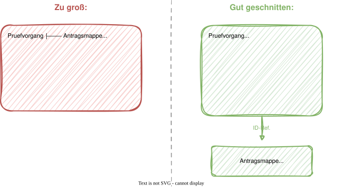
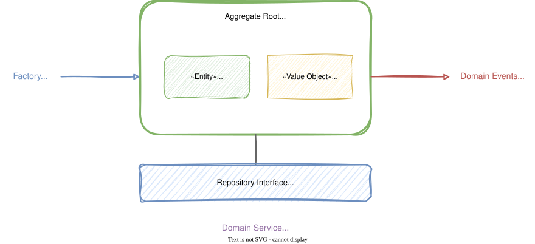

# Modul 06 - Tactical DDD Building Blocks

## Die Bausteine des Domain-Driven Design

---

### Lernziele

- Entity, Value Object und Aggregate unterscheiden können
- Aggregate-Regeln verstehen und korrekt anwenden
- Domain Services, Domain Events, Factories und Repositories einordnen
- Die "Primitive Obsession" als Anti-Pattern erkennen
- Alle Building Blocks in Java 21+ idiomatisch umsetzen
- DAO vs. DDD Repository unterscheiden
- Fluent API und Builder Pattern kontextgerecht einsetzen

---

<style scoped>section { font-size: 1.9em; }</style>

## Verbindung zum Event Storming

### Die gelben Sticky Notes werden jetzt zu Code

| Event-Storming-Element   | → | Building Block                          |
|--------------------------|---|-----------------------------------------|
| 🟨 Aggregate (gelb)      | → | Aggregate Root (Klasse mit Invarianten) |
| 🟧 Domain Event (orange) | → | Domain Event (Java Record)              |
| 🟦 Command (blau)        | → | Command-Objekt (Java Record)            |
| 🟪 Policy (lila)         | → | Event Handler / Domain Service          |
| Akteur                   | → | Auslöser eines Use Case                 |

> In der Realität weichen wir davon aber durchaus ab.

---
<style scoped>section { font-size: 1.4em; }</style>

## Überblick - Tactical DDD Building Blocks

| Baustein           | Zweck                                       | Java-Umsetzung                       |
|--------------------|---------------------------------------------|--------------------------------------|
| Entity         | Objekt mit Identität und Lebenszyklus       | Klasse mit ID, equals/hashCode by ID |
| Value Object   | Unveränderlicher Wert ohne Identität        | Java `record` mit Validierung        |
| Aggregate      | Konsistenzgrenze mit Root-Entity            | Klasse mit Invarianten + Event-Liste |
| Domain Service | Zustandslose domänenübergreifende Logik     | Klasse ohne State                    |
| Domain Event   | Fachliches Ereignis (Vergangenheitsform)    | Java `record` (immutable)            |
| Factory        | Komplexe Erzeugungslogik                    | Statische Methode oder eigene Klasse |
| Repository     | Collection-ähnlicher Zugriff auf Aggregates | Java Interface (Port)                |

---


## Was macht eine Entity aus?

- Hat eine eindeutige Identität (ID), die über den Lebenszyklus bestehen bleibt
- Gleichheit wird über die ID bestimmt, nicht über Attribute
- Hat einen Lebenszyklus: Erstellung → Änderung → ggf. Archivierung
- Enthält Geschäftslogik als Methoden

In der Förderantragsverwaltung sind das z.B. `AntragsMappe`, `Flurstück` oder `Betriebsinhaber` -
jeweils identifiziert durch eine `UUID`.

---
<style scoped>section { font-size: 1.5em; }</style>

## Entity in Java

```java
public class Betriebsinhaber {

    private final UUID id;
    private String vorname;
    private String nachname;
    private BetriebsNummer betriebsNummer;
    private BhbTyp typ; // ANTRAGSTELLER, SACHBEARBEITER

    public Betriebsinhaber(UUID id, String vorname,
                           String nachname, BhbTyp typ) {
        this.id = Objects.requireNonNull(id);
        this.vorname = Objects.requireNonNull(vorname);
        this.nachname = Objects.requireNonNull(nachname);
        this.typ = Objects.requireNonNull(typ);
    }
}
```

- Konstruktor validiert alle Pflichtfelder
- Objekt ist nie in einem ungültigen Zustand

---
<style scoped>section { font-size: 1.5em; }</style>

## Gleichheit über ID

```java
public class Betriebsinhaber {
    // ... fields and constructor

    @Override
    public boolean equals(Object o) {
        if (this == o) return true;
        if (!(o instanceof Betriebsinhaber other)) return false;
        return id.equals(other.id);
    }

    @Override
    public int hashCode() {
        return id.hashCode();
    }
}
```

- Zwei Betriebsinhaber mit gleicher ID sind dasselbe Objekt
- Auch wenn Vorname oder Betriebsnummer sich geändert haben
- `instanceof` Pattern Matching (Java 16+)

---
<style scoped>section { font-size: 1.7em; }</style>

## Value Objects

Nicht jedes Objekt braucht eine ID. Value Objects beschreiben Eigenschaften,
Maße oder Konzepte - ohne eigene Identität.

- Gleichheit durch Wertevergleich aller Attribute
- Unveränderlich (immutable) - Änderung erzeugt neues Objekt
- In Java 21+: ideal als Record umsetzbar

| Value Object | Beschreibt |
|-------------|-----------|
| `Foerderbetrag` | Betrag + Währung (beantragte Fördersumme) |
| `Foerderquote` | Förderanteil als Dezimalfaktor (z. B. `0.35` = 35 %) |
| `FlurstueckNummer` | Kataster-Parzellen-Kennung |

```java
public record Foerderquote(BigDecimal prozentsatz) {
    public Foerderquote {
        Objects.requireNonNull(prozentsatz);
        if (prozentsatz.compareTo(BigDecimal.ZERO) < 0
                || prozentsatz.compareTo(BigDecimal.ONE) > 0) {
            throw new IllegalArgumentException(
                "Foerderquote muss zwischen 0 und 1 liegen: " + prozentsatz);
        }
    }
}
```

---
<style scoped>section { font-size: 1.7em; }</style>

## Value Object als Java Record

```java
public record Foerderbetrag(BigDecimal betrag, String waehrung) {

    public Foerderbetrag {
        Objects.requireNonNull(betrag, "Betrag muss angegeben werden");
        Objects.requireNonNull(waehrung, "Währung muss angegeben werden");
        if (betrag.compareTo(BigDecimal.ZERO) < 0) {
            throw new IllegalArgumentException(
                "Förderbetrag darf nicht negativ sein: " + betrag);
        }
    }

    /** Skaliert den Betrag mit einem Faktor (z. B. 1.05 für 5 % Bonus). */
    public Foerderbetrag multiplizieren(BigDecimal faktor) {
        return new Foerderbetrag(
            betrag.multiply(faktor).setScale(2, RoundingMode.HALF_UP),
            waehrung);
    }

    /** Wendet eine Foerderquote auf diesen Betrag an. */
    public Foerderbetrag anwenden(Foerderquote quote) {
        return multiplizieren(quote.prozentsatz());
    }
}
```

- Record = automatisch immutable + `equals()`/`hashCode()` by value
- Compact Constructor für Validierung — kein `new`-Keyword im Body
- Berechnungsmethoden geben ein **neues** Record zurück — niemals mutieren
- `foerderbetrag.betrag()` statt `foerderbetrag.getBetrag()` (kein Boilerplate)

---

## Primitive Obsession - ein Anti-Pattern

Exzessiver Einsatz von Primitives statt Value Objects gilt als Anti Pattern im Domain Driven Design.

```java
public class AntragsMappe {
    private String antragstellerId;     // Welches Format?
    private double foerderbetrag;       // Welche Währung?
    private double foerderquote;        // Prozent oder absolut?
    private String registrierungsNummer; // Welche Länge, welches Format?
}
```

---

## Value Objects statt Primitives

```java
public class AntragsMappe {
    private BhbNummer antragstellerId;
    private Foerderbetrag beantragteFoerderung;
    private Foerderquote foerderquote;
    private RegistrierungsNummer registrierungsNummer;
}
```

```java
// Weitere Value Object Beispiele aus der Domäne
public record FlurstueckNummer(String wert) {
    public FlurstueckNummer {
        Objects.requireNonNull(wert, "FlurstueckNummer darf nicht null sein");
        if (wert.isBlank()) throw new IllegalArgumentException(
            "FlurstueckNummer darf nicht leer sein");
    }
}

public record RegistrierungsNummer(String wert) {
    public RegistrierungsNummer {
        Objects.requireNonNull(wert);
        if (!wert.matches("DZ-[A-Z]{2}-\\d{4}-\\d{4}"))
            throw new IllegalArgumentException(
                "Ungültiges Format: " + wert);
    }
}
```

Value Objects sind typsicher und drücken ihre Rolle durch ihren Typ aus.

---
<style scoped>section { font-size: 1.9em; }</style>

## Entity vs. Value Object - Entscheidungshilfe

| Kriterium | Entity | Value Object |
|-----------|--------|-------------|
| Identität | Ja (ID) | Nein |
| Gleichheit | Per ID | Per Wert |
| Veränderlich | Ja | Nein (immutable) |
| Lebenszyklus | Ja | Nein - wird ersetzt |
| Java-Umsetzung | Klasse | Record |

> Faustregel: Im Zweifel Value Object bevorzugen!
> Nur wenn ein Objekt über die Zeit getrackt werden muss, dann Entity.

---

## Aggregates und ihre Grenzen

Ein Aggregate ist ein **Cluster von Entities und Value Objects mit einer
Root-Entity**. Es bildet eine **Konsistenzgrenze**: Invarianten innerhalb
eines Aggregats werden sofort garantiert, zwischen Aggregates gilt
Eventual Consistency.

Die **Aggregate Root** ist der einzige Einstiegspunkt von außen.
Sie kontrolliert alle Änderungen, hat eine global eindeutige ID und
stellt sicher, dass das Aggregat immer in einem gültigen Zustand ist.

---

## Aggregate-Regeln - Die 7 Gebote

1. Nur die Root ist von außen referenzierbar
2. Innere Objekte dürfen nicht direkt weitergegeben werden (→ Kopie oder Unmodifiable)
3. Cross-Aggregate-Referenz nur per ID, nie per Objektreferenz
4. Innerhalb eines Aggregats: Immediate Consistency
5. Zwischen Aggregates: Eventual Consistency (über Domain Events)
6. Aggregates sollten klein gehalten werden
7. Ein Repository pro Aggregate - nie für innere Entities

---

## Aggregate Sizing - Wie groß ist richtig?

### Klein anfangen!



---

### Sizing: Faustregel

- Entities, die nur zusammen mit der Root geändert werden → ins Aggregate
- Entities, die eigenständig geladen werden müssen → eigenes Aggregate
- Wenn in Zweifel → kleineres Aggregate, verbunden per ID

---
<style scoped>section { font-size: 1.5em; }</style>

## Codebeispiel

```java
public class AntragsMappe {

    private final AntragId id;
    private RegistrierungsNummer registrierungsNummer;
    private Foerderbetrag beantragteFoerderung;
    private AntragStatus status;
    private final List<Flurstueck> flurstuecke = new ArrayList<>();
    private final List<Nachweis> nachweise = new ArrayList<>();
    private final List<AntragEvent> domainEvents = new ArrayList<>();

    public FlurstueckId flurstueckHinzufuegen(
            FlurstueckNummer nummer, BigDecimal flaeche) {
        var flurstueck = new Flurstueck(
            FlurstueckId.generate(), nummer, flaeche);
        this.flurstuecke.add(flurstueck);
        this.status = AntragStatus.IN_BEARBEITUNG;
        registerEvent(new FlurstueckHinzugefuegt(this.id, flurstueck.getId(), nummer, flaeche, Instant.now()));
        return flurstueck.getId();
    }

    public NachweisId nachweisEinreichen(String dokumentTyp, String eingereichtVon) {
        var nachweisId = NachweisId.generate();
        var nachweis = new Nachweis(nachweisId, dokumentTyp, eingereichtVon, Instant.now());
        this.nachweise.add(nachweis);
        registerEvent(new NachweisEingereicht(this.id, nachweisId, dokumentTyp, Instant.now()));
        return nachweisId;
    }
}
```

---

## Invarianten schützen

```java
public class AntragsMappe {

    public void einreichen() {
        boolean hatFlurstuecke = !flurstuecke.isEmpty();

        if (!hatFlurstuecke) {
            // Invariante: Einreichung nur mit mindestens einem Flurstück
            throw new IllegalStateException(
                "Antrag muss mindestens ein Flurstück enthalten");
        }
        this.status = AntragStatus.EINGEREICHT;
        registerEvent(new AntragsmappeEingereicht(this.id));
    }

    // Außenstehende können Liste nicht modifizieren, weil unmodifiable
    public List<Flurstueck> getFlurstuecke() {
        return Collections.unmodifiableList(flurstuecke);
    }
}
```

---
<style scoped>section { font-size: 1.6em; }</style>

## Domain Event Collection Pattern: Events sammeln

```java
// Marker-Interface für alle Domain Events des BC Antragstellung
public sealed interface AntragEvent
    permits AntragsmappeErstellt, AntragsmappeEingereicht,
            FlurstueckHinzugefuegt, NachweisEingereicht,
            NachweisAkzeptiert, KontrolleDurchgefuehrt {}
```

- `sealed` stellt sicher: nur definierte Event-Typen erlaubt
- Kein Framework, keine Abhängigkeiten — reines Java

---
<style scoped>section { font-size: 1.6em; }</style>

## Domain Event Collection Pattern: Events sammeln

```java
public class AntragsMappe {

    private final List<AntragEvent> domainEvents = new ArrayList<>();

    // Wird von Business-Methoden aufgerufen
    protected void registerEvent(AntragEvent event) {
        this.domainEvents.add(event);
    }

    public List<AntragEvent> domainEvents() {
        return Collections.unmodifiableList(domainEvents);
    }

    public void clearDomainEvents() {
        this.domainEvents.clear();
    }
}
```

---

## Domain Services

Manche Geschäftslogik passt in keine Entity und kein Value Object.
Für diese Fälle gibt es **Domain Services**: zustandslos, in der Domain-Schicht
angesiedelt, oft über Aggregate-Grenzen hinweg operierend.

---

### Abgrenzung von Domain zum Application Service

| | Domain Service | Application Service |
|---|---------------|-------------------|
| **Schicht** | Domain | Application |
| **Enthält** | Geschäftslogik | Orchestrierung |
| **Zustand** | Stateless | Stateless |
| **Spring** | Kein Spring nötig | `@Service`, `@Transactional` |
| **Beispiel** | FoerderbetragBerechner | FlurstueckHinzufuegenService |

---
<style scoped>section { font-size: 1.6em; }</style>

## Beispiel: FoerderbetragBerechner

```java
// Diese Klasse kommt ohne Abhängigkeiten zu Spring aus
public class FoerderbetragBerechner {

    // Flurstueck ist eine Entity mit expliziter flaeche()-Methode:
    // public BigDecimal flaeche() { return this.flaeche; }
    public Foerderbetrag berechnen(List<Flurstueck> flurstuecke,
                                   Foerderquote quote,
                                   FoerderProgramm programm) {
        var gesamtFlaeche = flurstuecke.stream()
            .map(Flurstueck::flaeche)
            .reduce(BigDecimal.ZERO, BigDecimal::add);

        // Foerderquote.prozentsatz() ist ein Dezimalfaktor (0.0–1.0):
        // 10 ha × 0,35 × 300 EUR/ha = 1050 EUR — KEIN weiteres /100!
        var betrag = gesamtFlaeche
            .multiply(quote.prozentsatz())
            .multiply(programm.basisBetragProHektar())
            .setScale(2, RoundingMode.HALF_UP);

        return new Foerderbetrag(betrag, "EUR");
    }
}
```

---

## Domain Events - Fachliche Ereignisse

Domain Events beschreiben Dinge, die in der Domäne passiert sind.
**Immer** in der **Vergangenheitsform, immer unveränderlich**.

Sie enthalten alle relevanten Daten des Ereignisses und ermöglichen
lose Kopplung - sowohl intern als auch als Basis für spätere Integrationsereignisse.

Beispiele: `KontrolleDurchgefuehrt`, `AntragsmappeEingereicht`,
`AntragPositivBeschieden`

> **Domain Events als Rückmeldung des Systems:**
> Was in der Domäne passiert, sollte sichtbar werden — für andere Teile des Systems
> und für Menschen. Ein Ereignis, das keiner kennt, kann keiner beantworten.
> Domain Events sind Signale, keine Befehle. Sie beschreiben, was war —
> und überlassen es anderen, was als Nächstes geschehen soll.
>
> *Wenn ein Prozess keine Ereignisse hat, hat er auch keine Rückmeldung.
> Kein Rückmeldung = kein Lernen = keine Anpassung.*

---

## Domain Event als Record

```java
public record FlurstueckHinzugefuegt(
    AntragId antragsmappeId, FlurstueckId flurstueckId,
    FlurstueckNummer flurstueckNummer, BigDecimal flaeche,
    Instant occurredAt
) implements AntragEvent {
    public FlurstueckHinzugefuegt {
        Objects.requireNonNull(antragsmappeId);
        Objects.requireNonNull(flurstueckId);
    }
}

public record NachweisEingereicht(
    AntragId antragsmappeId, NachweisId nachweisId,
    String dokumentTyp, Instant occurredAt
) implements AntragEvent {}

public record NachweisAkzeptiert(
    AntragId antragsmappeId, NachweisId nachweisId,
    Instant occurredAt
) implements AntragEvent {}
```

Records bieten sich an, weil sie unverändlich und kompakt zu definieren sind.

---
<style scoped>section { font-size: 1.5em; }</style>

## Interne Domain Events vs. öffentliche Integrations-Events

> Nicht jedes Domain Event ist ein Integrations-Event!

| Aspekt             | Domain Event (intern)                      | Modul-/Integrations-Event (öffentlich)    |
|--------------------|--------------------------------------------|-------------------------------------------|
| Zweck              | Fachliche Änderung im Modell signalisieren | Andere BCs/Module informieren             |
| Gültigkeit         | Innerhalb des BC                           | Über die BC-/Modulgrenze                  |
| Typen              | Domain-nahe Typen möglich                  | Primitive/stabile Vertragstypen bevorzugt |
| API-Status         | Internes Modellartefakt                    | Öffentlicher Vertrag                      |
| Einführung im Kurs | Dieses Modul                               | Modul 12/13                               |

---
<style scoped>section { font-size: 1em; }</style>

## Factory - Erzeugung komplexer Objekte

### Als statische Factory-Methode auf dem Aggregate Root

```java
public class AntragsMappe {

    // Private constructor
    private AntragsMappe(AntragId id,
            RegistrierungsNummer regNr, Foerderbetrag beantragteFoerderung) {
        this.id = id;
        this.registrierungsNummer = regNr;
        this.beantragteFoerderung = beantragteFoerderung;
        this.status = AntragStatus.NEU;
    }

    public static AntragsMappe erstellen(
            AntragId id, RegistrierungsNummer regNr,
            Foerderbetrag beantragteFoerderung) {
        var mappe = new AntragsMappe(id, regNr, beantragteFoerderung);
        mappe.registerEvent(new AntragsmappeErstellt(mappe.id));
        return mappe;
    }

    /**
     * Wiederherstellung aus der Datenbank — kein Domain Event.
     * Wird ausschließlich vom Repository-Mapper aufgerufen.
     */
    public static AntragsMappe rekonstruieren(
            AntragId id, AntragStatus status,
            RegistrierungsNummer regNr,
            Foerderbetrag beantragteFoerderung,
            List<Flurstueck> flurstuecke,
            List<Nachweis> nachweise) {
        var mappe = new AntragsMappe(id, regNr, beantragteFoerderung);
        mappe.status = status;
        mappe.flurstuecke.addAll(flurstuecke);
        mappe.nachweise.addAll(nachweise);
        // Kein registerEvent() — Laden aus Persistenz ist kein Domänenereignis
        return mappe;
    }
}
```

- Privater Konstruktor → Erstellung nur über Factory-Methode
- Event wird direkt bei Erstellung registriert
- Objekt ist sofort in einem gültigen Zustand

---

## Factories: Fluent API vs. Builder Pattern

Komplexe Objekte entstehen oft über mehrere Schritte. Zwei bewährte Muster:

| | **Builder Pattern** | **Fluent API** |
|---|---|---|
| Zweck | Schrittweise Objektkonstruktion | Geführter, domänensprachlicher Ablauf |
| Reihenfolge | Beliebig, Validierung erst bei `build()` | Erzwungene logische Sequenz |
| Fehlerhandling | Validation am Ende | Sofort bei jedem Schritt |
| DDD-Eignung | Gut für optionale Parameter | Optimal — spricht Ubiquitous Language |

```java
// Builder Pattern — Reihenfolge ist optional, Validierung am Ende
AntragsMappe.builder()
    .registrierungsNummer("DZ-BW-2024-0042")
    .foerderbetrag(new Foerderbetrag(BigDecimal.ZERO, "EUR"))
    .build();

// Fluent API — Ablauf ist durch Rückgabetypen vorgegeben
AntragsMappe.fuerBetriebsinhaber(bhbNummer)
    .mitRegistrierungsNummer("DZ-BW-2024-0042")
    .erstellen();
```

> Eine gut gestaltete Fluent API liest sich wie ein Fachgespräch
> und kann ungültige Zustände durch den Typen erzwingen.

---

## DAO vs. Repository — nicht dasselbe

Ein häufiger Irrtum: `JpaRepository` aus Spring Data = DDD Repository.

| | **DAO (Data Access Object)** | **DDD Repository** |
|---|---|---|
| Zweck | Technischer CRUD-Zugriff | Fachliche Collection-Abstraktion |
| Sprache | `insert`, `select`, `update`, `delete` | `save`, `findByRegistrierungsNummer` |
| Einheit | Datenbankzeile / Tabelle | Aggregate Root |
| Abhängigkeit | Kennt Datenbank-Details | Kennt nur Domain-Typen |
| Interface | Optional | Pflicht (Port in Domain-Schicht) |

```java
// DAO — technisch:
public interface AntragsMappeJpaDao {
    void insert(AntragsMappeJpaEntity entity);
    Optional<AntragsMappeJpaEntity> selectById(UUID id);
}

// Repository — fachlich:
public interface AntragsMappeRepository {
    void save(AntragsMappe mappe);
    Optional<AntragsMappe> findByRegistrierungsNummer(RegistrierungsNummer nr);
}
```

> Ein Spring-Data `JpaRepository` ist ein DAO — kein DDD Repository.
> Das DDD Repository-Interface lebt in der Domain-Schicht und delegiert intern an den DAO.

---

## Das Repository als Port

Repositories abstrahieren die **Persistenz**:

Die Domäne arbeitet mit einer Schnittstelle, **ohne die Datenbank zu kennen**.

Definiert wird das Interface in der Domain-Schicht (Port), implementiert in der Infrastructure-Schicht (Adapter).

---

## Repository-Interface

```java
// Domain layer: pure Java, no Spring!
public interface AntragsMappeRepository {

    Optional<AntragsMappe> findById(AntragId id);

    Optional<AntragsMappe> findByRegistrierungsNummer(RegistrierungsNummer nr);

    void save(AntragsMappe mappe);

    void delete(AntragsMappe mappe);
}
```

- Kein `JpaRepository`, keine Spring-Abhängigkeit!
- Kein primitiver `UUID`-Parameter — `AntragId` drückt die Rolle aus (Primitive Obsession vermieden)
- Spricht die Ubiquitous Language: `save`, `findByRegistrierungsNummer`
- Rückgabetyp: Domain-Objekt, nicht JPA-Entity

---
<style scoped>section { font-size: 1.5em; }</style>

## ID-Strategien

### Wie generiert man Aggregate-IDs?

| Strategie | Vorteile | Nachteile |
|-----------|----------|-----------|
| UUID.randomUUID() | Einfach, keine DB nötig, verteilt | Nicht sortierbar, 36 Chars |
| UUIDv7 (zeitbasiert) | Sortierbar + einzigartig | Java-Library nötig |
| DB-Sequence | Kompakt, sortierbar | Kopplung an DB |
| Fachliche ID | Lesbar (`DZ-BW-2024-0042`) | Eindeutigkeit schwerer sicherbar |

### Empfehlung: UUIDv7 für neue Projekte

```java
// Java 21.0.4+ / JDK 24 hat UUID.randomUUID(7) — bis dahin: externe Library
// com.github.f4b6a3:uuid-creator
UUID id = UuidCreator.getTimeOrderedEpoch(); // UUIDv7: sortierbar + einzigartig
```

> UUIDv7 ist zeitbasiert sortierbar → B-Tree-Indizes in der DB fragmentieren nicht.
> Für diesen Workshop ist `UUID.randomUUID()` ausreichend, in Produktion UUIDv7 bevorzugen.
> ID wird immer im Domain Layer erzeugt (Factory-Methode), nie von der Datenbank vergeben.

---

## Zusammenspiel der Building Blocks



---

## Hands-on: Lab 04

### Building Blocks der Förderantragsverwaltung implementieren

---

## Zusammenfassung

- Entity = Identität + Lebenszyklus, Gleichheit per ID
- Value Object = immutabel, Gleichheit per Wert → Java Record
- Aggregate = Konsistenzgrenze, Zugriff nur über Root, klein halten!
- Domain Service = zustandslose Geschäftslogik (kein Spring nötig)
- Domain Event = was passiert ist, immutabel, Record
- Factory = garantiert gültigen Initialzustand
- Repository = Java Interface in der Domain-Schicht (Port) — kein Spring-Data DAO!
- DAO (technisch) ≠ DDD Repository (fachlich) — Trennung bewusst halten
- Primitive Obsession vermeiden → Value Objects nutzen!

### Zum Nachlesen

- Evans, „Domain-Driven Design" (2003), S. 89: Entity-Konzept — Identität über den Lebenszyklus
- Evans, „Domain-Driven Design" (2003), S. 97: Value Objects — Gleichheit durch Wert
- Evans, „Domain-Driven Design" (2003), S. 125: Aggregate — Konsistenzgrenzen und Invarianten
- Evans, „Domain-Driven Design" (2003), S. 147: Repository — Collection-Abstraktion für Aggregate
- Vernon, „Implementing Domain-Driven Design" (2013), S. 217: Value Objects in Java
- Vernon, „Implementing Domain-Driven Design" (2013), S. 285: Domain Events
- Khononov, „Einführung in Domain-Driven Design" (2022), Kapitel 6: Komplexe Business-Logik — Domain Model und Bausteine
- Santana, „Domain-Driven Design with Java" (2026), Kap. 3: Tactical DDD — Entities, Value Objects, Aggregates
- Santana, „Domain-Driven Design with Java" (2026), Kap. 12: Fluent API vs. Builder Pattern, Anemic vs. Rich Model

---

## Diskussion: Value Objects in der Praxis

> **Primitive Obsession** ist eines der häufigsten Anti-Patterns in unserer Codebasis:
> Fachbegriffe wie Registrierungsnummern, Beträge und Flächen werden als `String` oder `double`
> gespeichert — ohne Validierung, ohne Typsicherheit, ohne Domänenbedeutung.

- Wo seht ihr in euren Modulen heute Primitive Obsession?
  - `String` statt `BhbNummer`, `String` statt `RegistrierungsNummer`, `double` statt `Foerderbetrag`?
- Welche Validierungslogik liegt heute in Services, die eigentlich in Value Objects gehört?
- Wie würdet ihr `AenderungsArt` (UPDATED/REACTIVATED/REMOVED/ARCHIVED) als Value Object modellieren?
- **Wichtig:** Ein falsch eingegebener Förderbetrag in falscher Einheit = falsche Auszahlung.
  Wie schützt `Foerderbetrag(BigDecimal, String)` davor besser als `double`?
- Was ist der Unterschied zwischen einem `Foerderbetrag` als Value Object und einer Zahl?

> Im nächsten Modul überführen wir diese Building Blocks
> in eine Clean Architecture (Modul 07).
