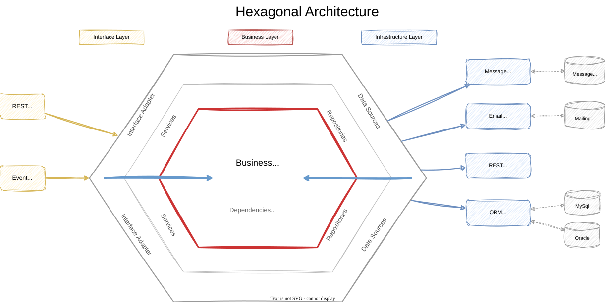
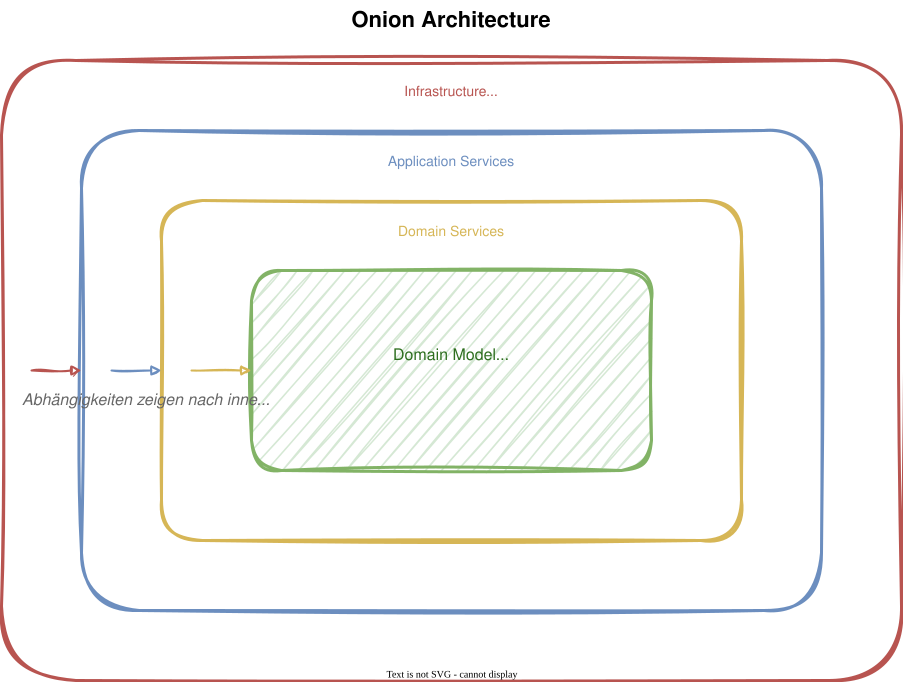
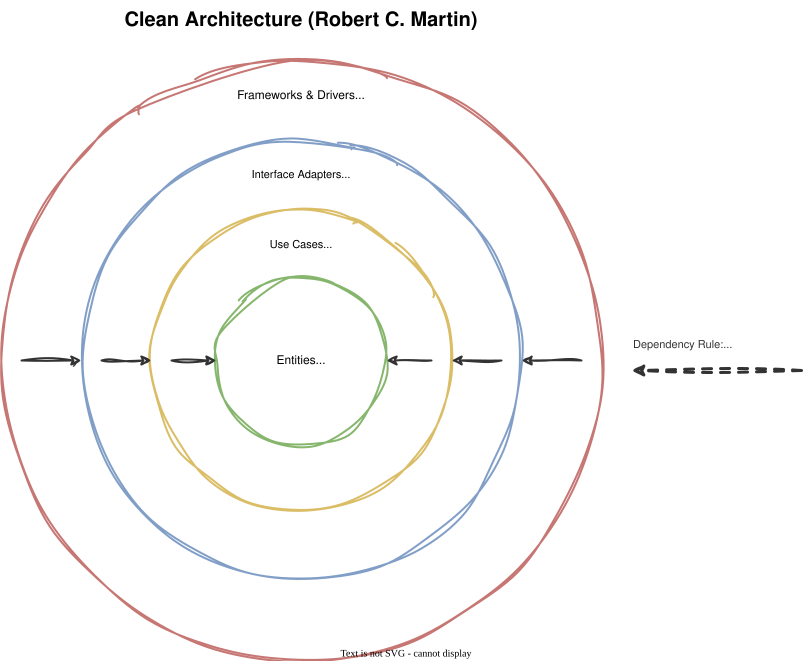
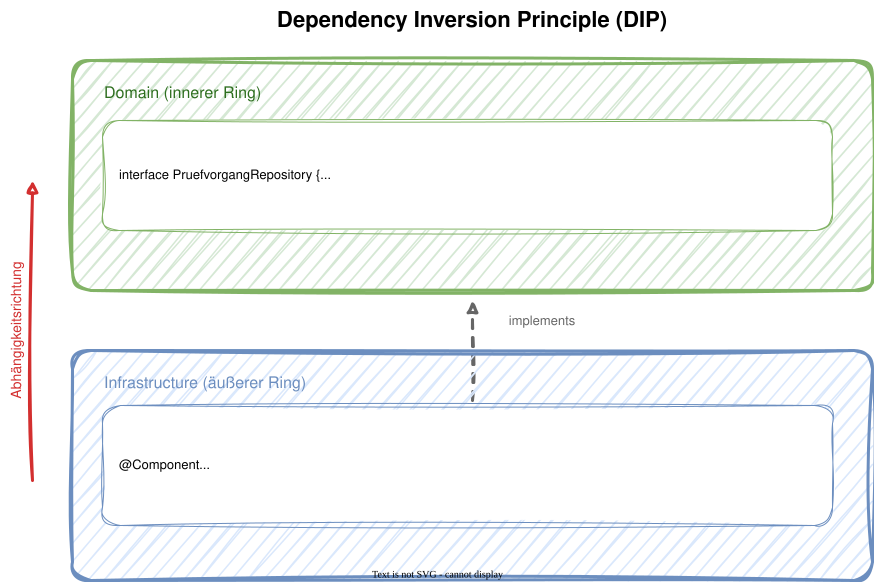
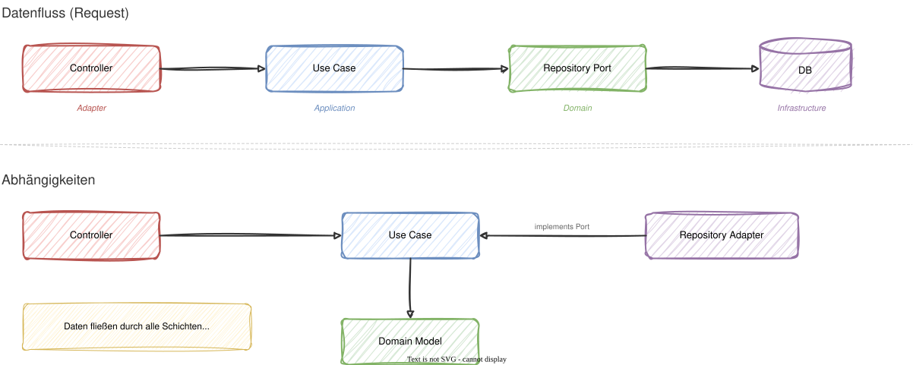
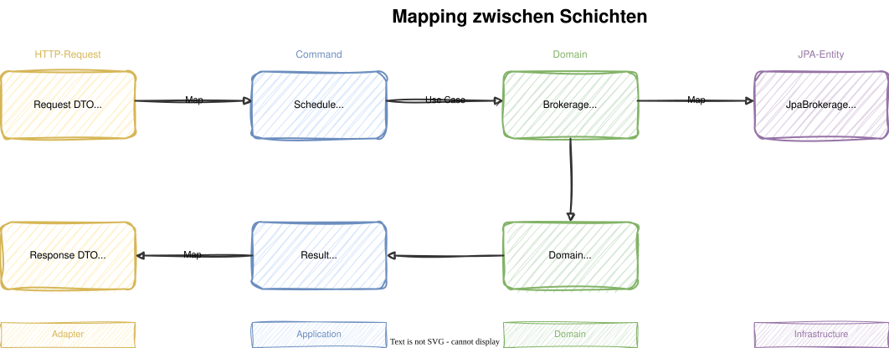

# Modul 07 - Clean Architecture

## Von Hexagonal zu Clean Architecture

---

## Lernziele

- Die historische Entwicklung von Ports & Adapters bis Clean Architecture nachvollziehen
- Die Dependency Rule verstehen und erklären können
- Dependency Inversion als Schlüsselprinzip anwenden
- Die vier Schichten (Ringe) benennen und zuordnen
- Einschätzen, wann ein pragmatischer Kompromiss sinnvoll ist

---

## Historische Entwicklung

| Jahr | Architektur | Urheber |
|------|------------|---------|
| 2005 | Ports & Adapters (Hexagonal) | Alistair Cockburn |
| 2008 | Onion Architecture | Jeffrey Palermo |
| 2012 | Clean Architecture | Robert C. Martin |

- Alle drei verfolgen dasselbe Ziel: Domäne im Zentrum, Infrastruktur am Rand
- Clean Architecture ist eine Synthese der vorherigen Ansätze
- Der gemeinsame Kern: die Dependency Rule

---

## Ports & Adapters (Hexagonal Architecture)

---



---

<style scoped>section { font-size: 1.6em; }</style>

## Ports & Adapters - Konzept

### Driving / Inbound (links)

- Ports definieren, was die Anwendung kann (Use-Case-Interfaces)
- Adapter rufen diese Ports auf (REST-Controller, CLI, UI)
- Richtung: Außenwelt → Anwendung

### Driven / Outbound (rechts)

- Ports definieren, was die Anwendung braucht (Repository-Interfaces)
- Adapter implementieren diese Ports (JPA, Messaging, externe APIs)
- Richtung: Anwendung → Außenwelt

### Kernidee

- Kein Unterschied zwischen "links" und "rechts" - beides sind Adapter
- Die Anwendung kennt nur ihre eigenen Ports, nicht die Adapter

---

## Onion Architecture

### Jeffrey Palermo, 2008

- Stellt die Schichten als konzentrische Ringe dar
- Abhängigkeiten zeigen immer nach innen
- Der Kern (Domain Model) hat keine Abhängigkeiten nach außen

---



---

## Clean Architecture - Robert C. Martin

- Publiziert 2012 (Blog), 2017 (Buch "Clean Architecture")
- Vereint Hexagonal, Onion und weitere Ansätze
- Definiert vier Ringe mit klaren Verantwortlichkeiten

---



---

## Die Dependency Rule

> *"Source code dependencies must point only inward,
> toward higher-level policies."*
> - Robert C. Martin

- Nichts in einem inneren Ring darf etwas aus einem äußeren Ring kennen
- Kein Name, kein Typ, keine Klasse, kein Interface aus dem äußeren Ring
- Daten fließen in beide Richtungen - Abhängigkeiten nur nach innen

---
<style scoped>section { font-size: 1.6em; }</style>

## Die vier Ringe im Detail

| Ring | Verantwortung | Enthält | Spring? |
|------|--------------|---------|---------|
| 1. Entities (innen) | Geschäftsregeln des Unternehmens | Aggregates, Value Objects, Domain Events | Nein |
| 2. Use Cases | Anwendungsspezifische Abläufe | Application Services, Commands, Ports | Minimal (`@Service`) |
| 3. Interface Adapters | Übersetzen zwischen innen und außen | Controller, Request/Response-DTOs, API-Mapper | Ja |
| 4. Frameworks & Drivers (außen) | Technische Infrastruktur | Spring Boot, Spring Data, JPA-Entities, Persistenzklassen, H2, Jackson | Ja |

---

## Dependency Inversion Principle (DIP)

### Das Problem

- Use Case muss Daten persistieren
- Darf aber die Datenbank-Implementierung nicht kennen

### Die Lösung

- Der innere Ring definiert das Interface (Port)
- Der äußere Ring liefert die Implementierung (Adapter)
- Abhängigkeit zeigt nach innen, nicht nach außen

---



---

## Datenfluss vs. Abhängigkeitsrichtung

- Daten fließen durch alle Schichten (Request rein, Response raus)
- Abhängigkeiten zeigen nur nach innen (Controller → Use Case ← Adapter)
- Der Repository-Adapter implementiert das Domain-Interface (Pfeil nach innen!)

---



---

## Before / After: Klassisch → Clean Architecture

### Klassisch: Domain hängt von JPA ab

```java
@Entity                             // ← Framework im Kern
public class AntragsMappe {
    @Id @GeneratedValue
    private Long id;
    @OneToMany(cascade = ALL)
    private List<Flurstueck> flurstuecke;
}
```

---

### Clean Architecture: Domain ist sauber

```java
// domain/model - no Spring, no JPA
public class AntragsMappe {
    private final AntragId id;
    private final List<Flurstueck> flurstuecke;

    public FlurstueckId flurstueckHinzufuegen(
            FlurstueckNummer nummer, BigDecimal flaeche) {
        // Business logic here, not in the service
    }
}
```


> Das JPA-Mapping wandert in eine separate Klasse in `infrastructure`.

---

## Mapping zwischen Schichten



- Jede Schichtgrenze hat eigene Datenstrukturen
- Kein "durchreichen" von JPA-Entities bis zum Controller!
- Mapping ist explizit - mehr Code, aber klare Grenzen

---

## Vorteile der Clean Architecture

### Testbarkeit

| Ring | Testart | Framework nötig? |
|------|---------|-------------------|
| Domain (Entities) | Unit Tests | Nein - reines Java, JUnit 5 |
| Use Cases | Unit Tests + Mocks | Nein - Ports mocken |
| Adapters | Integration Tests | Ja - `@WebMvcTest`, `@DataJpaTest` |
| Full Stack | E2E Tests | Ja - `@SpringBootTest` |

---

```java
@Test
void flurstueck_hinzufuegen_funktioniert() {
    // No Spring context needed!
    var repo = new InMemoryAntragsMappeRepository();
    repo.save(AntragsMappe.erstellen(...));
    var useCase = new FlurstueckHinzufuegenService(repo, mock(ApplicationEventPublisher.class));
    var result = useCase.hinzufuegen(command);
    assertThat(result.flurstueckId()).isNotNull();
}
```

---

## Weitere Vorteile

- Framework-Unabhängigkeit: Spring Boot → Quarkus? Domain bleibt gleich
- Datenbank-Unabhängigkeit: JPA → MongoDB? Nur Adapter tauschen
- UI-Unabhängigkeit: REST → GraphQL? Nur Adapter tauschen
- Domänenfokus: Geschäftslogik steht im Zentrum, nicht die Technik
- Parallele Entwicklung: Teams können an verschiedenen Schichten arbeiten

---
<style scoped>section { font-size: 1.5em; }</style>

## Der Pragmatismus-Trade-off: @Entity in der Domain?

### Puristischer Ansatz (unser Workshop)

- Domain-Modell ohne JPA-Annotationen
- Separate JPA-Entities in `infrastructure`
- Mapping zwischen Domain-Model und JPA-Entity
- Vorteil: Domain ist 100% rein, testbar, portabel
- Nachteil: Mehr Mapping-Code, Duplikation

### Pragmatischer Ansatz

- `@Entity` direkt auf dem Domain-Modell
- Spart Mapping-Code
- Vorteil: Weniger Boilerplate, schneller
- Nachteil: Domain ist an JPA gekoppelt, schwerer zu testen

> Empfehlung: Puristisch für Core Subdomains,
> pragmatisch für Supporting/Generic Subdomains.

---

<style scoped>section { font-size: 1.8em; }</style>

## Clean Architecture vs. klassische Schichtarchitektur

| Aspekt | Klassisch (Layers) | Clean Architecture |
|--------|---------------------|---------------------|
| Abhängigkeiten | UI → Service → Repository → DB | Alle zeigen nach innen (Domain) |
| Domain kennt | JPA, Spring, DB-Schema | Nichts außer Java |
| Framework-Rolle | Durchdringt alles | Nur am Rand (Adapter) |
| Tests | Brauchen DB/Spring | Domain: plain JUnit |
| DB-Wechsel | Ändert Domain | Ändert nur Adapter |
| Mapping | Wenig (Entities durchgereicht) | Explizit (DTO ↔ Domain ↔ JPA) |
| Komplexität | Niedrig | Höher (mehr Struktur) |

---

## Was Clean Architecture NICHT ist

Clean Architecture ist **nicht für jedes Projekt** geeignet.
Es kann einem zu **Over-Engineering** verleiten bei Anwendungsfällen,
die eigentlich simpel mit CRUD zu lösen wären.

Clean Architecture ist kein Dogma!

---

## Wann lohnt es sich?

Bei komplexer Domänenlogik der **Kerndomänen**, die zudem langlebig
ist und von mehreren Teams oder Modulen verwendet wird.

## Wann eher nicht?

Bei reinen CRUD-Anwendungen, generisch-technischen Domänen oder Prototypen.

---

## Clean Architecture in der Praxis

> Aus einer **internen Architekturdokumentation**:
>
> *„Vermeide Entitäten-Frameworks! Implementiere je Modul ein leichtes
> POJO-basiertes Domänenmodell ohne übermächtiges Oberklassen-Framework
> und allzu vielen Abhängigkeiten."*

Das ist die Clean Architecture Dependency Rule in eigenen Worten:
→ Domain-Klassen ohne `@Entity`, ohne Spring, ohne Framework.

> *„Module kommunizieren asynchron und bieten
> **KEINE modulübergreifende Transaktion**."*

Das ist die Motivation für Event-basierte Kommunikation zwischen Modulen,
die keine verteilten Transaktionen braucht.

---

## Clean Architecture verletzt: Ein reales Muster

### Wenn Infrastruktur in die Application-Schicht eindringt

> Ein typisches Problem in gewachsenen Spring-Projekten:
> Der Application Service verwendet `EntityManager` direkt,
> um ein Entity aus dem Persistenzkontext zu lösen.

```java
// ❌ Infrastruktur dringt in die Application-Schicht ein
@Service
public class DateiAnhaengService {

    @PersistenceContext
    private EntityManager entityManager;  // JPA direkt im Service!

    public byte[] ladeInhalt(UUID dateiId) {
        var datei = dateiRepository.findById(dateiId).orElseThrow();
        byte[] inhalt = datei.getInhalt();
        entityManager.detach(datei);  // ← Dependency Rule verletzt
        return inhalt;
    }
}
```

```java
// ✅ Lösung: JPA Projection im Repository kapselt die Infrastruktur
interface DateiInhaltProjektion {
    UUID getId();
    byte[] getInhalt();
}

// Im Repository-Interface — kein EntityManager im Service mehr:
Optional<DateiInhaltProjektion> findInhaltById(UUID id);
```

- `EntityManager` gehört in die Infrastrukturschicht, nicht in `application`
- JPA Projections sind die sauberere Alternative: Der Service bekommt nur was er braucht
- ArchUnit kann diese Verletzung automatisch erkennen (→ Modul 11)
