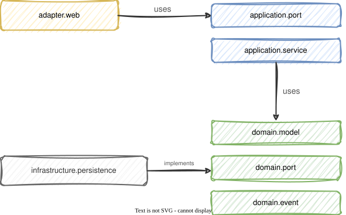
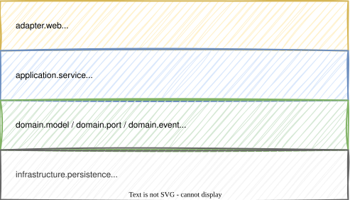

# Modul 08 - Paketstruktur

## Clean Architecture in Spring Boot umsetzen

---

## Lernziele

- Clean Architecture auf eine Spring Boot Paketstruktur abbilden
- Wissen, welcher Code in welches Package gehört
- Domain-Schicht frei von Spring-Abhängigkeiten halten
- Mapper zwischen Schichten implementieren
- Multi-Module vs. Package-only Ansatz bewerten können
- Abhängigkeitsregeln mit ArchUnit absichern

---

## Von Ringen zu Packages

- Clean Architecture definiert konzeptionelle Ringe
- In Spring Boot übersetzen wir diese in Java Packages
- Jedes Package hat klare Verantwortlichkeiten und Abhängigkeitsregeln
- Ziel: Die Dependency Rule wird durch die Paketstruktur sichtbar

```
Clean Architecture Ring          Java Package
─────────────────────────────────────────────────────────────
Entities (innen)            →    domain.model, domain.event
Use Cases                   →    application.service, application.port
Interface Adapters          →    adapter.web, adapter.messaging
Frameworks & Drivers        →    infrastructure.persistence, infrastructure.config
```

---

## Paketstruktur - Übersicht

```text
de.realestate.brokerage            ← Bounded Context
├── domain                            ← Ring 1: Entities
│   ├── model                         ← Aggregates, Entities, Value Objects
│   ├── event                         ← Domain Events (Records)
│   └── port                          ← Outbound-Ports (Repository-Interfaces)
├── application                       ← Ring 2: Use Cases
│   ├── port                          ← Inbound-Ports (Use-Case-Interfaces) (optional)
│   └── service                       ← Use-Case-Implementierungen
├── adapter                           ← Ring 3: Interface Adapters
│   └── web                           ← REST Controller, DTOs, Mapper
└── infrastructure                    ← Ring 4: Frameworks & Drivers
    ├── persistence                   ← JPA Entities, Spring Data Repos, Mapper
    └── config                        ← Spring @Configuration
```

---

## Domain Layer: `domain.model`

- Enthält die wichtigste Geschäftslogik
- Reines Java - keine Spring-Imports, keine JPA-Annotations
- Aggregates, Entities, Value Objects, Domain Services
- Hier findet die Validierung der Entities stattt

---

```java
package de.realestate.brokerage.domain.model;
// Keine Spring-Imports!

public class BrokerageProcess {
    private final ProcessId id;
    private ProcessStatus status;
    private final List<Viewing> viewings;

    public ViewingId scheduleViewing(ContactId prospect,
                                     LocalDateTime appointmentDate) {
        if (status != ProcessStatus.ACTIVE) {
            throw new ProcessNotActiveException(id);
        }
        var viewing = new Viewing(ViewingId.generate(), prospect, appointmentDate);
        viewings.add(viewing);
        return viewing.getId();
    }
}
```

---

## Domain Layer: `domain.port`

- Outbound-Ports: Interfaces für den Zugriff auf externe Ressourcen
- Definiert, was die Domäne von der Außenwelt braucht
- Keine Implementierungsdetails - kein JPA, kein SQL

---

```java
package de.realestate.brokerage.domain.port;

public interface BrokerageProcessRepository {

    ProcessId nextId();
    void save(BrokerageProcess process);
    Optional<BrokerageProcess> findById(ProcessId id);
    List<BrokerageProcess> findByStatus(ProcessStatus status);
    void delete(BrokerageProcess process);
}
```

Kein `extends JpaRepository` - das ist ein reines Domain-Interface!

---

## Domain Layer: `domain.event`

- Domain Events als Java Records (immutable)
- Vergangenheitsform, fachlich benannt
- Keine Framework-Abhängigkeiten

---

```java
package de.realestate.brokerage.domain.event;

public record ViewingScheduled(
    ProcessId processId, ViewingId viewingId,
    ContactId prospectId, LocalDateTime appointmentDate,
    Instant occurredAt
) {
    public ViewingScheduled {
        Objects.requireNonNull(processId);
        Objects.requireNonNull(viewingId);
    }
}
```

Events werden im Aggregate gesammelt und nach dem Speichern von der Infrastruktur dispatched (Event Collection Pattern).

---

## Application Layer: `application.port` (Inbound)

- Inbound-Ports: Interfaces, die beschreiben, was die Anwendung _kann_
- Optional, aber nützlich für Testbarkeit und Dokumentation
- Der Controller kennt nur das Interface, nicht die Implementierung

---

```java
package de.realestate.brokerage.application.port;

public interface ScheduleViewing {
    ViewingId schedule(ScheduleViewingCommand command);
}

public record ScheduleViewingCommand(
    ProcessId processId,
    ContactId prospectId,
    LocalDateTime appointmentDate
) {
    public ScheduleViewingCommand {
        Objects.requireNonNull(processId);
        Objects.requireNonNull(appointmentDate, "Appointment date is required");
    }
}
```

---

## Application Layer: `application.service`

- Implementiert den Inbound-Port (Use Case), falls er getrennt ist
- Orchestriert den Ablauf: laden → Domain aufrufen → speichern
- Hier leben `@Service` und `@Transactional`
- Kennt die Domain, aber nicht die Infrastruktur-Details

---
<style scoped>section { font-size: 1.7em; }</style>

```java
package de.realestate.brokerage.application.service;

@Service
@Transactional
public class ScheduleViewingService implements ScheduleViewing {

    private final BrokerageProcessRepository repository;

    public ScheduleViewingService(BrokerageProcessRepository repository) {
        this.repository = repository;
    }

    @Override
    public ViewingId schedule(ScheduleViewingCommand cmd) {
        var process = repository.findById(cmd.processId())
            .orElseThrow(() -> new ProcessNotFound(cmd.processId()));
        var viewingId = process.scheduleViewing(
            cmd.prospectId(), cmd.appointmentDate());
        repository.save(process);
        return viewingId;
    }
}
```

---

## Adapter Layer: `adapter.web`

- REST-Controller mit `@RestController`
- DTOs als Records für Request und Response
- Mapping: DTO → Command (rein), Domain → ResponseDTO (raus)
- Keine Geschäftslogik - nur Delegation an den Inbound-Port

---
<style scoped>section { font-size: 1.8em; }</style>

```java
package de.realestate.brokerage.adapter.web;

@RestController
@RequestMapping("/api/brokerage/viewings")
public class ViewingController {

    private final ScheduleViewing useCase;

    public ViewingController(ScheduleViewing useCase) {
        this.useCase = useCase;
    }

    @PostMapping
    public ResponseEntity<ViewingResponse> schedule(
            @Valid @RequestBody ViewingRequest request) {
        var id = useCase.schedule(request.toCommand());
        var uri = URI.create("/api/brokerage/viewings/" + id.value());
        return ResponseEntity.created(uri).body(new ViewingResponse(id.value()));
    }
}
```

---
<style scoped>section { font-size: 1.7em; }</style>

## Adapter Layer: DTOs als Records

```java
// Adapter dienen der Übersetzung der äußeren Schicht in die innere.

// Request DTO: kommt von außen und wird validiert
public record ViewingRequest(
    @NotNull UUID processId,
    @NotNull UUID prospectId,
    @NotNull @Future LocalDateTime appointmentDate
) {
    public ScheduleViewingCommand toCommand() {
        return new ScheduleViewingCommand(
            new ProcessId(processId),
            new ContactId(prospectId),
            appointmentDate);
    }
}

// Response DTO: geht nach außen
public record ViewingResponse(UUID viewingId) {}
```

---
<style scoped>section { font-size: 1.4em; }</style>

## Infrastructure: JPA-Entity (separates Modell)

```java
package de.realestate.brokerage.infrastructure.persistence;

@Entity
@Table(name = "brokerage_process")
public class ProcessJpaEntity {

    @Id
    private UUID id;

    @Enumerated(EnumType.STRING)
    private ProcessStatus status;

    private UUID propertyId;

    @OneToMany(cascade = CascadeType.ALL, orphanRemoval = true)
    @JoinColumn(name = "process_id")
    private List<ViewingJpaEntity> viewings = new ArrayList<>();

    protected ProcessJpaEntity() {} // Default Constructor für JPA

    // Getter und Setter
}
```

---
<style scoped>section { font-size: 1.3em; }</style>

## Infrastructure: Mapper zwischen Domain und JPA

```java
@Component
public class ProcessMapper {

    public ProcessJpaEntity toJpaEntity(BrokerageProcess domain) {
        var entity = new ProcessJpaEntity();
        entity.setId(domain.getId().value());
        entity.setStatus(domain.getStatus());
        entity.setPropertyId(domain.getPropertyId().value());
        entity.setViewings(
            domain.getViewings().stream()
                .map(this::toViewingJpa)
                .toList());
        return entity;
    }

    public BrokerageProcess toDomain(ProcessJpaEntity entity) {
        return BrokerageProcess.reconstitute(
            new ProcessId(entity.getId()),
            entity.getStatus(),
            new PropertyId(entity.getPropertyId()),
            entity.getViewings().stream()
                .map(this::toViewingDomain)
                .toList());
    }
}
```

---
<style scoped>section { font-size: 1.1em; }</style>

## Infrastructure: Repository-Adapter

```java
@Repository
public class JpaBrokerageProcessRepository
        implements BrokerageProcessRepository {

    private final ProcessSpringDataRepository jpaRepo;
    private final ProcessMapper mapper;

    public JpaBrokerageProcessRepository(
            ProcessSpringDataRepository jpaRepo,
            ProcessMapper mapper) {
        this.jpaRepo = jpaRepo;
        this.mapper = mapper;
    }

    @Override
    public void save(BrokerageProcess process) {
        jpaRepo.save(mapper.toJpaEntity(process));
    }

    @Override
    public Optional<BrokerageProcess> findById(ProcessId id) {
        return jpaRepo.findById(id.value())
            .map(mapper::toDomain);
    }

    @Override
    public ProcessId nextId() {
        return new ProcessId(UUID.randomUUID());
    }
}
```

---

## Infrastructure: Spring Data (interne Hilfsschnittstelle)

```java
package de.realestate.brokerage.infrastructure.persistence;

// Not public! Only used by the repository adapter.
interface ProcessSpringDataRepository
        extends JpaRepository<ProcessJpaEntity, UUID> {

    List<ProcessJpaEntity> findByStatus(ProcessStatus status);
}
```

- Package-private (`interface` ohne `public`)
- Wird nur vom `JpaBrokerageProcessRepository` verwendet
- Kein Code außerhalb von `infrastructure.persistence` kennt diese Schnittstelle

---

## Abhängigkeitsregeln



---

## Abhängigkeitsregeln

- `domain.*` importiert nichts aus `application`, `infrastructure` oder `adapter`
- `application.*` importiert nur `domain.*`
- `infrastructure.*` implementiert Ports aus `domain.port`
- `adapter.*` kennt `application.port` (und ggf. `domain.model` für Result-Typen)

> Faustregel: Abhängigkeiten zeigen immer Richtung `domain`.

---

## Multi-Module vs. Package-only

| Kriterium | Package-only | Multi-Module |
|-----------|-------------|--------------|
| Aufwand | Gering | Mittel bis hoch |
| Abhängigkeitsschutz | Konvention + ArchUnit | Compiler-enforced |
| Build-Zeit | Schnell | Langsamer (parallelisierbar) |
| Team-Skalierung | 1-2 Teams | Mehrere Teams |
| Domain ohne Spring | Durch Konvention | Durch `pom.xml` erzwungen |
| Empfohlen für | Workshop, MVPs, kleine Teams | Produktivsysteme, große Teams |

---

### Multi-Module - Maven-Beispiel

```xml
<modules>
    <module>brokerage-domain</module>      <!-- No Spring dependency! -->
    <module>brokerage-application</module> <!-- Only domain + @Service -->
    <module>brokerage-infrastructure</module>
    <module>brokerage-adapter-web</module>
    <module>brokerage-boot</module>        <!-- Entry point, all modules -->
</modules>
```

---

## Zusammenfassung



- Jede Schicht hat eigene Datenstrukturen (DTO ≠ Command ≠ Domain ≠ JPA)
- Abhängigkeiten zeigen nur nach innen (Richtung Domain)

---

## Hands-on: Lab-05

### Refactoring zur Paketstruktur
