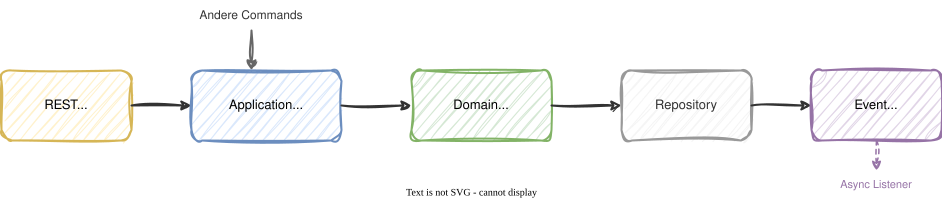
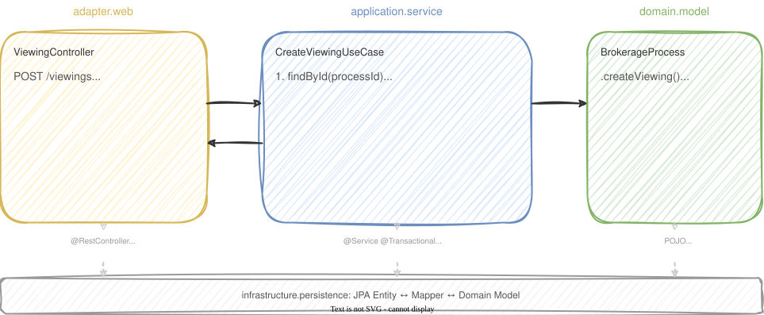

# Modul 09 - Use Cases & Application Services

## Der Orchestrator zwischen Adapter und Domain

---

### Lernziele

- Application Service als Use-Case-Orchestrator verstehen
- Unterschied zwischen Domain Service und Application Service kennen
- Commands und Queries als Java Records modellieren
- `@Transactional` korrekt einsetzen
- Error Handling in Application Services beherrschen
- CQRS-lite: Lese- und Schreib-Use-Cases trennen

---
<style scoped>section { font-size: 1.9em; }</style>

## Was ist ein Application Service?

- Orchestrator für einen konkreten Use Case
- Koordiniert den Ablauf zwischen Domain und Infrastruktur
- Enthält keine Geschäftslogik selbst
- Verantwortlich für:
  - Laden von Aggregates aus Repositories
  - Aufrufen von Domain-Methoden
  - Speichern von Ergebnissen
  - Transaktionssteuerung
  - Technische Nebenwirkungen nur commit-sicher auslösen

> Der Application Service ist der Dirigent - er spielt kein Instrument selbst.

---

## Der Use-Case-Flow



1. Controller empfängt Request, mappt auf Command
2. Application Service lädt Aggregate, ruft Domain-Logik auf
3. Domain führt Geschäftslogik aus und schützt Invarianten
4. Repository persistiert das Ergebnis
5. Response geht zurück; Integrationsereignisse erst nach Commit

---
<style scoped>section { font-size: 1.9em; }</style>

## Application Service vs. Domain Service

| Aspekt | Application Service | Domain Service |
|--------|-------------------|----------------|
| Zweck | Orchestrierung eines Use Case | Domänenlogik über Aggregate hinweg |
| Geschäftslogik | Nein | Ja |
| Abhängigkeiten | Ports (z. B. Repository) | Nur Domain-Objekte |
| Spring | `@Service`, `@Transactional` | Keine (POJO) |
| Schicht | `application.service` | `domain.model` |
| Testbar ohne Spring | Ja (Ports mocken) | Ja (reines Java) |

---
<style scoped>section { font-size: 1.9em; }</style>

## Domain Service - Beispiel

```java
// domain.model - no Spring, no framework
public class CommissionCalculationService {

    public Commission calculate(Property property, PurchaseContract contract) {
        var basis = contract.purchasePrice()
            .multiply(property.commissionRate());

        if (property.isListedBuilding()) {
            return new Commission(basis.multiply(BigDecimal.valueOf(0.95)));
        }
        return new Commission(basis);
    }
}
```

- Reine Domänenlogik, die keinem einzelnen Aggregate gehört
- Keine Abhängigkeit auf Infrastruktur
- Wird vom Application Service aufgerufen, nicht vom Controller

---
<style scoped>section { font-size: 1.3em; }</style>

## Application Service - Vollständiges Beispiel

```java
@Service
public class CreateViewingUseCase {

    private final BrokerageProcessRepository repository;

    public CreateViewingUseCase(BrokerageProcessRepository repository) {
        this.repository = repository;
    }

    @Transactional
    public CreateViewingResult create(CreateViewingCommand command) {
        var process = repository.findById(command.processId())
            .orElseThrow(() -> new ProcessNotFoundException(command.processId()));

        var viewingId = process.addViewing(
            command.prospectName(),
            command.appointmentDate());

        repository.save(process);

        return new CreateViewingResult(viewingId, process.getId());
    }
}
```

---
<style scoped>section { font-size: 1.7em; }</style>

## Command als Java Record

```java
public record CreateViewingCommand(
    UUID processId,
    String prospectName,
    LocalDateTime appointmentDate
) {}
```

- Lebt im Workshop in `application.command`
- Trägt die Absicht des Aufrufers ohne Framework-Abhängigkeit
- Fachregeln bleiben im Domain-Modell; syntaktische Validierung kann im Adapter erfolgen

---
<style scoped>section { font-size: 1.5em; }</style>

## Warum Commands als Records?

| Vorteil | Erklärung |
|---------|-----------|
| Immutability | Einmal erzeugt, nicht mehr änderbar |
| Selbstdokumentation | Der Record beschreibt, was der Use Case braucht |
| Wenig Overhead | Keine Setter, kein Boilerplate, klarer Fokus |
| Kein Boilerplate | `equals()`, `hashCode()`, `toString()` inklusive |
| Testbarkeit | Records sind leicht zu instanziieren |

### Commands vs. DTOs


---
<style scoped>section { font-size: 1.5em; }</style>

## CQRS-lite: Lese- und Schreib-Use-Cases trennen

### Schreibender Use Case (Command)

```java
@Service
public class CreateViewingUseCase {
    @Transactional
    public CreateViewingResult create(CreateViewingCommand command) { ... }
}
```

### Lesender Use Case (Query)

```java
@Service
public class ListViewingsUseCase {
    @Transactional(readOnly = true)
    public List<Viewing> list(UUID processId) { ... }
}
```

- Schreibend: Ändert State und speichert Aggregate
- Lesend: Separater read-only Use Case für Abfragen
- Im Workshop bewusst pragmatisch: getrennte Use Cases, aber noch kein separates Read Model

---
<style scoped>section { font-size: 1.4em; }</style>

## Read-Only Use Case im Workshop

```java
@Service
@Transactional(readOnly = true)
public class ListViewingsUseCase {

    private final BrokerageProcessRepository repository;

    public ListViewingsUseCase(BrokerageProcessRepository repository) {
        this.repository = repository;
    }

    public List<Viewing> list(UUID processId) {
        var process = repository.findById(processId)
            .orElseThrow(() -> new ProcessNotFoundException(processId));
        return process.getViewings();
    }
}
```

> `readOnly = true` erlaubt Hibernate-Optimierungen (kein Dirty Checking).

---
<style scoped>section { font-size: 1.2em; }</style>

## Result-Typen: Was gibt ein Use Case zurück?

### Schreibende Use Cases

```java
CreateViewingResult create(CreateViewingCommand command);

public record CreateViewingResult(
    UUID viewingId,
    UUID processId
) {}
```

### Mutierende Use Cases ohne neue Ressource

```java
void complete(CompleteViewingCommand command);
```

### Lese-Use-Cases im Workshop

- oft `readOnly = true`
- eigener Use Case statt Wiederverwendung eines Schreib-Services
- Mapping auf Response-DTOs typischerweise im Adapter

---
<style scoped>section { font-size: 1.5em; }</style>

## `@Transactional` - Wo und Warum?

### Richtig: Auf dem Application Service

```java
@Service
public class CreateViewingUseCase {

    @Transactional  // ← entire use case = one transaction
    public CreateViewingResult create(CreateViewingCommand command) {
        var process = repository.findById(command.processId())
            .orElseThrow(() -> new ProcessNotFoundException(command.processId()));
        var id = process.addViewing(
            command.prospectName(),
            command.appointmentDate());
        repository.save(process);
        return new CreateViewingResult(id, process.getId());
    }
}
```

---

### Falsch: Auf der Domain

```java
// Domain should remain framework-free!
public class BrokerageProcess {
    @Transactional  // ← NEVER
    public UUID addViewing(...) { }
}
```

---
<style scoped>section { font-size: 1.3em; }</style>

## `@Transactional` - Best Practices

| Regel | Warum |
|-------|-------|
| Ein Use Case = eine Transaktion | Unit of Work Pattern |
| `@Transactional` auf der Service-Methode | Nicht tiefer (Domain) und nicht höher (Controller) |
| `readOnly = true` für Leseoperationen | Hibernate-Optimierung, kein Dirty Checking |
| Rollback bei Runtime Exceptions | Ist Standardverhalten von Spring |
| Checked Exceptions: `rollbackFor = ...` | Sonst kein automatischer Rollback |

> Wenn später Domain Events dazukommen: nicht direkt nach `save()` feuern, sondern erst after commit oder per Outbox.

---

### Warnung: Selbstaufruf

```java
@Service
public class MyService {
    @Transactional
    public void methodA() { /* ... */ }

    public void methodB() {
        methodA();  // ← @Transactional wird IGNORIERT! (Proxy-Problem)
    }
}
```

> Spring-Proxies fangen nur externe Aufrufe ab.

---
<style scoped>section { font-size: 1.6em; }</style>

## Error Handling - Zwei Kategorien

### Domain Exceptions (fachlich)

```java
public class ProcessNotFoundException extends RuntimeException {
    public ProcessNotFoundException(UUID id) {
        super("BrokerageProcess with ID " + id + " not found");
    }
}
```

- Im Workshop starten wir bewusst schlicht mit konkreten Exceptions
- Eine gemeinsame `DomainException`-Hierarchie ist ein möglicher nächster Schritt

---

<style scoped>section { font-size: 1.3em; }</style>

## Error Handling: Exception → HTTP-Response

```java
// In the application service: let exceptions propagate!
@Transactional
public CreateViewingResult create(CreateViewingCommand command) {
    var process = repository.findById(command.processId())
        .orElseThrow(() -> new ProcessNotFoundException(command.processId()));
    var id = process.addViewing(
        command.prospectName(),
        command.appointmentDate());
    repository.save(process);
    return new CreateViewingResult(id, process.getId());
    // No try/catch - exceptions flow to the controller advice
}
```

---

```java
// In the adapter: exception → HTTP status code
@RestControllerAdvice
public class GlobalExceptionHandler {

    @ExceptionHandler(ProcessNotFoundException.class)
    public ProblemDetail handleProcessNotFoundException(
            ProcessNotFoundException ex) {
        var problem = ProblemDetail.forStatusAndDetail(
            HttpStatus.NOT_FOUND, ex.getMessage());
        problem.setTitle("Not Found");
        return problem;
    }
}
```

---

## Gesamtbild: Ein Use Case End-to-End



---

## Zusammenfassung

- Application Service = Use-Case-Orchestrator, keine Geschäftslogik
- Domain Service = Domänenlogik über Aggregate hinweg
- Commands als schlanke Java Records in `application.command`
- CQRS-lite: getrennte Lese- und Schreib-Use-Cases, noch ohne eigenes Read Model
- `@Transactional` gehört auf den Application Service, nicht auf die Domain
- Technische Nebenwirkungen nur nach Commit auslösen
- Exceptions propagieren zum `@RestControllerAdvice`
- Der Application Service ist dünn - die Logik steckt in der Domain

---

## Hands-on: Lab 06

### Einen Use-Case implementieren
