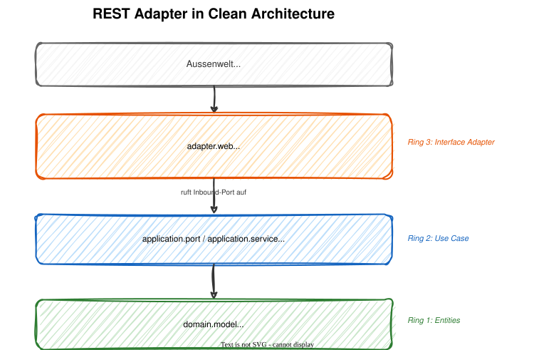

# Modul 10 - REST Adapter

## Der Inbound Adapter in Clean Architecture

Geschätzte Dauer: ca. 70 Minuten

### Lernziele

- `@RestController` als Inbound Adapter in Clean Architecture verstehen
- DTOs als Records gestalten - niemals Domain-Objekte exponieren
- Mapping zwischen DTOs, Commands und Domain sicher umsetzen
- REST-Endpunkte für CRUD korrekt mit HTTP-Statuscodes modellieren
- Problem Details (RFC 9457) mit Spring Boot 4 implementieren
- Integration Tests mit `@WebMvcTest` schreiben

---

## Der REST Adapter in Clean Architecture



- Der Controller ist ein Adapter - er übersetzt HTTP in Domain-Sprache
- Er kennt `application.port`, aber nicht `infrastructure`

---
<style scoped>section { font-size: 1.3em; }</style>

## Warum DTOs? Niemals Domain-Objekte exponieren

| Problem | Was passiert ohne DTOs |
|---------|----------------------|
| Kopplung | API-Änderung erzwingt Domain-Änderung (und umgekehrt) |
| Sicherheit | Interne Felder werden sichtbar (z.B. `domainEvents`) |
| Serialisierung | Jackson-Annotationen wandern in die Domain |
| Versionierung | Keine unabhängige API-Evolution möglich |
| Zirkuläre Deps | Domain kennt plötzlich `com.fasterxml.jackson` |

```java
// NEVER:
@GetMapping("/{id}")
public AntragsMappe getById(@PathVariable UUID id) {
    return repository.findById(new AntragId(id)).orElseThrow();
}
```

> DTOs gehören zum Adapter - sie sind der API-Kontrakt mit der Außenwelt.

---

## Record-basierte DTOs - Request

```java
package de.foerderung.antragstellung.adapter.web;

public record FlurstuckHinzufuegenRequest(
    @NotNull UUID antragsmappeId,
    @NotNull @Size(min = 1, max = 30) String flurstueckNummer,
    @NotNull @Positive BigDecimal flaeche
) {
    // Mapping: DTO → Command (primitive types → value objects)
    public FlurstueckHinzufuegenCommand toCommand() {
        return new FlurstueckHinzufuegenCommand(
            new AntragId(antragsmappeId),
            new FlurstueckNummer(flurstueckNummer),
            flaeche);
    }
}
```

---

## Record-basierte DTOs - Request

- Java Records sind ideal für DTOs: immutable, kompakt
- Bean Validation direkt auf den Record-Komponenten
- `toCommand()` erzeugt Value Objects aus primitiven Typen
- Kein Boilerplate: `equals()`, `hashCode()`, `toString()` inklusive
- `toCommand()` liegt bewusst im DTO: der Adapter darf den Application-Layer kennen

---

## Record-basierte DTOs - Response

```java
public record FlurstueckResponse(
    UUID flurstueckId,
    UUID antragsmappeId,
    String flurstueckNummer,
    BigDecimal flaeche
) {
    // Factory: domain result → response DTO
    public static FlurstueckResponse from(
            FlurstueckId id,
            AntragId antragsmappeId,
            FlurstueckNummer nummer,
            BigDecimal flaeche) {
        return new FlurstueckResponse(
            id.value(), antragsmappeId.value(), nummer.wert(), flaeche);
    }
}
```

---

## Record-basierte DTOs - Response

```java
public record AntragsmappeDetailResponse(
    UUID id, String status, int flurstueckAnzahl,
    List<FlurstueckSummaryResponse> flurstuecke
) {
    public static AntragsmappeDetailResponse from(AntragsmappeDetails details) { /* ... */ }
}
```

- Response-DTOs verwenden primitive Typen (UUID, String) - keine Value Objects
- `from()`-Factory macht das Mapping explizit und testbar

---
<style scoped>section { font-size: 1.2em; }</style>

## REST Controller - POST (Ressource erstellen)

```java
@RestController
@RequestMapping("/api/v1/antragstellung/flurstuecke")
public class FlurstueckController {

    private final FlurstueckHinzufuegen hinzufuegenUseCase;
    private final FlurstueckeAbfragen abfragenUseCase;
    private final AntragEinreichen einreichenUseCase;

    public FlurstueckController(FlurstueckHinzufuegen hinzufuegenUseCase,
                                FlurstueckeAbfragen abfragenUseCase,
                                AntragEinreichen einreichenUseCase) {
        this.hinzufuegenUseCase = hinzufuegenUseCase;
        this.abfragenUseCase = abfragenUseCase;
        this.einreichenUseCase = einreichenUseCase;
    }

    @PostMapping
    public ResponseEntity<FlurstueckResponse> create(
            @Valid @RequestBody FlurstuckHinzufuegenRequest request) {
        var result = hinzufuegenUseCase.hinzufuegen(request.toCommand());
        var uri = ServletUriComponentsBuilder.fromCurrentRequest()
            .path("/{id}").buildAndExpand(result.flurstueckId().value()).toUri();
        var response = FlurstueckResponse.from(
            result.flurstueckId(), result.antragsmappeId(),
            result.flurstueckNummer(), result.flaeche());
        return ResponseEntity.created(uri).body(response);
    }
}
```

> `ServletUriComponentsBuilder` erzeugt die `Location`-URI inkl. Host, Port und Context-Path.

---
<style scoped>section { font-size: 1.5em; }</style>

## REST Controller - GET und PUT

```java
@GetMapping("/{id}")
public ResponseEntity<FlurstueckResponse> getById(
        @PathVariable UUID id) {
    return abfragenUseCase.findById(new FlurstueckId(id))
        .map(FlurstueckResponse::from)
        .map(ResponseEntity::ok)
        .orElse(ResponseEntity.notFound().build());
}

@PutMapping("/{antragsmappeId}/einreichen")
public ResponseEntity<Void> einreichen(@PathVariable UUID antragsmappeId) {
    einreichenUseCase.execute(
        new AntragEinreichenCommand(new AntragId(antragsmappeId)));
    return ResponseEntity.noContent().build();
}
```

- Alle Use Cases sind im Konstruktor deklariert (vorherige Slide)
- GET gibt `FlurstueckResponse` zurück - konsistent mit dem Ressourcen-Typ
- PUT auf Sub-Ressource `/einreichen` modelliert die fachliche Aktion "Antrag einreichen"

---

<style scoped>section { font-size: 1.5em; }</style>

## HTTP Status Codes - Best Practices

| Methode | Erfolg | Fehler |
|---------|--------|--------|
| `POST` (erstellen) | `201 Created` + `Location`-Header | `400` / `422` |
| `GET` (lesen) | `200 OK` | `404 Not Found` |
| `PUT` (ändern) | `200 OK` oder `204 No Content` | `404` / `422` |
| `DELETE` (löschen) | `204 No Content` | `404` |

### Fachliche Fehler vs. technische Fehler

| Kategorie | HTTP-Status | Beispiel |
|-----------|------------|---------|
| Syntaktisch ungültig | `400 Bad Request` | Bean Validation fehlgeschlagen |
| Ressource nicht gefunden | `404 Not Found` | Unbekannte AntragId |
| Fachliche Regel verletzt | `422 Unprocessable Entity` | Einreichen ohne Flurstück |
| Interner Fehler | `500 Internal Server Error` | Unerwarteter Datenbankfehler |

---
<style scoped>section { font-size: 1.5em; }</style>

## Problem Details - RFC 9457

Spring Boot 4 unterstützt RFC 9457 nativ mit der `ProblemDetail`-Klasse:

```json
{
  "type": "https://api.foerderung.example/errors/antragsmappe-nicht-gefunden",
  "title": "AntragsMappe nicht gefunden",
  "status": 404,
  "detail": "Keine AntragsMappe mit ID 550e8400-e29b-41d4-a716-446655440000",
  "instance": "/api/v1/antragstellung/flurstuecke"
}
```

### Aktivierung

```yaml
# application.yml
spring:
  mvc:
    problemdetails:
      enabled: true
```

- Standardisiertes Fehlerformat - maschinenlesbar und menschenlesbar
- Jeder Fehlertyp bekommt eine eigene URI (`type`-Feld)

---

<style scoped>section { font-size: 1.3em; }</style>

## @RestControllerAdvice mit ProblemDetail

```java
@RestControllerAdvice
public class DomainExceptionHandler {

    @ExceptionHandler(AntragsmappeNichtGefundenException.class)
    public ProblemDetail handleNotFound(AntragsmappeNichtGefundenException ex) {
        var problem = ProblemDetail.forStatusAndDetail(
            HttpStatus.NOT_FOUND, ex.getMessage());
        problem.setTitle("AntragsMappe nicht gefunden");
        problem.setType(URI.create(
            "https://api.foerderung.example/errors/antragsmappe-nicht-gefunden"));
        return problem;
    }

    @ExceptionHandler(AntragstellungDomainException.class)
    public ProblemDetail handleDomainViolation(AntragstellungDomainException ex) {
        var problem = ProblemDetail.forStatusAndDetail(
            HttpStatus.UNPROCESSABLE_ENTITY, ex.getMessage());
        problem.setTitle("Fachliche Regel verletzt");
        problem.setType(URI.create(
            "https://api.foerderung.example/errors/domaene-verletzt"));
        return problem;
    }
}
```

> Alternative: Für einfache Fälle ohne eigene `type`-URI reicht `@ResponseStatus(HttpStatus.NOT_FOUND)` direkt auf der Exception-Klasse. `@RestControllerAdvice` lohnt sich, wenn `ProblemDetail`-Felder individuell gesetzt werden sollen.

---
<style scoped>section { font-size: 1.2em; }</style>

## Integration Test mit @WebMvcTest

```java
@WebMvcTest(FlurstueckController.class)
class FlurstueckControllerTest {

    @Autowired private MockMvc mockMvc;
    @MockitoBean private FlurstueckHinzufuegen hinzufuegenUseCase;
    @MockitoBean private FlurstueckeAbfragen abfragenUseCase;
    @MockitoBean private AntragEinreichen einreichenUseCase;

    @Test
    void flurstueck_hinzufuegen_erstellt_ressource() throws Exception {
        var result = new FlurstueckHinzufuegenResult(
            new FlurstueckId(UUID.randomUUID()),
            new AntragId(UUID.randomUUID()),
            new FlurstueckNummer("BW-0012-0034-0001"),
            new BigDecimal("3.75"));
        when(hinzufuegenUseCase.hinzufuegen(any())).thenReturn(result);

        mockMvc.perform(post("/api/v1/antragstellung/flurstuecke")
                .contentType(MediaType.APPLICATION_JSON)
                .content("""
                    {
                      "antragsmappeId": "550e8400-e29b-41d4-a716-446655440000",
                      "flurstueckNummer": "BW-0012-0034-0001",
                      "flaeche": 3.75
                    }
                    """))
            .andExpect(status().isCreated())
            .andExpect(header().exists("Location"))
            .andExpect(jsonPath("$.flurstueckId").value(
                result.flurstueckId().value().toString()));
    }
}
```

---
<style scoped>section { font-size: 1.5em; }</style>

## @WebMvcTest - Fehlerfall testen

```java
@Test
void unbekannte_antragsmappe_gibt_404() throws Exception {
    when(hinzufuegenUseCase.hinzufuegen(any()))
        .thenThrow(new AntragsmappeNichtGefundenException(
            new AntragId(UUID.randomUUID())));

    mockMvc.perform(post("/api/v1/antragstellung/flurstuecke")
            .contentType(MediaType.APPLICATION_JSON)
            .content("""
                {
                  "antragsmappeId": "550e8400-e29b-41d4-a716-446655440000",
                  "flurstueckNummer": "BW-0012-0034-0001",
                  "flaeche": 3.75
                }
                """))
        .andExpect(status().isNotFound())
        .andExpect(jsonPath("$.title")
            .value("AntragsMappe nicht gefunden"));
}
```

- `@WebMvcTest` lädt einen reduzierten Spring-Kontext - nur Web-Layer, keine Services, keine DB
- Use Cases werden mit `@MockitoBean` gemockt
- Testet: Routing, Serialisierung, Validation, Exception Handling

---

## Zusammenfassung

- `@RestController` ist ein Inbound Adapter - übersetzt HTTP ↔ Domain-Sprache
- DTOs als Records - niemals Domain-Objekte über die API exponieren
- Request-DTO → `toCommand()` → Value Objects, Result → `from()` → Response-DTO
- HTTP Status Codes: `201` (POST), `200` (GET), `204` (PUT/DELETE), `404`, `422`
- Problem Details (RFC 9457) für standardisierte Fehlermeldungen
- `@RestControllerAdvice` fängt Domain Exceptions und mappt auf `ProblemDetail`
- `@WebMvcTest` testet den Adapter isoliert ohne Datenbank

---

## Hands-on: Lab 07

### REST-Adapter implementieren

1. Request- und Response-DTOs als Java Records erstellen
2. `FlurstueckController` mit POST und GET Endpunkt implementieren
3. Manuelles Mapping: `toCommand()` und `from()` Methoden
4. `@RestControllerAdvice` mit Problem Details (RFC 9457) einrichten
5. Integration Test mit `@WebMvcTest` schreiben

> Dauer: ca. 45 Minuten
> Details und Aufgabenstellung im Lab-07

---

## Diskussion: Adapter-Grenzen in der Praxis

> Welche API-Design-Entscheidungen sind in eurem Kontext wichtig?

- Wie handhabt ihr API-Versionierung (URL-Pfad, Header, Query-Parameter)?
- Wie dokumentiert ihr eure APIs (OpenAPI/Swagger, Spring REST Docs)?

**Externe DTOs und das ACL-Prinzip:**

> Ein typisches Muster in integrierten Systemen: externe Systeme liefern Datenstrukturen
> (z.B. Buchungscodes, Berechtigungsmodelle, Statuswerte), die direkt als Request-DTO
> ins Domain-Modell wandern — ohne Übersetzung an der Adapter-Grenze.

```java
// ❌ Externes DTO direkt im Controller als Domain-Input verwenden
@PostMapping("/berechtigungen")
public void setzeBerechtigungen(ExternesSystemBerechtigungDTO dto) {
    // externes Datenmodell direkt im Domain-Service!
    berechtigungService.apply(dto);
}

// ✅ Übersetzung im Adapter — Domain kennt externe Formate nicht
@PostMapping("/berechtigungen")
public void setzeBerechtigungen(ExternesSystemBerechtigungDTO dto) {
    var command = translator.translate(dto); // ← ACL im Adapter
    berechtigungService.anwenden(command);
}
```

- Welche Request-DTOs in euren Controllern stammen direkt aus einem externen System?
- Wo übernimmt ein Controller heute Aufgaben, die eigentlich ein ACL-Translator erledigen sollte?
- Was passiert, wenn das externe System sein DTO ändert — wie weit reicht die Änderung?
- Wer ist verantwortlich für die Übersetzung: Controller, Service, oder ein dedizierter Translator?
