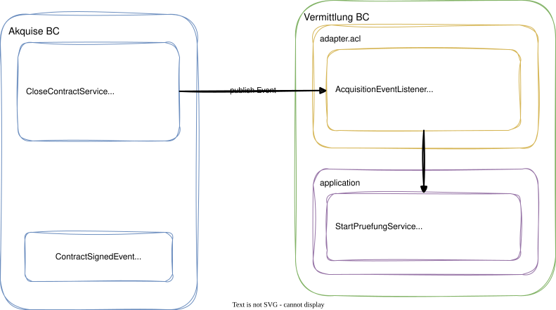

# Modul 12 - Context Integration

## Bounded Contexts verbinden - ACL, Events, Kafka

Geschätzte Dauer: ca. 60 Minuten

### Lernziele

- Context-Mapping-Patterns (aus Modul 05) technisch umsetzen
- Anti-Corruption Layer zwischen Bounded Contexts implementieren
- Den Unterschied zwischen At-Most-Once und At-Least-Once Delivery verstehen
- Transactional Outbox Pattern als Lösung für zuverlässige Event-Zustellung kennen
- Idempotente Event-Verarbeitung sicherstellen
- Den Weg von In-Process Events zu Kafka nachvollziehen
- Wissen, wo ACL-Code in der Paketstruktur lebt

---

## Warum Context Integration?

- Bounded Contexts sind bewusst voneinander getrennt
- Trotzdem müssen Geschäftsprozesse kontextübergreifend ablaufen

### Beispiel in der Förderantragsverwaltung

- `Antragstellung` publiziert `AntragsmappeEingereicht`
- `Fachliche Prüfung` reagiert darauf und startet einen `Pruefvorgang`

- Lose Kopplung durch Events statt direkte Methodenaufrufe
- Jeder BC behält seine eigene Ubiquitous Language
- Die Übersetzung findet im Anti-Corruption Layer statt

---
<style scoped>section { font-size: 1.55em; }</style>

## Praxisbeispiel: Hunderte MDBs = hunderte unvollständige ACLs

### Das Problem in gewachsenen Systemen

In manchen Systemen läuft die gesamte BC-Kommunikation über **JMS Topics**:

```
Antragstellung  ──[topic/AntragGeaendert]──►  Zahlreiche MDBs im Legacy-System
                ──[topic/ZahlungFreigegeben]──────►  Auszahlung-MDBs
                ──[topic/ZahlungVermerkt]────────►  Bescheid-MDBs
```

**Was wir haben:** Zahlreiche `@MessageDriven`-Beans, die auf JMS-Topics hören.

**Was DDD draus macht:** Ebenso viele potenzielle Anti-Corruption Layers — nur leider ohne den entscheidenden Teil: den **Translator**.

```java
// Was heute in jeder MDB passiert — direkt, ohne Übersetzung:
@Override
public void onMessage(Message message) {
    AntragsmappeAenderung aend =
        (AntragsmappeAenderung) ((ObjectMessage) message).getObject();
    // ↑ Fremdes Domänenobjekt direkt verwendet — das ist Conformist, kein ACL!
    optimusPrime.synchronisiere(aend.getRegistrationNumber());
}
```

> Ziel dieses Moduls: Verstehen, was fehlt — und wie man es richtig macht.

---
<style scoped>section { font-size: 1.7em; }</style>

## Context-Mapping-Patterns: Technische Umsetzung

| Pattern (Modul 05) | Technische Umsetzung |
|--------------------|---------------------|
| Customer/Supplier | Event Publishing + ACL-Listener |
| Open Host Service | REST API mit Published Language (JSON Schema) |
| Published Language | Versioniertes Austauschformat, z. B. JSON Schema oder Event Contract |
| Anti-Corruption Layer | Translator-Klasse an der Modul-Grenze |
| Conformist | Event direkt verwenden, kein eigenes Modell |
| Shared Kernel | Shared-Modul mit Value Objects |
| Partnership | Gemeinsame Abstimmung, oft gemeinsamer Release- und Änderungsprozess |
| Separate Ways | Keine Integration |

> In diesem Modul fokussieren wir uns auf Event-basierte Integration
> mit ACL - das häufigste Pattern in modularen Monolithen.

---
<style scoped>section { font-size: 1.7em; }</style>

## Cross-BC-Event publizieren

### Schritt 1: Event im publizierenden BC definieren

```java
// Public API of the Antragstellung module (NOT in internal/)
package de.foerderung.antragstellung;

public record AntragsmappeEingereicht(
    UUID antragsmappeId,
    String registrierungsNummer,
    Instant eingereichtAm
) {
    public AntragsmappeEingereicht(UUID antragsmappeId, String registrierungsNummer) {
        this(antragsmappeId, registrierungsNummer, Instant.now());
    }
}
```

- Event verwendet primitive Typen (UUID, String) - keine Value Objects des BCs
- Liegt im Root-Package des Moduls = öffentliche API
- Andere Module dürfen dieses Record importieren

---
<style scoped>section { font-size: 1.7em; }</style>

## Cross-BC-Event publizieren

### Schritt 2: Application Service dispatched nach dem Speichern

```java
package de.foerderung.antragstellung.internal;

@Service
@RequiredArgsConstructor
public class AntragEinreichenService implements AntragEinreichen {

    private final AntragsMappeRepository repository;
    private final ApplicationEventPublisher eventPublisher;

    @Transactional
    @Override
    public void execute(AntragEinreichenCommand cmd) {
        var mappe = repository.findById(cmd.antragsmappeId()).orElseThrow();
        mappe.einreichen();
        repository.save(mappe);
        mappe.domainEvents().forEach(eventPublisher::publishEvent);
        mappe.clearDomainEvents();
    }
}
```

---
<style scoped>section { font-size: 1.7em; }</style>

## Anti-Corruption Layer - Konzept

### Das Problem

- Das Event `AntragsmappeEingereicht` spricht die Antragstellungs-Sprache
- Der Prüfungs-BC kennt keine "AntragsMappe" - er arbeitet mit `Pruefvorgang`
- Ohne ACL: Antragstellungs-Konzepte "infizieren" das Prüfungs-Domänenmodell


---
<style scoped>section { font-size: 1.7em; }</style>

## ACL: Wo lebt der Code?

### Paketstruktur des konsumierenden BC

```
de.foerderung.pruefung
├── PruefungApi.java                 ← öffentliche API
├── internal
│   ├── domain
│   │   └── model
│   │       └── Pruefvorgang.java
│   ├── application
│   │   └── PruefungStartenService.java
│   └── adapter
│       └── acl                      ← Anti-Corruption Layer
│           ├── AntragstellungEventTranslator.java
│           └── AntragstellungEventListener.java
```

- Der ACL ist ein Adapter des konsumierenden BC
- Er gehört in die Adapter-Schicht (äußerer Ring)
- Der Application Service kennt nur seinen eigenen Command

---
<style scoped>section { font-size: 1.7em; }</style>

## ACL-Implementierung: Translator

```java
package de.foerderung.pruefung.internal.adapter.acl;

@Component
public class AntragstellungEventTranslator {

    public PruefungStartenCommand translate(
            AntragsmappeEingereicht event) {
        return new PruefungStartenCommand(
            new AntragsReferenz(event.antragsmappeId()),
            new RegistrierungsNummer(event.registrierungsNummer()),
            event.eingereichtAm()
        );
    }
}
```

- Fremde IDs werden in eigene Value Objects gewrappt
- Fremde Begriffe werden in eigene Domänensprache übersetzt
- `AntragsmappeEingereicht` (Antragstellung) → `PruefungStartenCommand` (Prüfung)
- Der Translator ist ein reiner Mapper - keine Geschäftslogik

---
<style scoped>section { font-size: 1.7em; }</style>

## ACL-Implementierung: Event Listener

```java
package de.foerderung.pruefung.internal.adapter.acl;

@Component
@RequiredArgsConstructor
public class AntragstellungEventListener {

    private final AntragstellungEventTranslator translator;
    private final PruefungStartenService service;

    @TransactionalEventListener(phase = AFTER_COMMIT)
    public void on(AntragsmappeEingereicht event) {
        var command = translator.translate(event);
        service.start(command);
    }
}
```

- Listener delegiert sofort an den Translator - Application Service kennt nur eigene Commands
- Keine Abhängigkeit des Prüfungs-Domänenmodells auf Antragstellungs-Klassen
- `AFTER_COMMIT`: Listener läuft nach der Publisher-Transaktion - ohne Retry.
  Bei Fehler geht das Event verloren (At-Most-Once)

---
<style scoped>section { font-size: 1.55em; }</style>

## Transactional Outbox Pattern: Zuverlässige Event-Zustellung

### Das Problem mit `@TransactionalEventListener(phase = AFTER_COMMIT)`

```
Transaktion committed  ✅
   → Event wird an Listener gesendet
      → Listener-JVM crasht / DB down     ❌  Event verloren!
```

At-Most-Once reicht nicht aus, wenn Events Geschäftsprozesse auslösen.

### Die Lösung: Outbox-Tabelle in derselben Transaktion

```java
@Transactional
public void execute(AntragEinreichenCommand cmd) {
    var mappe = repository.findById(cmd.antragsmappeId()).orElseThrow();
    mappe.einreichen();
    repository.save(mappe);
    // Event wird in outbox_events-Tabelle gespeichert — gleiche Transaktion!
    outboxRepository.save(new OutboxEvent("AntragsmappeEingereicht",
        mappe.getId().toString(), serialize(mappe.domainEvents())));
}
```

Ein separater **Outbox-Poller** liest unverarbeitete Events und publiziert sie:

```java
@Scheduled(fixedDelay = 500)
@Transactional
public void poll() {
    // Wichtig: Limit! findUnpublished() ohne Limit → OOM bei Rückstau
    outboxRepository.findTopUnpublished(100).forEach(event -> {
        eventPublisher.publishEvent(deserialize(event));
        outboxRepository.markPublished(event.getId());
    });
    // 0 verarbeitete Events = fertig; nächster Durchlauf in 500 ms
}
```

> **OOM-Falle:** `findAllUnpublished()` ohne Limit lädt bei einem Backlog
> von 50.000 Events alles in den Heap — Pod-Kill garantiert.
> Immer in Batches verarbeiten (`findTop100...`, `LIMIT 100`).

> Garantie: Event wird genau dann publiziert, wenn der Domänen-Zustand
> persistiert wurde. Crash vor dem Poller → Event bleibt in der Outbox → Retry.

---
<style scoped>section { font-size: 1.6em; }</style>

## Outbox: Spring Modulith EventPublicationRegistry

Spring Modulith bietet eine fertige Outbox-Implementierung:

```java
// Keine manuelle outbox_events-Tabelle nötig!
// Spring Modulith schreibt Events automatisch in JDBC-backed Registry

@Transactional
public void execute(AntragEinreichenCommand cmd) {
    var mappe = repository.findById(cmd.antragsmappeId()).orElseThrow();
    mappe.einreichen();
    repository.save(mappe);
    mappe.domainEvents().forEach(eventPublisher::publishEvent);
    // ↑ Spring Modulith speichert Events in event_publication-Tabelle
    //   und markiert sie nach erfolgreichem Listener als COMPLETED
}
```

```java
// Unvollendete Events (z.B. nach Absturz) werden automatisch redelivered:
@TransactionalEventListener
public void on(AntragsmappeEingereicht event) {
    // Bei Fehler: Event bleibt als INCOMPLETE → Spring Modulith redelivert
    pruefungService.start(translator.translate(event));
}
```

| Eigenschaft | Ohne Outbox | Mit Spring Modulith Outbox |
|-------------|-------------|---------------------------|
| Delivery | At-Most-Once | At-Least-Once |
| Crash-Sicherheit | Events verloren | Events bleiben erhalten |
| Infrastruktur | Keine | JDBC-Tabelle (kein Kafka nötig) |
| Idempotenz | Optional | Pflicht |

> Santana, „Domain-Driven Design with Java" (2026), Kap. 10:
> Reliable Event Publishing mit Outbox Pattern

---
<style scoped>section { font-size: 1.4em; }</style>

## Praxisbeispiel: MDB → ACL — die Transformation

### Was wir haben (Legacy EJB — Conformist, kein ACL)

```java
// MonitoringSynchronizerMDB.java — Ist-Zustand
@MessageDriven(activationConfig = {
    @ActivationConfigProperty(propertyName = "destination",
        propertyValue = "topic/AntragGeaendert"),
    @ActivationConfigProperty(propertyName = "messageSelector",
        propertyValue = "messageObjectClass= 'de.legacy.antrag.basis.AntragsmappeAenderung'") })
public class MonitoringSynchronizerMDB implements MessageListener {
    @Override
    public void onMessage(Message message) {
        // ❌ Direkte Verwendung des fremden Domänenobjekts — kein Translator!
        AntragsmappeAenderung aend =
            (AntragsmappeAenderung) ((ObjectMessage) message).getObject();
        if (aend.getAenderungsArt() == UPDATED)
            optimusPrime.synchronisiere(aend.getRegistrationNumber());
    }
}
```

**Diagnose:** `messageSelector` = Event-Routing ✅ | Translator = fehlt ❌ | Eigenes Modell im Auswertungs-BC = fehlt ❌

---
<style scoped>section { font-size: 1.4em; }</style>

## MDB → ACL — so sollte es aussehen

### Schritt 1: Integrations-Event als öffentliche API des publizierenden BC

```java
// Paket: de.foerderung.antragstellung  (öffentliche API, NICHT internal/)
public record AntragsmappeGeaendert(
    String registrierungsNummer,  // primitive ID, kein AntragsMappe-Objekt!
    AenderungsArt aenderungsArt,
    Instant geaendertAm
) {}

public enum AenderungsArt { AKTUALISIERT, REAKTIVIERT, ENTFERNT, ARCHIVIERT }
```

### Schritt 2: Translator im Auswertungs-BC (der fehlende ACL-Teil)

```java
// Paket: de.foerderung.auswertung.internal.adapter.acl
@Component
class AntragsmappeEventTranslator {
    MonitoringSynchronisierenCommand translate(AntragsmappeGeaendert event) {
        return new MonitoringSynchronisierenCommand(
            new AntragsReferenz(event.registrierungsNummer()), // eigenes VO!
            MonitoringsStatus.from(event.aenderungsArt())     // eigene Enum!
        );
    }
}

// Paket: de.foerderung.auswertung.internal.adapter.acl
@Component @RequiredArgsConstructor
class AntragsmappeEventListener {
    private final AntragsmappeEventTranslator translator;
    private final MonitoringService monitoringService;

    @TransactionalEventListener(phase = AFTER_COMMIT)
    void on(AntragsmappeGeaendert event) {             // ← fremder Typ (public API)
        monitoringService.synchronisiere(              // ← eigener Service
            translator.translate(event));              // ← ACL-Übersetzung
    }
}
```

---
<style scoped>section { font-size: 1.55em; }</style>

## JMS-Konzepte → DDD-Konzepte

| JMS / EJB (Legacy-System) | Spring / DDD (modernes System) |
|---------------------------|--------------------------------|
| `@MessageDriven` | `@TransactionalEventListener` |
| `topic/AntragGeaendert` | `ApplicationEventPublisher.publishEvent()` |
| `messageSelector` auf `messageObjectClass` | Java-Typ-basiertes Event-Routing (automatisch) |
| `MessageListener.onMessage()` | Event-Handler-Methode |
| `subscriptionDurability = Durable` | `@TransactionalEventListener(phase=AFTER_COMMIT)` |
| `ObjectMessage` + Cast | Typsicheres Java Record |
| JMS Topic (Pub/Sub, 1:n) | Spring Event mit mehreren `@EventListener` |
| JMS Queue (Point-to-Point) | Command per direktem Service-Aufruf |
| `maxSession = 1` | Thread-Pool-Konfiguration via `@Async` |

> Der `messageSelector` auf `messageObjectClass` ist **kein** ACL — er ist Event-Routing.
> Der ACL ist der Translator, der aus dem fremden Typ einen eigenen Command macht.

---
<style scoped>section { font-size: 1.3em; }</style>

## Idempotente Event-Verarbeitung

### Das Problem bei At-Least-Once Delivery

- Events können mehrfach zugestellt werden (Crash, Retry, Redelivery)
- Ohne Idempotenz: Pruefvorgang wird doppelt angelegt

### Lösung: Idempotenz-Check im Service

```java
@Service
public class PruefungStartenService {

    private final PruefvorgangRepository repository;

    @Transactional
    public void start(PruefungStartenCommand cmd) {
        // Idempotenz: bereits vorhanden?
        if (repository.existsByAntragsReferenz(cmd.antragsReferenz())) {
            log.info("Pruefvorgang fuer Antrag {} bereits vorhanden",
                cmd.antragsReferenz());
            return;
        }
        var pruefvorgang = Pruefvorgang.starten(
            PruefvorgangId.generate(), cmd.antragsReferenz(), cmd.eingereichtAm());
        repository.save(pruefvorgang);
    }
}
```

---

## Gesamtbild: Event Flow zwischen BCs



---
<style scoped>section { font-size: 1.7em; }</style>

## Ausblick: Von In-Process zu Kafka

### Im Modulith (heute)

```java
// In-Process: Spring ApplicationEventPublisher
eventPublisher.publishEvent(new AntragsmappeEingereicht(...));
```

### Als Microservices: Producer (später)

```java
@Component
public class KafkaEventPublisher {
    private final KafkaTemplate<String, Object> kafka;

    @TransactionalEventListener(phase = AFTER_COMMIT)
    public void on(AntragsmappeEingereicht event) {
        kafka.send("antragstellung.antragsmappe.eingereicht",
            event.antragsmappeId().toString(), event);
    }
}
```

---

## Ausblick: Kafka Consumer

```java
@KafkaListener(topics = "antragstellung.antragsmappe.eingereicht",
    groupId = "pruefung")
public void consume(@Payload String payload) {
    var event = objectMapper.readValue(
        payload, AntragsmappeEingereicht.class);
    var command = translator.translate(event);
    service.start(command);
}
```

- Explizite Deserialisierung nötig (JSON/Avro statt Java-Objekt)
- ACL-Logik (Translator + Service) bleibt identisch zum Modulith

---
<style scoped>section { font-size: 1.7em; }</style>

## Ausblick: Kafka - Was ändert sich?

| Aspekt | In-Process ohne Outbox | In-Process + Outbox | Kafka |
|--------|----------------------|----------------------|-------|
| Transport | Methodenaufruf | Methodenaufruf | Netzwerk (Topic) |
| Garantie | At-Most-Once | At-Least-Once | At-Least-Once |
| Serialisierung | Java Objekt | Java Objekt | JSON / Avro |
| Idempotenz | Empfohlen | **Pflicht** | **Pflicht** |
| ACL-Code | Identisch | Identisch | Identisch |
| Reihenfolge | Garantiert | Garantiert | Nur pro Partition |

- Gleiche ACL-Logik — nur der Transport ändert sich
- `@Externalized` (Spring Modulith) bereitet den Übergang zu Kafka vor
- Kafka und Outbox garantieren At-Least-Once → Idempotenz ist Pflicht

---

## Zusammenfassung

- Context Integration verbindet Bounded Contexts über Events
- Der Anti-Corruption Layer übersetzt fremde Konzepte in die eigene Sprache
- ACL lebt in der Adapter-Schicht des konsumierenden BC
- `@TransactionalEventListener(AFTER_COMMIT)` = At-Most-Once: Events können verloren gehen
- **Transactional Outbox Pattern** löst das Problem: Event in gleicher Transaktion wie Domänen-Zustand persistieren
- Spring Modulith EventPublicationRegistry = fertige Outbox-Implementierung ohne Kafka
- Idempotenz ist Pflicht bei At-Least-Once Delivery
- Von In-Process → Kafka: ACL-Code bleibt gleich, nur Transport ändert sich
- Öffentliche Event-API: primitive Typen, im Root-Package des Moduls

```
Event-Entscheidungsbaum:
├─ Gleicher BC?        → Domain Event (intern, nicht publiziert)
├─ Anderer BC, gleicher Monolith? → ApplicationEventPublisher + ACL (+ Idempotenz empfohlen)
└─ Anderer Service?    → Kafka/RabbitMQ + ACL + Idempotenz (Pflicht)
```

---

## Hands-on: Lab 09

### Aufgabe

Implementiert Cross-BC-Integration in der Förderantragsverwaltung:

1. Domain Event `AntragsmappeEingereicht` im Antragstellung-Modul erstellen
2. Event über `ApplicationEventPublisher` publizieren (Event Collection Pattern)
3. ACL-Translator im Prüfung-Modul implementieren
4. `@TransactionalEventListener` registrieren
5. Idempotenz-Check im Application Service einbauen
6. `Pruefvorgang` automatisch anlegen lassen

> Dauer: ca. 45 Minuten

---

## Ausblick: Evolutionspfad — DDD-getrieben, nicht infrastruktur-getrieben

### Vier Stufen der Integration

```
Stufe 1 — Ist-Zustand (JMS/EJB, Conformist)
  @MessageDriven + ObjectMessage + JMS Topic
  Problem: kein Translator, kein eigenes Modell, kein Idempotenz-Check

Stufe 2 — DDD nachrüsten (Transport bleibt gleich!)
  Published Language + ACL-Translator + Idempotenz + eigenes Domänenmodell
  Erkenntnis: Das Problem ist nicht der Broker — es ist das fehlende DDD

Stufe 3 — Spring Modulith + Postgres Outbox (Ziel für Monolith)
  ApplicationEventPublisher + EventPublicationRegistry (JDBC)
  At-Least-Once ohne Broker, Kubernetes-ready, Zero Infrastruktur-Overhead

Stufe 4 — Optional: Service-Extraktion mit @Externalized
  @Externalized → Kafka/RabbitMQ/SNS — nur bei echten Microservices
  ACL-Code bleibt identisch, nur Transport + Konfiguration ändern sich
```

> **Erst DDD (Stufe 2), dann Infrastruktur (Stufe 3).** Stufe 4 nur bei Bedarf.
> Siehe auch: **Exkurs E1 — Von MDBs zu Spring Modulith** für die vollständige Analyse.

---

## Diskussion: Gewachsene Systeme

> Bezogen auf Architekturen mit JMS/EJB-Legacy:

- Welche der vorhandenen MDBs hat den höchsten Geschäftswert und wäre der erste Kafka-Kandidat?
  *Kandidat: eine MDB, deren Ausfall das Auswertungs-Dashboard direkt betrifft*
- Wo fehlt ein Idempotenz-Check am dringendsten?
  *Kandidat: eine MDB, die bei Doppelausführung eine Auszahlung doppelt anlegen würde*
- Wo haben wir ungewollt Conformist statt ACL?
  *Überall, wo ein fremdes Domänenobjekt direkt aus `onMessage()` gecastet wird*
- Was passiert, wenn wir `AntragsmappeAenderung` umbenennen?
  *Alle abhängigen MDBs kompilieren nicht mehr — weil keine Published Language existiert*
- Wo ist `@Scheduled` ein schlechter Ersatz für einen echten Event-Listener?
  *Polling-basierte Versand-Services — Race Condition bei Mehrfach-Instanzen*

### Generelles ACL-Muster für externe Codes

> Ein häufiges Muster in integrierten Systemen: externe Systeme vergeben neue Codes
> (Berechtigungscodes, Statuswerte, Kategorien). Ohne ACL wandern diese Codes
> direkt ins Domain-Modell — eine Änderung im externen System bricht die Domain.

```java
// Mit ACL: externe Codes werden übersetzt, nicht direkt verwendet
class ExternesSystemTranslator {
    DomainBerechtigung translate(String externerCode) {
        return switch (externerCode) {
            case "22", "24", "25" -> DomainBerechtigung.BEVOLLMAECHTIGT;
            default -> throw new UnbekannterBerechtigungsCodeException(externerCode);
        };
    }
}
```

- Wo gibt es in euren Systemen externe Codes direkt im Domain-Modell?
- Wie verhindert dieser ACL, dass neue externe Codes das Domain-Modell destabilisieren?
- Was passiert ohne den `default`-Zweig, wenn das externe System einen neuen Code einführt?

> Evans, „Domain-Driven Design" (2003), S. 364: Anti-Corruption Layer — das Modell vor externen Systemen schützen
> Khononov, „Einführung in Domain-Driven Design" (2022), Kapitel 4: Bounded Contexts integrieren
> Khononov, „Einführung in Domain-Driven Design" (2022), Kapitel 9: Kommunikations-Patterns (Model Translation, Outbox)
