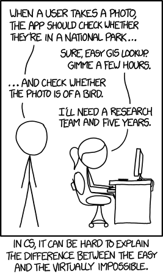
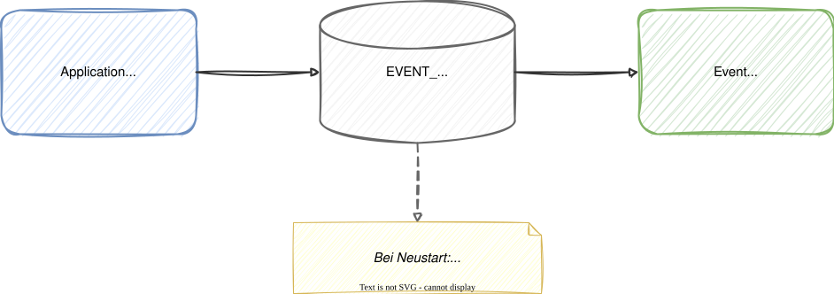
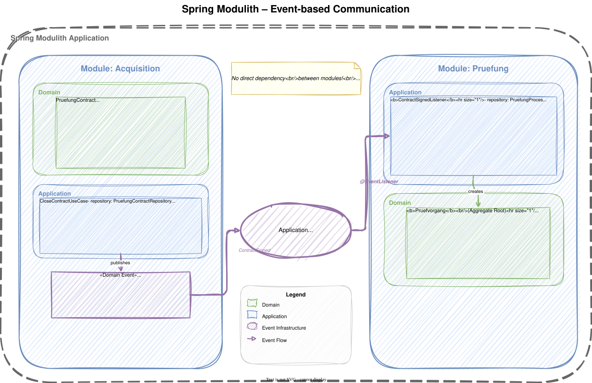
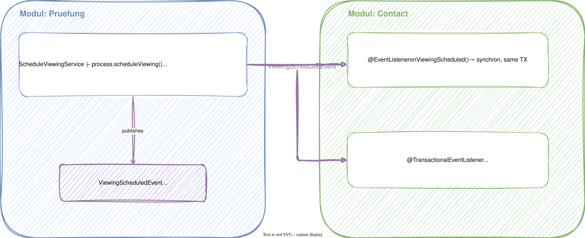

# Modul 13 - Business Components & Spring Modulith

## Vom Bounded Context zum modularen Monolithen

---

## Lernziele

- Progression von Bounded Context zu Modul zu Deployment Unit verstehen
- Modular Monolith vs. Microservices bewerten
- Spring Modulith einsetzen: Module, Verifikation, Events
- Domain Events mit dem Event Collection Pattern publizieren
- Inter-Modul-Kommunikation event-basiert gestalten
- ArchUnit vs. Spring Modulith: Wann welches Werkzeug?

---

## Von Bounded Context zu Deployment Unit


---

## Von Bounded Context zu Deployment Unit - Übersicht

| Ebene | Beschreibung | Beispiel |
|-------|-------------|----------|
| Bounded Context | Fachliche Grenze aus DDD | Antragstellung, Auswertung |
| Modul | Code-Organisation im Monolithen | z. B. `de.foerderung.antragstellung` |
| Deployment Unit | Auslieferbare Einheit | JAR, Docker Container |

> Ein Bounded Context kann als Modul starten und später zum Microservice werden.

---
<style scoped>section { font-size: 1.7em; }</style>

## Modular Monolith vs. Microservices

| Aspekt | Modular Monolith | Microservices |
|--------|-------------------|---------------|
| Deployment | Ein Artefakt | Viele Artefakte |
| Kommunikation | In-Process (Methodenaufruf) | Netzwerk (HTTP, Messaging) |
| Konsistenz | ACID-Transaktionen möglich | Eventual Consistency |
| Ops-Komplexität | Gering | Hoch (Monitoring, Tracing, Mesh) |
| Team-Autonomie | Geringer | Höher |
| Skalierung | Gesamtes System | Einzelne Services |
| Refactoring | Einfach (gleicher Prozess) | Schwer (Schnittstellen fixiert) |
| Fehlersuche | Stack Trace | Distributed Tracing |

---

## Monolith First (Martin Fowler)



*xkcd.com/1425 — CC BY-NC 2.5*

> *"Almost all the successful microservice stories have started
> with a monolith that got too big and was broken up."*
> - Martin Fowler

---

## Der pragmatische Weg

```
1. Starten       →  Gut strukturierter Monolith (Module = BCs)
2. Grenzen       →  Saubere Schnittstellen zwischen Modulen
3. Events        →  Inter-Modul-Kommunikation über Domain Events
4. Beobachten    →  Wo entsteht ein konkreter Engpass?
5. Extrahieren   →  Einzelnes Modul → Microservice (bei Bedarf)
```

### Warum nicht sofort Microservices?

- Distributed Monolith ist schlimmer als ein Monolith
- BC-Grenzen sind anfangs oft falsch geschnitten
- Im Monolithen lassen sich Grenzen leichter verschieben
- Microservices lohnen sich erfahrungsgemäß ab ca. 5+ Teams

---
<style scoped>section { font-size: 1.6em; }</style>

## Team Topologies: Modul-Grenzen = Team-Grenzen

### Conway's Law aktiv nutzen (Kaiser, 2025)

> Modul-Schnitt und Team-Organisation müssen zusammenpassen.
> Ein Modul, das von mehreren Teams geändert wird, wird zur Koordinations-Falle.

| Modul / BC | Team-Typ (Team Topologies) | Interaktion |
|---|---|---|
| Antragstellung (Core) | Stream-Aligned Team | X-as-a-Service |
| Fachliche Prüfung (Core) | Stream-Aligned Team | X-as-a-Service |
| Referenzdaten (Generic) | Platform Team | X-as-a-Service |
| Shared Kernel / Querschnitt | Enabling Team (temporär) | Facilitating |

### Wann ist ein Modul "extrahierbar"?

Wenn ein Stream-Aligned Team **vollständige End-to-End-Verantwortung**
für ein Modul übernehmen kann — ohne tägliche Abstimmung mit anderen Teams.

---
<style scoped>section { font-size: 1.7em; }</style>

## Spring Modulith - Einführung

- Spring-Projekt für modulare Monolithen (1.0 seit Spring Boot 3.1)
- Baut auf Spring Boot auf - keine neue Runtime

### Features

| Feature | Beschreibung |
|---------|-------------|
| Modul-Konventionen | Top-Level-Packages = Module |
| Modul-Verifikation | Abhängigkeiten automatisch prüfen |
| Event-Kommunikation | `ApplicationEventPublisher` + Registry |
| Dokumentation | Modulstruktur-Diagramme generieren |
| Observability | Modul-übergreifendes Tracing |

---

### Maven-Dependency

```xml
<dependencies>
    <dependency>
        <groupId>org.springframework.modulith</groupId>
        <artifactId>spring-modulith-starter-core</artifactId>
    </dependency>
    <dependency>
        <groupId>org.springframework.modulith</groupId>
        <artifactId>spring-modulith-starter-test</artifactId>
        <scope>test</scope>
    </dependency>
</dependencies>
```

---
<style scoped>section { font-size: 1.6em; }</style>

## Modul-Struktur-Konventionen

```
de.foerderung                 <- @SpringBootApplication
├── antragstellung/                           <- Modul "Antragstellung"
│   ├── FlurstueckHinzugefuegt.java               (public -> Event-API)
│   ├── adapter/                                  (Subpaket -> intern)
│   │   └── web/
│   ├── application/
│   │   └── service/
│   ├── domain/
│   │   └── model/
│   └── infrastructure/
├── auswertung/                               <- Modul "Auswertung"
└── FoerderungAnwendung.java
```

- Top-Level-Packages unter der Hauptklasse = Module
- Alle Subpakete (adapter, application, domain, ...) = modulintern
- Nur Klassen im Root des Moduls = öffentliche API
- Events gehören zur öffentlichen API eines Moduls

> Spring Modulith erkennt sowohl `internal/` als auch beliebige Subpakete als intern.
> Eine hexagonale Paketstruktur funktioniert genauso.

---

<style scoped>section { font-size: 1.7em; }</style>

## @ApplicationModule

```java
// antragstellung/package-info.java
@ApplicationModule(
    allowedDependencies = {
        "auswertung",
        "shared"
    }
)
package de.foerderung.antragstellung;
```

- Deklariert explizit, welche anderen Module referenziert werden dürfen
- Spring Modulith prüft, ob nur erlaubte Module verwendet werden
- Verhindert ungewollte Kopplungen zwischen Bounded Contexts

> Ohne `allowedDependencies` sind alle Module erlaubt - explizite Deklaration ist empfohlen.

---
<style scoped>section { font-size: 1.7em; }</style>

## ArchUnit vs. Spring Modulith - Vergleich

| Aspekt | ArchUnit | Spring Modulith |
|--------|----------|-----------------|
| Granularität | Fein (Package, Klasse, Annotation) | Modul-Ebene |
| Konfiguration | Code (Fluent API) | Konvention + `@ApplicationModule` |
| Regeln | Selbst definiert | Automatisch aus Konventionen |
| Events | Nicht relevant | Event-Publishing + Registry |
| Dokumentation | Nein | Ja (Diagramme generieren) |
| Spring-Kontext | Nicht nötig | Ja (für Verifikation) |
| Einsatz | Schicht-Regeln innerhalb eines BC | Modul-Grenzen zwischen BCs |

> Empfehlung: Beide kombinieren!
> ArchUnit für feine Schicht-Regeln, Spring Modulith für Modul-Grenzen.

---
<style scoped>section { font-size: 1.5em; }</style>

## Modul-Verifikation als Test

```java
class ModulithStructureTest {

    ApplicationModules modules =
        ApplicationModules.of(FoerderungAnwendung.class);

    @Test
    void verifyModuleStructure() {
        // Checks: no unauthorized access between modules
        // Checks: no access to 'internal' packages from outside
        modules.verify();
    }

    @Test
    void documentModuleStructure() {
        // Generates PlantUML diagrams in target/modulith-docs/
        new Documenter(modules)
            .writeDocumentation();
    }
}
```

- `verify()` prüft alle Modul-Grenzen automatisch
- `Documenter` generiert Abhängigkeitsdiagramme als PlantUML
- Läuft als normaler JUnit-Test in der CI/CD-Pipeline

---
<style scoped>section { font-size: 1.5em; }</style>

## Domain Events publizieren - Event Collection Pattern

### Schritt 1: Aggregate sammelt Events

```java
// domain.model (no Spring!)
public class AntragsMappe {
    private final List<AntragEvent> domainEvents = new ArrayList<>();

    public FlurstueckId flurstueckHinzufuegen(FlurstueckNummer nummer,
                                              BigDecimal flaeche) {
        var flurstueck = new Flurstueck(
            FlurstueckId.generate(), nummer, flaeche);
        flurstuecke.add(flurstueck);

        // Value Objects auf primitive Typen mappen — öffentliche Modul-API kennt keine Value Objects
        registerEvent(new FlurstueckHinzugefuegt(
            id.value(), flurstueck.getId().value(), nummer.wert(), flaeche, Instant.now()));

        return flurstueck.getId();
    }

    public List<AntragEvent> domainEvents() {
        return Collections.unmodifiableList(domainEvents);
    }

    protected void registerEvent(AntragEvent event) { domainEvents.add(event); }

    public void clearDomainEvents() { domainEvents.clear(); }
}
```

---
<style scoped>section { font-size: 1.2em; }</style>

## Domain Events publizieren - Event Collection Pattern

### Schritt 2: Application Service dispatched Events nach dem Speichern

```java
@Service
public class FlurstueckHinzufuegenService implements FlurstueckHinzufuegen {

    private final AntragsMappeRepository repository;
    private final ApplicationEventPublisher eventPublisher;

    public FlurstueckHinzufuegenService(
            AntragsMappeRepository repository,
            ApplicationEventPublisher eventPublisher) {
        this.repository = repository;
        this.eventPublisher = eventPublisher;
    }

    @Transactional
    @Override
    public FlurstueckHinzufuegenResult hinzufuegen(FlurstueckHinzufuegenCommand cmd) {
        var mappe = repository.findById(cmd.antragsmappeId())
            .orElseThrow(() -> new AntragsmappeNichtGefundenException(cmd.antragsmappeId()));
        var flurstueckId = mappe.flurstueckHinzufuegen(
            cmd.flurstueckNummer(), cmd.flaeche());
        repository.save(mappe);
        mappe.domainEvents().forEach(eventPublisher::publishEvent);
        mappe.clearDomainEvents();
        return new FlurstueckHinzufuegenResult(
            flurstueckId, mappe.getId(), cmd.flurstueckNummer(), cmd.flaeche());
    }
}
```

> Der `ApplicationEventPublisher` ist hier akzeptabel - er ist ein Spring-Interface
> in der Application-Schicht, nicht in der Domain.
>
> Achtung: Ohne Event Publication Registry können Events zwischen `save()` und
> `publishEvent()` verloren gehen. Die Registry (nächste Folien) löst dieses Problem.
>
> Alternative: Spring Data bietet `AbstractAggregateRoot<T>` mit `registerEvent()`,
> das Events beim `save()` automatisch dispatched - allerdings mit Spring-Abhängigkeit in der Domain.

---
<style scoped>section { font-size: 1.7em; }</style>

## Domain Event als Record - Öffentliche Modul-API

```java
// Located in the module root (NOT in internal/) -> public API
package de.foerderung.antragstellung;

public record FlurstueckHinzugefuegt(
    UUID antragsmappeId,
    UUID flurstueckId,
    String flurstueckNummer,
    BigDecimal flaeche,
    Instant occurredAt
) {}
```

- Events verwenden einfache, standardisierte Typen (UUID, String), keine Value Objects
- Andere Module sollen keine Domain-internen Typen kennen
- Events sind immutable - Records eignen sich perfekt
- Lose Kopplung: Sender kennt die Empfänger nicht

---
<style scoped>section { font-size: 1.5em; }</style>

## Events konsumieren - @EventListener

```java
// In a different module: auswertung
package de.foerderung.auswertung.internal;

@Component
class AntragsstatusNotification {

    @EventListener
    public void onFlurstueckHinzugefuegt(FlurstueckHinzugefuegt event) {
        log.info("Neues Flurstueck {} fuer Antrag {} hinzugefuegt",
            event.flurstueckId(), event.antragsmappeId());
        // Auswertung aktualisieren
    }
}
```

- `@EventListener` = synchrone Verarbeitung
- Läuft in der gleichen Transaktion wie der Publisher
- Fehler im Listener → Rollback der gesamten Transaktion

> Verwende `@EventListener` nur, wenn der Listener
> Teil der gleichen Business-Transaktion sein soll.

---
<style scoped>section { font-size: 1.7em; }</style>

## @ApplicationModuleListener — Spring Modulith 1.2+

Spring Modulith bietet seit Version 1.2 eine dedizierte Annotation,
die `@TransactionalEventListener(phase = AFTER_COMMIT)` vereinfacht
und explizit die Modul-Semantik ausdrückt:

```java
@Component
class AntragsstatusNotification {

    // Kurzform: implizit AFTER_COMMIT + transaktionale Semantik
    @ApplicationModuleListener
    public void onFlurstueckHinzugefuegt(FlurstueckHinzugefuegt event) {
        // Läuft nach erfolgreichem Commit der Publisher-Transaktion
        benachrichtigungsService.senden(event.antragsmappeId(), event.flurstueckId());
    }
}
```

| Annotation | Verhalten | Empfehlung |
|-----------|-----------|------------|
| `@EventListener` | Synchron, in Publisher-Transaktion | Für Invarianten innerhalb desselben BC |
| `@TransactionalEventListener(phase = AFTER_COMMIT)` | Nach Commit, At-Most-Once | Explizite Phasensteuerung |
| `@ApplicationModuleListener` | AFTER_COMMIT, Spring Modulith-aware | **Standard für Modul-Events** |

> `@ApplicationModuleListener` ist die empfohlene Annotation für Event-Listener
> zwischen Spring-Modulith-Modulen — sie macht die Modul-Semantik explizit sichtbar.

---
<style scoped>section { font-size: 1.7em; }</style>

## Event Publication Registry - At-Least-Once Delivery

### Problem: Was passiert, wenn der Listener nach dem Commit abstürzt?

```xml
<!-- Enable Event Publication Registry -->
<dependency>
    <groupId>org.springframework.modulith</groupId>
    <artifactId>spring-modulith-events-jdbc</artifactId>
</dependency>
```

---

### Problem: Was passiert, wenn der Listener nach dem Commit abstürzt?



- Events werden in der gleichen Transaktion in eine DB-Tabelle geschrieben
- Nach Verarbeitung: Event wird als completed markiert
- Bei Crash: unvollständige Events werden beim Neustart erneut dispatched

---
<style scoped>section { font-size: 1.4em; }</style>

## @Async - Asynchrone Event-Verarbeitung

```java
@Component
class AntragsStatistik {

    @Async
    @TransactionalEventListener(phase = AFTER_COMMIT)
    public void onFlurstueckHinzugefuegt(FlurstueckHinzugefuegt event) {
        // Runs in its own thread, its own transaction
        statistikService.flurstueckErfassen(event);
    }
}
```

### Voraussetzung: `@EnableAsync`

```java
@SpringBootApplication
@EnableAsync
public class FoerderungAnwendung { }
```

- `@Async` + `@TransactionalEventListener` = eigener Thread-Pool, eigene Transaktion
- Fehler beeinflussen den Publisher nicht
- Ohne Event Publication Registry: fire-and-forget
- Mit Registry: fehlgeschlagene Events werden beim Neustart erneut verarbeitet

---
<style scoped>section { font-size: 1.6em; }</style>

## @Externalized - Events nach außen leiten

```java
@Externalized("flurstuecke::#{#this.flurstueckId()}")
public record FlurstueckHinzugefuegt(
    UUID antragsmappeId,
    UUID flurstueckId,
    String flurstueckNummer,
    BigDecimal flaeche,
    Instant occurredAt
) {}
```

```xml
<!-- z.B. Kafka-Integration -->
<dependency>
    <groupId>org.springframework.modulith</groupId>
    <artifactId>spring-modulith-events-kafka</artifactId>
</dependency>
```

- `@Externalized` leitet Events an Messaging-Infrastruktur weiter
- Unterstützt: Kafka, RabbitMQ, Amazon SQS, JMS
- Routing Key über SpEL definierbar
- Vorbereitung für spätere Microservice-Extraktion

---
<style scoped>section { font-size: 1.6em; }</style>

## Ablösung direkter Webhook-Kommunikation zwischen Modulen

### Das Problem

```
Heute: Module rufen sich direkt per Webhook auf
→ Enge Kopplung: Antragstellung kennt Auszahlung direkt
→ Keine Fehlertoleranz: Webhook schlägt fehl = Daten verloren
→ Schwer testbar: Integration Tests brauchen alle Module
```

### Die Lösung: Spring Modulith EventRegistry

```java
// Kein Kafka nötig! DB-backed, at-least-once delivery
@TransactionalEventListener(phase = AFTER_COMMIT)
@Async
public void onAntragEingereicht(AntragsmappeEingereicht event) {
    // Auszahlungsmodul reagiert auf Event - kennt Antragstellung NICHT
    auszahlungService.initiieren(event.antragsmappeId());
}
```

> **Broker-frei:** Die Event Publication Registry (JDBC) schreibt Events
> in die gleiche DB-Transaktion - keine externe Infrastruktur nötig.
> Perfekt als erster Schritt hin zu entkoppelter, event-basierter Modulkommunikation.

---
<style scoped>section { font-size: 1.7em; }</style>

## Wann einen Microservice extrahieren?

### Extrahieren bei konkretem Grund

- Unabhängiges Deployment: Team will unabhängig deployen
- Skalierung: Ein Modul hat andere Lastanforderungen
- Technologie: Ein Modul braucht einen anderen Tech-Stack
- Organisatorisch: Stream-Aligned Team mit vollständiger End-to-End-Verantwortung (Team Topologies)

### NICHT extrahieren wegen

- "Das machen alle so" / Microservice-Hype
- Vermutete zukünftige Anforderungen
- "Microservices sind moderner"

---

### Extraktionsstrategie

```
1. Modul im Monolith sauber geschnitten  -> Spring Modulith verify() [OK]
2. Events fuer Kommunikation             -> @Externalized vorbereitet
3. API definiert                         -> REST / gRPC Schnittstelle
4. Eigene Datenbank                      -> Shared DB aufloesen
5. Eigenes Deployment                    -> Container, CI/CD Pipeline
```

---

## Spring Modulith Events - Übersicht



---



---

## Zusammenfassung

- Bounded Context → Modul → Deployment Unit: schrittweise Progression
- Monolith First: Starten mit modularem Monolith, extrahieren bei Bedarf
- Spring Modulith: Module, Verifikation, Event-basierte Kommunikation
- Event Collection Pattern: Domain sammelt Events, Application dispatched
- `@EventListener` für synchrone, `@TransactionalEventListener` für Side Effects
- Event Publication Registry für At-Least-Once Delivery
- `@Externalized` als Brücke zur Messaging-Infrastruktur
- ArchUnit für Schicht-Regeln, Spring Modulith für Modul-Grenzen
- Microservice-Extraktion nur mit konkretem Grund

---
<style scoped>section { font-size: 1.5em; }</style>

## Integration-Tests mit der Scenario-API

```java
@ApplicationModuleTest
class AntragstellungIntegrationTest {

    @Test
    void flurstueckHinzugefuegtAktualisiertStatistik(Scenario scenario) {
        scenario.publish(new FlurstueckHinzugefuegt(
                antragsmappeId, flurstueckId,
                "BW-0012-0034-0001", new BigDecimal("3.75"),
                Instant.now()))
            .andWaitForEventOfType(StatistikAktualisiertEvent.class)
            .toArriveAndVerify(event ->
                assertThat(event.antragsmappeId()).isEqualTo(antragsmappeId));
    }
}
```

- `Scenario` testet event-basierte Interaktionen zwischen Modulen
- Wartet asynchron auf Folge-Events - kein `Thread.sleep()` nötig
- Ersetzt komplexe Mocking-Setups für Modul-Kommunikation

---
<style scoped>section { font-size: 1.7em; }</style>

## Reflexion: Prüft euer Verständnis

1. Warum "Monolith First" statt direkt Microservices?
2. Was ist der Unterschied zwischen `@EventListener` (synchron) und `@ApplicationModuleListener` (nach Commit)?
3. Wie garantiert die Event Publication Registry At-Least-Once Delivery — *ohne* Broker?

> Im Lab setzt ihr Spring Modulith mit Event-basierter Modul-Kommunikation selbst um.

---

## Hands-on: Lab-10

### Aufgabe

Strukturiert die Förderantragsverwaltung mit Spring Modulith:

1. Module nach Bounded Contexts schneiden (Top-Level-Packages)
2. `package-info.java` mit `@ApplicationModule` anlegen
3. Modul-Verifikationstest schreiben (`modules.verify()`)
4. Domain Event mit Event Collection Pattern publizieren
5. Event in einem anderen Modul mit `@TransactionalEventListener` konsumieren
6. Event Publication Registry aktivieren (JDBC)

> Dauer: ca. 45 Minuten
> Details und Aufgabenstellung im Lab-10

---

## Diskussion

> Modulith oder Microservices - was passt zu eurem Kontext?

- **Konkret:** Wie ersetzen wir direkte Webhook-Infrastruktur zwischen Modulen durch Events?
- Welche Module kommunizieren heute noch direkt per Webhook - und wie würde ein Event-basierter Schnitt aussehen?
- Wie verhindert Spring Modulith, dass neue Module das Webhook-Antipattern wiederholen?
- Wie groß ist euer Team / eure Organisation?
- Habt ihr die Ops-Kapazität für Microservices
  (Monitoring, Tracing, Service Mesh)?
- Wo liegen eure Bounded-Context-Grenzen aktuell?
- Könntet ihr Events zwischen euren Modulen identifizieren?

---

### Zum Nachlesen

- Kaiser, „Architecture for Flow" (2025), Kapitel 5: Team Topologies und Bounded Contexts
- Kaiser, „Architecture for Flow" (2025), Kapitel 6: Streams of Change identifizieren
- Skelton & Pais, „Team Topologies" (2019): Team-Typen und Interaktionsmodi
