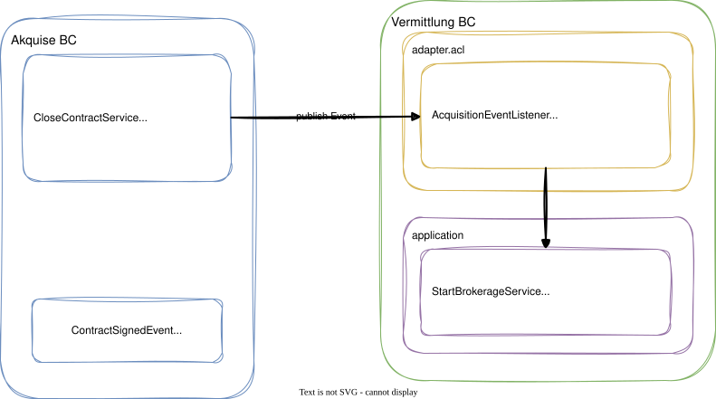

# Modul 13 - Context Integration

## Bounded Contexts verbinden - ACL, Events, Kafka

Geschätzte Dauer: ca. 60 Minuten

### Lernziele

- Context-Mapping-Patterns (aus Modul 05) technisch umsetzen
- Anti-Corruption Layer zwischen Bounded Contexts implementieren
- Idempotente Event-Verarbeitung sicherstellen
- Den Weg von In-Process Events zu Kafka nachvollziehen
- Wissen, wo ACL-Code in der Paketstruktur lebt

---

## Warum Context Integration?

- Bounded Contexts sind bewusst voneinander getrennt
- Trotzdem müssen Geschäftsprozesse kontextübergreifend ablaufen

### Beispiel im Immobilien-CRM


- Lose Kopplung durch Events statt direkte Methodenaufrufe
- Jeder BC behält seine eigene Ubiquitous Language
- Die Übersetzung findet im Anti-Corruption Layer statt

---
<style scoped>section { font-size: 1.7em; }</style>

## Context-Mapping-Patterns: Technische Umsetzung

| Pattern (Modul 05) | Technische Umsetzung |
|--------------------|---------------------|
| Customer/Supplier | Event Publishing + ACL-Listener |
| Open Host Service | REST API mit Published Language (JSON Schema) |
| Published Language | Versioniertes Austauschformat, z. B. JSON Schema oder Event Contract |
| Anti-Corruption Layer | Translator-Klasse an der Modul-Grenze |
| Conformist | Event direkt verwenden, kein eigenes Modell |
| Shared Kernel | Shared-Modul mit Value Objects |
| Partnership | Gemeinsame Abstimmung, oft gemeinsamer Release- und Änderungsprozess |
| Separate Ways | Keine Integration |

> In diesem Modul fokussieren wir uns auf Event-basierte Integration
> mit ACL - das häufigste Pattern in modularen Monolithen.

---
<style scoped>section { font-size: 1.7em; }</style>

## Cross-BC-Event publizieren

### Schritt 1: Event im publizierenden BC definieren

```java
// Public API of the Acquisition module (NOT in internal/)
package de.realestate.acquisition;

public record ContractSignedEvent(
    UUID contractId,
    UUID propertyId,
    UUID ownerId,
    Instant occurredAt
) {
    public ContractSignedEvent(
            UUID contractId, UUID propertyId, UUID ownerId) {
        this(contractId, propertyId, ownerId, Instant.now());
    }
}
```

- Event verwendet primitive Typen (UUID) - keine Value Objects des BCs
- Liegt im Root-Package des Moduls = öffentliche API
- Andere Module dürfen dieses Record importieren

---
<style scoped>section { font-size: 1.7em; }</style>

## Cross-BC-Event publizieren

### Schritt 2: Application Service dispatched nach dem Speichern

```java
package de.realestate.acquisition.internal;

@Service
@RequiredArgsConstructor
public class CloseContractService {

    private final BrokerageContractRepository repository;
    private final ApplicationEventPublisher eventPublisher;

    @Transactional
    public void close(BrokerageContractId id) {
        var contract = repository.findById(id).orElseThrow();
        contract.close();
        repository.save(contract);
        contract.domainEvents().forEach(eventPublisher::publishEvent);
        contract.clearDomainEvents();
    }
}
```

---
<style scoped>section { font-size: 1.7em; }</style>

## Anti-Corruption Layer - Konzept

### Das Problem

- Das Event `ContractSignedEvent` spricht die Akquise-Sprache
- Der Vermittlung BC kennt keine "Maklerverträge" - er hat eigene Begriffe
- Ohne ACL: Akquise-Konzepte "infizieren" das Vermittlung-Domänenmodell


---
<style scoped>section { font-size: 1.7em; }</style>

## ACL: Wo lebt der Code?

### Paketstruktur des konsumierenden BC

```
de.realestate.brokerage
├── BrokerageApi.java                ← öffentliche API
├── internal
│   ├── domain
│   │   └── model
│   │       └── BrokerageProcess.java
│   ├── application
│   │   └── StartBrokerageService.java
│   └── adapter
│       └── acl                      ← Anti-Corruption Layer
│           ├── AcquisitionEventTranslator.java
│           └── AcquisitionEventListener.java
```

- Der ACL ist ein Adapter des konsumierenden BC
- Er gehört in die Adapter-Schicht (äußerer Ring)
- Der Application Service kennt nur seinen eigenen Command

---
<style scoped>section { font-size: 1.7em; }</style>

## ACL-Implementierung: Translator

```java
package de.realestate.brokerage.internal.adapter.acl;

@Component
public class AcquisitionEventTranslator {

    public StartBrokerageCommand translate(
            ContractSignedEvent event) {
        return new StartBrokerageCommand(
            new PropertyReference(event.propertyId()),
            new ContractReference(event.contractId()),
            LocalDate.now()
        );
    }
}
```

- Fremde IDs werden in eigene Value Objects gewrappt
- Fremde Begriffe werden in eigene Domänensprache übersetzt
- `ContractSignedEvent` (Akquise) → `StartBrokerageCommand` (Vermittlung)
- Der Translator ist ein reiner Mapper - keine Geschäftslogik

---
<style scoped>section { font-size: 1.7em; }</style>

## ACL-Implementierung: Event Listener

```java
package de.realestate.brokerage.internal.adapter.acl;

@Component
@RequiredArgsConstructor
public class AcquisitionEventListener {

    private final AcquisitionEventTranslator translator;
    private final StartBrokerageService service;

    @TransactionalEventListener(phase = AFTER_COMMIT)
    public void on(ContractSignedEvent event) {
        var command = translator.translate(event);
        service.start(command);
    }
}
```

- Listener delegiert sofort an den Translator - Application Service kennt nur eigene Commands
- Keine Abhängigkeit des Vermittlung-Domänenmodells auf Akquise-Klassen
- `AFTER_COMMIT`: Listener läuft nach der Publisher-Transaktion - ohne Retry.
  Bei Fehler geht das Event verloren (At-Most-Once)

---
<style scoped>section { font-size: 1.3em; }</style>

## Idempotente Event-Verarbeitung

### Das Problem bei At-Least-Once Delivery

- Events können mehrfach zugestellt werden (Crash, Retry, Redelivery)
- Ohne Idempotenz: Vermittlungsvorgang wird doppelt angelegt

### Lösung: Idempotenz-Check im Service

```java
@Service
public class StartBrokerageService {

    private final BrokerageProcessRepository repository;

    @Transactional
    public void start(StartBrokerageCommand cmd) {
        // Idempotency: already exists?
        if (repository.existsByContractReference(cmd.contractReference())) {
            log.info("Brokerage for contract {} already exists",
                cmd.contractReference());
            return;
        }
        var process = BrokerageProcess.create(
            ProcessId.generate(), cmd.propertyReference(), cmd.contractReference());
        repository.save(process);
    }
}
```

---

## Gesamtbild: Event Flow zwischen BCs



---
<style scoped>section { font-size: 1.7em; }</style>

## Ausblick: Von In-Process zu Kafka

### Im Modulith (heute)

```java
// In-Process: Spring ApplicationEventPublisher
eventPublisher.publishEvent(new ContractSignedEvent(...));
```

### Als Microservices: Producer (später)

```java
@Component
public class KafkaEventPublisher {
    private final KafkaTemplate<String, Object> kafka;

    @TransactionalEventListener(phase = AFTER_COMMIT)
    public void on(ContractSignedEvent event) {
        kafka.send("acquisition.contract.signed",
            event.contractId().toString(), event);
    }
}
```

---

## Ausblick: Kafka Consumer

```java
@KafkaListener(topics = "acquisition.contract.signed",
    groupId = "brokerage")
public void consume(@Payload String payload) {
    var event = objectMapper.readValue(
        payload, ContractSignedEvent.class);
    var command = translator.translate(event);
    service.start(command);
}
```

- Explizite Deserialisierung nötig (JSON/Avro statt Java-Objekt)
- ACL-Logik (Translator + Service) bleibt identisch zum Modulith

---
<style scoped>section { font-size: 1.7em; }</style>

## Ausblick: Kafka - Was ändert sich?

| Aspekt | In-Process (Modulith) | Kafka (Microservices) |
|--------|----------------------|----------------------|
| Transport | Methodenaufruf | Netzwerk (Topic) |
| Garantie | At-Most-Once (AFTER_COMMIT) | At-Least-Once |
| Serialisierung | Java Objekt | JSON / Avro |
| Idempotenz | Empfohlen | Pflicht |
| ACL-Code | Identisch | Identisch |
| Reihenfolge | Garantiert (synchroner Listener) | Nur pro Partition |

- Gleiche ACL-Logik - nur der Transport ändert sich
- `@Externalized` (Spring Modulith) bereitet den Übergang vor
- Kafka garantiert At-Least-Once → Idempotenz immer beachten

---

## Zusammenfassung

- Context Integration verbindet Bounded Contexts über Events
- Der Anti-Corruption Layer übersetzt fremde Konzepte in die eigene Sprache
- ACL lebt in der Adapter-Schicht des konsumierenden BC
- Idempotenz ist Pflicht bei At-Least-Once Delivery
- Von In-Process → Kafka: ACL-Code bleibt gleich, nur Transport ändert sich
- Öffentliche Event-API: primitive Typen, im Root-Package des Moduls

```
Event-Entscheidungsbaum:
├─ Gleicher BC?        → Domain Event (intern, nicht publiziert)
├─ Anderer BC, gleicher Monolith? → ApplicationEventPublisher + ACL (+ Idempotenz empfohlen)
└─ Anderer Service?    → Kafka/RabbitMQ + ACL + Idempotenz (Pflicht)
```

---

## Hands-on: Lab 09

### Aufgabe

Implementiert Cross-BC-Integration im Immobilien-CRM:

1. Domain Event `ContractSignedEvent` im Akquise-Modul erstellen
2. Event über `ApplicationEventPublisher` publizieren (Event Collection Pattern)
3. ACL-Translator im Vermittlung-Modul implementieren
4. `@TransactionalEventListener` registrieren
5. Idempotenz-Check im Application Service einbauen
6. Vermittlungsvorgang automatisch anlegen lassen

> Dauer: ca. 45 Minuten

---

## Diskussion

> Wie würdet ihr die Integration zwischen euren Bounded Contexts gestalten?

- Welche Events würdet ihr als synchron vs. asynchron modellieren?
- Wo seht ihr die Grenze zwischen In-Process Events und Kafka?
- Habt ihr Erfahrungen mit dem Outbox Pattern?
- Wie geht ihr mit Eventual Consistency zwischen BCs um?
- Wo braucht ihr einen ACL und wo reicht ein Conformist?
