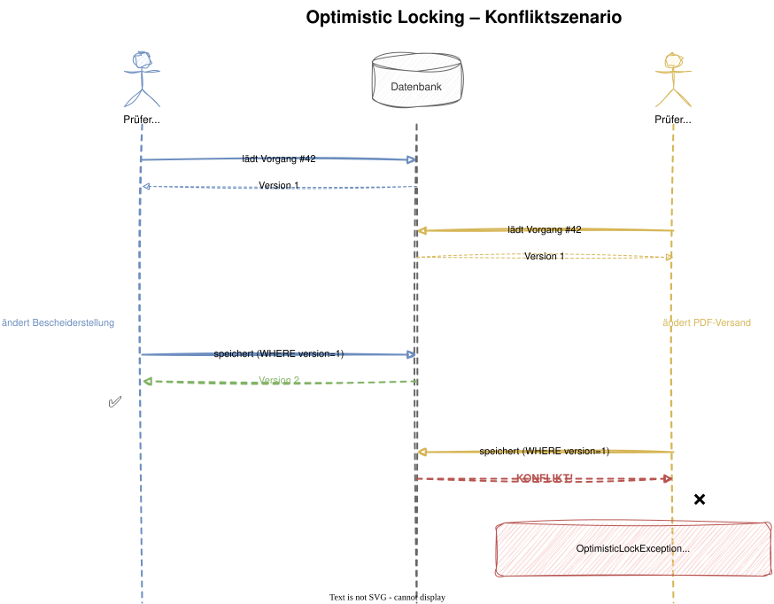
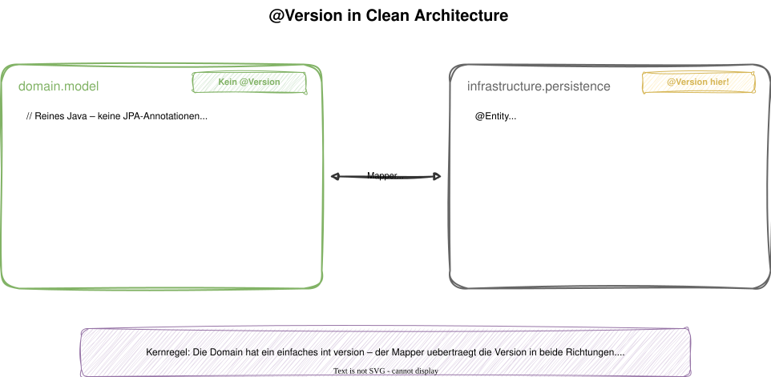
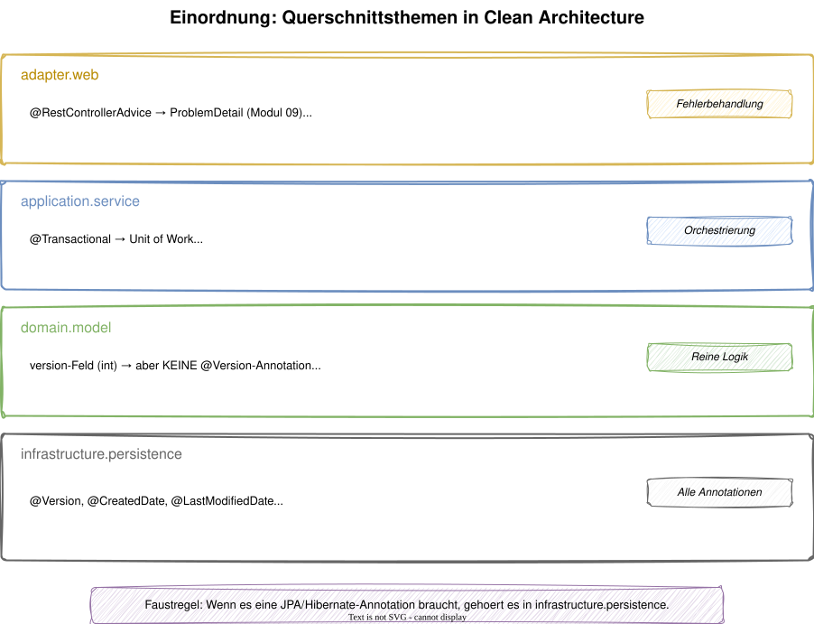

# Modul 14 - Querschnittsthemen

## Optimistic Locking, Auditing & Multi-Tenancy in Clean Architecture

Geschätzte Dauer: ca. 60 Minuten

---

## Lernziele

- Optimistic Locking auf Aggregate Roots anwenden - auch mit separatem Persistenzmodell
- JPA Auditing für automatische Zeitstempel konfigurieren
- Multi-Tenancy-Strategien bewerten
- Querschnittsthemen in die richtige Schicht der Clean Architecture einordnen
- Soft Delete als Alternative zu physischem Löschen kennen

---

## Überblick: Was sind Querschnittsthemen?

<style scoped>
section { font-size: 22px; }
table { font-size: 20px; }
</style>

Querschnittsthemen betreffen mehrere Schichten - sie müssen sauber integriert werden, ohne die Domäne zu verschmutzen.

| Thema | Betroffene Schicht | Schlüssel-Annotation |
|-------|-------------------|---------------------|
| Optimistic Locking | Infrastructure (JPA Entity) | `@Version` |
| Auditing | Infrastructure (JPA Entity) | `@CreatedDate`, `@LastModifiedDate` |
| Multi-Tenancy | Infrastructure (Filter/Schema) | Hibernate `@Filter` |
| Soft Delete | Infrastructure (JPA Entity) | `@Where` / `@SQLRestriction` |
| Exception Handling | Adapter (Web) | `@RestControllerAdvice` (→ Modul 10) |

> Kernregel: Die Domain bleibt frei von diesen Concerns.
> Alle technischen Annotationen leben auf der JPA-Entity in `infrastructure`.

---

## Optimistic Locking - Warum?

- Aggregate Roots sind Konsistenzgrenzen
- Mehrere Benutzer können gleichzeitig dasselbe Aggregat bearbeiten
- Ohne Locking: Lost Updates - letzte Änderung gewinnt stillschweigend

---



---



- Die Domain hat ein einfaches `version`-Feld (int) - ohne JPA-Annotation
- Die JPA-Entity hat `@Version` - JPA prüft automatisch beim UPDATE
- Der Mapper überträgt die Version in beide Richtungen

---

## @Version auf der JPA-Entity

<style scoped>
section { font-size: 1.2em; }
</style>

```java
package de.realestate.brokerage.infrastructure.persistence;

@Entity
@Table(name = "brokerage_process")
public class ProcessJpaEntity {

    @Id
    private UUID id;

    @Version
    private Long version;

    @Enumerated(EnumType.STRING)
    private ProcessStatus status;

    private UUID propertyId;

    @OneToMany(cascade = CascadeType.ALL, orphanRemoval = true)
    @JoinColumn(name = "process_id")
    private List<ViewingJpaEntity> viewings = new ArrayList<>();

    protected ProcessJpaEntity() {}
    // Getter, Setter
}
```

---
<style scoped>section { font-size: 1.4em; }</style>

## Was passiert bei einem Konflikt?

```sql
-- JPA generates automatically:
UPDATE brokerage_process
SET status = ?, property_id = ?, version = 2
WHERE id = ? AND version = 1;
-- If 0 rows affected → OptimisticLockException
```

### Exception-Kette

```
JPA: OptimisticLockException
  ↓
Spring Data: OptimisticLockingFailureException
  ↓
@RestControllerAdvice: HTTP 409 Conflict
```

---
<style scoped>section { font-size: 1.4em; }</style>

## Konflikt-Behandlung im @RestControllerAdvice

```java
// In @RestControllerAdvice (from Module 10)
@ExceptionHandler(OptimisticLockingFailureException.class)
public ProblemDetail handleConflict(
        OptimisticLockingFailureException ex) {
    var problem = ProblemDetail.forStatusAndDetail(
        HttpStatus.CONFLICT,
        "The data has been modified in the meantime. "
        + "Please reload the current version.");
    problem.setTitle("Conflict: concurrent modification");
    return problem;
}
```

---
<style scoped>section { font-size: 1.2em; }</style>

## Auditing - Wer hat wann was geändert?

- Für Compliance und Nachvollziehbarkeit im Immobilien-CRM
- Spring Data JPA bietet deklaratives Auditing
- Automatische Befüllung von Zeitstempeln und Benutzerinformationen

### Aktivierung

```java
package de.realestate.infrastructure.config;

@Configuration
@EnableJpaAuditing
public class JpaAuditingConfig {

    @Bean
    public AuditorAware<String> auditorProvider() {
        return () -> Optional.ofNullable(
            SecurityContextHolder.getContext().getAuthentication())
            .map(Authentication::getName);
    }
}
```

> Auditing-Konfiguration lebt in `infrastructure.config` - nicht in der Domain.

---

## Auditable Base Entity

<style scoped>section { font-size: 1em; }</style>

```java
package de.realestate.infrastructure.persistence;

@MappedSuperclass
@EntityListeners(AuditingEntityListener.class)
public abstract class AuditableJpaEntity {

    @CreatedDate
    @Column(updatable = false)
    private Instant createdAt;

    @LastModifiedDate
    private Instant updatedAt;

    @CreatedBy
    @Column(updatable = false)
    private String createdBy;

    @LastModifiedBy
    private String updatedBy;

    // Getters
}
```

- `AuditableJpaEntity` lebt in `infrastructure.persistence` - nicht in der Domain!
- JPA-Entities erben davon, nicht die Domain-Klassen
- JPA befüllt die Felder automatisch bei `persist` und `merge`

---
<style scoped>section { font-size: 1.5em; }</style>

## Auditing in der Praxis - Code

```java
@Entity
@Table(name = "brokerage_process")
public class ProcessJpaEntity extends AuditableJpaEntity {

    @Id
    private UUID id;

    @Version
    private Long version;

    @Enumerated(EnumType.STRING)
    private ProcessStatus status;

    // ...
}
```

---

## Auditing in der Praxis - Erklärung

- `createdAt` / `createdBy` werden beim Anlegen gesetzt
- `updatedAt` / `updatedBy` werden bei jeder Änderung aktualisiert
- Die Domain-Klasse `BrokerageProcess` weiß davon nichts
- Auditing ist ein rein technisches Concern der Infrastruktur

---

## Soft Delete - Warum?

- Regulatorische Anforderungen (Aufbewahrungspflichten)
- "Papierkorb"-Funktion für Endbenutzer
- Audit-Trail bleibt erhalten

---

## Soft Delete - Implementierung

<style scoped>section { font-size: 1.4em; }</style>

```java
@Entity
@Table(name = "brokerage_process")
@SQLRestriction("deleted = false")  // Hibernate 6.4+
public class ProcessJpaEntity extends AuditableJpaEntity {

    @Id private UUID id;
    @Version private Long version;

    private boolean deleted = false;
    private Instant deletedAt;

    public void markAsDeleted() {
        this.deleted = true;
        this.deletedAt = Instant.now();
    }
}
```

- `@SQLRestriction` filtert gelöschte Einträge automatisch aus Queries
- Physisches Löschen wird durch `markAsDeleted()` ersetzt

---

## Multi-Tenancy - Überblick

Mandantenfähigkeit: Mehrere Maklerbüros auf einer Plattform

| Strategie | Isolation | Komplexität | Einsatz |
|-----------|-----------|-------------|---------|
| Discriminator Column | Niedrig | Niedrig | Kleine SaaS |
| Separate Schema | Mittel | Mittel | Mittlere SaaS |
| Separate Database | Hoch | Hoch | Enterprise / Compliance |

---
<style scoped>section { font-size: 1.4em; }</style>

## Multi-Tenancy - Discriminator Column

### Einfachste Variante

```java
@Entity
@FilterDef(name = "tenantFilter",
    parameters = @ParamDef(name = "tenantId", type = String.class))
@Filter(name = "tenantFilter",
    condition = "tenant_id = :tenantId")
public class ProcessJpaEntity {

    @Column(name = "tenant_id", nullable = false)
    private String tenantId;
}
```

> Multi-Tenancy ist ein reines Infrastruktur-Concern.
> Die Domain kennt keine Mandanten.

---



---

## Zusammenfassung

<style scoped>
section { font-size: 22px; }
table { font-size: 20px; }
</style>

| Thema | Wo? | Domain betroffen? |
|-------|-----|-------------------|
| Optimistic Locking | `@Version` auf JPA-Entity | Nur `version`-Feld (ohne Annotation) |
| Auditing | `AuditableJpaEntity` in infrastructure | Nein |
| Soft Delete | `@SQLRestriction` auf JPA-Entity | Nein |
| Multi-Tenancy | `@Filter` + Discriminator auf JPA-Entity | Nein |
| Exception Mapping | `@RestControllerAdvice` in adapter | Nein |

- Querschnittsthemen leben in der richtigen Schicht - nicht in der Domain
- Die Domain bleibt rein und testbar
- `@RestControllerAdvice` für Fehlerbehandlung → siehe Modul 10

---

## Hands-on: Lab 11

### Aufgabe

1. `@Version` auf der JPA-Entity `ProcessJpaEntity` ergänzen
2. `version`-Feld im Domain-Model und Mapper hinzufügen
3. `AuditableJpaEntity` als MappedSuperclass erstellen (in `infrastructure`)
4. JPA Auditing aktivieren (`@EnableJpaAuditing`)
5. `@RestControllerAdvice` um `OptimisticLockingFailureException` → 409 erweitern
6. Bonus: Test schreiben, der `OptimisticLockException` provoziert

> Dauer: ca. 30 Minuten

---

## Diskussion

> Wie ordnet ihr Querschnittsthemen in eure Architektur ein?

- Wo lebt Auditing in euren Projekten - in der Domain oder Infrastruktur?
- Nutzt ihr Optimistic oder Pessimistic Locking?
- Welche Multi-Tenancy-Strategie passt zu eurem Kontext?
- Habt ihr Erfahrungen mit Soft Delete - Fluch oder Segen?
- Was passiert, wenn `@Version` auf dem Domain-Model statt der JPA-Entity liegt?
