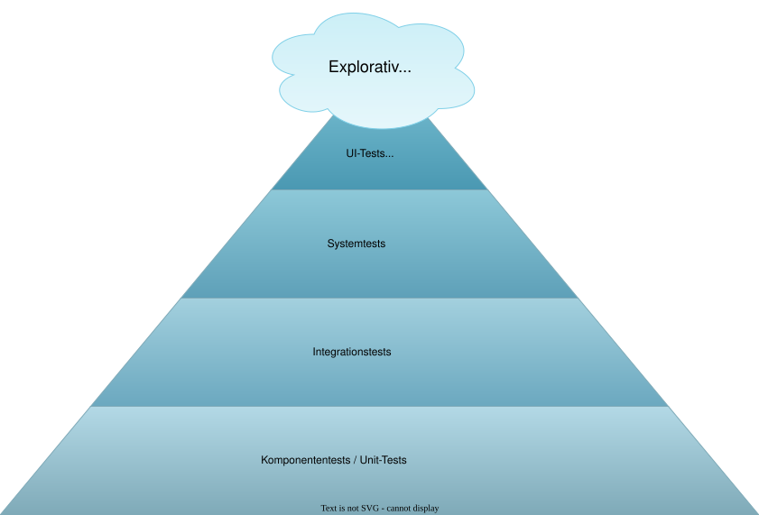
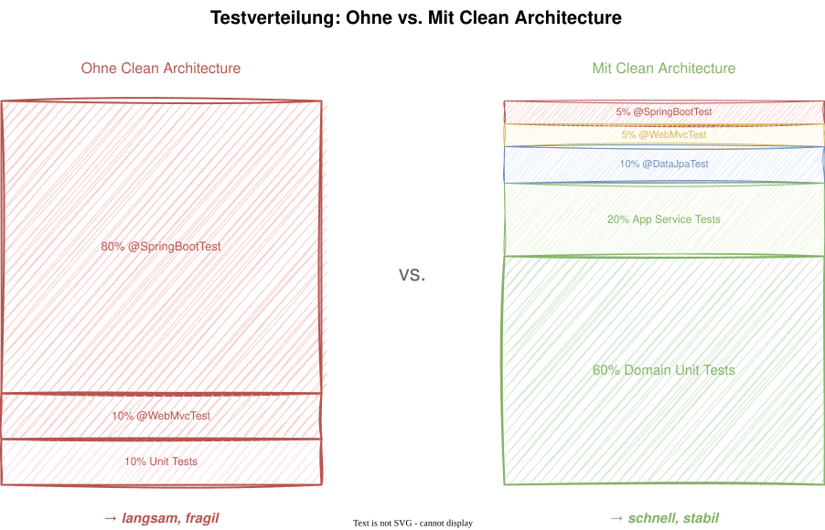

# Modul 15 - Teststrategie

## Die Testpyramide für Clean Architecture

Geschätzte Dauer: ca. 75 Minuten

---

## Lernziele

- Die Testpyramide auf die Clean Architecture Ringe abbilden
- Domain Unit Tests ohne Spring Context schreiben
- Application Service Tests mit gemockten Ports implementieren
- Repository Integration Tests mit `@DataJpaTest` umsetzen
- Web/API Tests mit `@WebMvcTest` schreiben
- InMemory-Repositories als leichtgewichtige Test-Doubles einsetzen

---

## Die Testpyramide



---

| Ebene | Scope | Spring nötig? | Geschwindigkeit |
|-------|-------|---------------|-----------------|
| Domain Unit | Entities, VOs, Domain Services | Nein | < 10 ms |
| Application Service | Use Cases + gemockte Ports | Nein | < 50 ms |
| Integration | JPA, Controller | Teilweise | < 2 s |
| E2E | Gesamte Anwendung | Ja | > 5 s |

---
<style scoped>section { font-size: 1.7em; }</style>

## Domain Unit Tests - das Fundament

Die Basis der Pyramide: plain JUnit 5 + AssertJ, kein Spring Context.
Diese Tests prüfen Geschäftsinvarianten und Domänenregeln direkt -
und laufen in Millisekunden.

Was fällt darunter?

- Aggregate Root: Zustandsübergänge, Invarianten
- Value Objects: Erzeugung, Gleichheit, Berechnung
- Domain Services und Event-Erzeugung bei Zustandsänderungen

---
<style scoped>section { font-size: 1.3em; }</style>

## Aggregate Root testen

```java
class BrokerageProcessTest {

    @Test
    void should_schedule_viewing() {
        // Arrange
        var process = BrokerageProcess.create(
            ProcessId.generate(),
            new PropertyId(UUID.randomUUID()),
            new ContactId(UUID.randomUUID()));

        // Act
        var viewingId = process.scheduleViewing(
            new ContactId(UUID.randomUUID()),
            LocalDateTime.now().plusDays(3));

        // Assert
        assertThat(viewingId).isNotNull();
        assertThat(process.getViewings()).hasSize(1);
    }

    @Test
    void should_throw_error_when_process_not_active() {
        var process = BrokerageProcessFixture.completed();

        assertThatThrownBy(() -> process.scheduleViewing(
                new ContactId(UUID.randomUUID()),
                LocalDateTime.now().plusDays(1)))
            .isInstanceOf(ProcessNotActiveException.class);
    }
}
```

---
<style scoped>section { font-size: 1.3em; }</style>

## Value Objects und Berechnung testen

```java
class AddressTest {

    @Test
    void should_reject_empty_street() {
        assertThatThrownBy(() -> new Address("", "50667", "Köln"))
            .isInstanceOf(IllegalArgumentException.class)
            .hasMessageContaining("street");
    }

    @Test
    void should_recognize_equal_addresses() {
        var a1 = new Address("Domstraße 1", "50667", "Köln");
        var a2 = new Address("Domstraße 1", "50667", "Köln");
        assertThat(a1).isEqualTo(a2);
    }
}

class AskingPriceTest {

    @Test
    void should_calculate_commission_correctly() {
        var price = new AskingPrice(BigDecimal.valueOf(300_000));
        var commission = price.calculateCommission(new CommissionRate(3.57));
        assertThat(commission.amount())
            .isEqualByComparingTo(BigDecimal.valueOf(10_710.00));
    }
}
```

---
<style scoped>section { font-size: 1.7em; }</style>

## Werden die richtigen Events erzeugt?

```java
@Test
void should_produce_domain_event_when_scheduling_viewing() {
    var process = BrokerageProcessFixture.active();

    process.scheduleViewing(
        new ContactId(UUID.randomUUID()),
        LocalDateTime.now().plusDays(3));

    assertThat(process.domainEvents())
        .hasSize(1)
        .first()
        .isInstanceOf(ViewingScheduledEvent.class);
}
```

- Tests prüfen, dass Zustandsänderungen Domain Events erzeugen
- Kein Spring Context, kein EventPublisher - nur die Event-Liste prüfen
- Das ist der größte Vorteil des Event Collection Patterns

---
<style scoped>section { font-size: 1.7em; }</style>

## Application Service Tests

Hier zeigt sich ein Vorteil der Clean Architecture: Der Application Service
hängt nur von Ports ab. Ports lassen sich einfach mocken oder durch
InMemory-Implementierungen ersetzen - kein Spring Context nötig.

---
<style scoped>section { font-size: 1.7em; }</style>

```java
class CreateViewingUseCaseTest {

    private final BrokerageProcessRepository repository =
        new InMemoryBrokerageProcessRepository();
    private final DomainEventDispatcher eventDispatcher =
        mock(DomainEventDispatcher.class);
    private final CreateViewingUseCase useCase =
        new CreateViewingUseCase(repository, eventDispatcher);

    @Test
    void should_create_viewing() {
        var process = BrokerageProcessFixture.active();
        repository.save(process);

        var result = useCase.execute(new CreateViewingCommand(
            process.getId(), new ContactId(UUID.randomUUID()),
            LocalDateTime.now().plusDays(3)));

        assertThat(result).isNotNull();
        verify(eventDispatcher).dispatchAll(anyList());
    }
}
```

---
<style scoped>section { font-size: 1.7em; }</style>

## Leichtgewichtiger als Mocks: InMemory-Repositories

```java
public class InMemoryBrokerageProcessRepository
        implements BrokerageProcessRepository {

    private final Map<ProcessId, BrokerageProcess> store =
        new ConcurrentHashMap<>();

    @Override
    public void save(BrokerageProcess process) {
        store.put(process.getId(), process);
    }

    @Override
    public Optional<BrokerageProcess> findById(ProcessId id) {
        return Optional.ofNullable(store.get(id));
    }

    @Override
    public List<BrokerageProcess> findByStatus(ProcessStatus status) {
        return store.values().stream()
            .filter(v -> v.getStatus() == status)
            .toList();
    }

    @Override
    public ProcessId nextId() { return ProcessId.generate(); }

    @Override
    public void delete(BrokerageProcess process) {
        store.remove(process.getId());
    }
}
```

> InMemory-Repos sind leichter als Mocks: kein Stubbing nötig,
> realistische Abfragen möglich, wiederverwendbar.

---
<style scoped>section { font-size: 1.7em; }</style>

## Was passiert bei fehlenden Daten?

```java
@Test
void should_throw_error_when_process_not_found() {
    // Repository is empty - findById returns Optional.empty()

    assertThatThrownBy(() -> useCase.execute(
            new CreateViewingCommand(
                new ProcessId(UUID.randomUUID()),
                new ContactId(UUID.randomUUID()),
                LocalDateTime.now().plusDays(1))))
        .isInstanceOf(ProcessNotFoundException.class);

    verifyNoInteractions(eventDispatcher);
}
```

- Kein Spring Context, kein `@MockitoBean`
- Test läuft in < 50 ms
- InMemory repo returns `Optional.empty()` → Exception
- Prüft, dass keine Events dispatched werden bei Fehler

---

## Repository-Tests mit @DataJpaTest

Ab hier verlassen wir die reine Unit-Ebene. `@DataJpaTest` startet nur
JPA-relevante Beans mit H2 In-Memory-Datenbank und testet JPA-Mappings
und Custom Queries in der Infrastruktur.

---
<style scoped>section { font-size: 1.5em; }</style>

```java
@DataJpaTest
@Import(ProcessMapper.class)
class JpaBrokerageProcessRepositoryTest {

    @Autowired private ProcessSpringDataRepository springDataRepo;
    @Autowired private ProcessMapper mapper;

    private JpaBrokerageProcessRepository repository;

    @BeforeEach
    void setUp() {
        repository = new JpaBrokerageProcessRepository(
            springDataRepo, mapper);
    }

    @Test
    void should_save_and_load_process() {
        var process = BrokerageProcessFixture.active();
        repository.save(process);

        var result = repository.findById(process.getId());
        assertThat(result).isPresent();
        assertThat(result.get().getStatus()).isEqualTo(ProcessStatus.ACTIVE);
    }
}
```

---
<style scoped>section { font-size: 1.3em; }</style>

## HTTP-Kontrakte prüfen mit @WebMvcTest

```java
@WebMvcTest(ViewingController.class)
class ViewingControllerTest {

    @Autowired private MockMvc mockMvc;
    @MockitoBean private ScheduleViewing scheduleUseCase;

    @Test
    void should_create_viewing_and_return_201() throws Exception {
        var expectedId = new ViewingId(UUID.randomUUID());
        when(scheduleUseCase.schedule(any())).thenReturn(expectedId);

        mockMvc.perform(post("/api/v1/brokerage/viewings")
                .contentType(APPLICATION_JSON)
                .content("""
                    {
                      "processId": "550e8400-e29b-41d4-a716-446655440000",
                      "prospectId": "660e8400-e29b-41d4-a716-446655440000",
                      "appointmentDate": "2026-04-15T14:00:00"
                    }
                    """))
            .andExpect(status().isCreated())
            .andExpect(header().exists("Location"))
            .andExpect(jsonPath("$.viewingId")
                .value(expectedId.value().toString()));
    }
}
```

> Siehe auch Modul 10 für weitere `@WebMvcTest`-Beispiele.

---
<style scoped>section { font-size: 1.2em; }</style>

## Die Spitze der Pyramide: Full Integration Tests

Hier startet der gesamte ApplicationContext. Diese Tests sind langsam und
ressourcenintensiv, prüfen dafür aber das Zusammenspiel aller Schichten.

```java
@SpringBootTest(webEnvironment = WebEnvironment.RANDOM_PORT)
class BrokerageIntegrationTest {

    @Autowired private TestRestTemplate restTemplate;

    @Test
    void should_create_viewing_and_retrieve() {
        // Arrange: Create process via API
        var processResponse = restTemplate.postForEntity(
            "/api/v1/brokerage/processes", createProcessRequest(),
            ProcessResponse.class);
        assertThat(processResponse.getStatusCode())
            .isEqualTo(HttpStatus.CREATED);

        // Act: Create viewing for the process
        var viewingResponse = restTemplate.postForEntity(
            "/api/v1/brokerage/viewings",
            createViewingRequest(processResponse.getBody().id()),
            ViewingResponse.class);

        // Assert
        assertThat(viewingResponse.getStatusCode())
            .isEqualTo(HttpStatus.CREATED);
    }
}
```

---
<style scoped>section { font-size: 1.2em; }</style>

## Test Fixtures - Wiederverwendbare Testdaten

```java
public class BrokerageProcessFixture {

    public static BrokerageProcess active() {
        return BrokerageProcess.create(
            ProcessId.generate(),
            new PropertyId(UUID.randomUUID()),
            new ContactId(UUID.randomUUID()));
    }

    public static BrokerageProcess withViewing() {
        var process = active();
        process.scheduleViewing(
            new ContactId(UUID.randomUUID()),
            LocalDateTime.now().plusDays(3));
        return process;
    }

    public static BrokerageProcess completed() {
        var process = active();
        // Move process through all phases...
        process.close();
        return process;
    }
}
```

- Jede Methode erzeugt ein valides Objekt im gewünschten Zustand
- Verwendet Domain-Methoden (nicht Reflection oder Builder)
- Wiederverwendbar in Domain-, Application- und Integration-Tests

---
<style scoped>section { font-size: 1.8em; }</style>

## Testverteilung: Empfehlung

| Level | Anteil | Geschwindigkeit | Was wird geprüft? |
|-------|--------|-----------------|-------------------|
| Domain Unit | ~60% | ms | Geschäftsregeln, Invarianten |
| Application Service | ~20% | < 50 ms | Use-Case-Orchestrierung |
| Repository (@DataJpaTest) | ~10% | < 1 s | JPA-Mapping, Custom Queries |
| Web (@WebMvcTest) | ~5% | < 2 s | HTTP-Kontrakte, Serialisierung |
| E2E (@SpringBootTest) | ~5% | > 5 s | Gesamtes Zusammenspiel |

> Clean Architecture ermöglicht ~80% der Tests ohne Spring Context.
> Das ist der größte praktische Vorteil.

---

## Zusammenfassung

> Clean Architecture macht Testen einfacher: Wenn eure Domäne frei von Framework-Abhängigkeiten ist, könnt ihr den wertvollsten Code mit den schnellsten Tests abdecken.



---

## Hands-on: Lab 13

### Aufgabe

1. Domain Unit Test: `BrokerageProcess` Zustandsübergang testen
2. Domain Unit Test: Value Object Validierung und Gleichheit testen
3. Application Service Test: Use Case mit InMemory-Repository testen
4. Repository Integration Test: Custom Query mit `@DataJpaTest`
5. Web/API Test: `@WebMvcTest` für Controller-Endpunkt
6. Bonus: Test Fixture-Klasse erstellen

> Dauer: ca. 45 Minuten

---

## Diskussion

> Welche Teststrategie verfolgt ihr aktuell?

- Wie sieht eure aktuelle Testpyramide aus - oder ist es eher ein "Test-Eisbecher"?
- Wie viel Prozent eurer Tests laufen ohne Spring Context?
- Nutzt ihr InMemory-Repositories als Test-Doubles?
- Welche Test-Ebene bereitet euch die meisten Probleme?
- Schreibt ihr Tests vor oder nach dem Produktivcode (TDD)?
