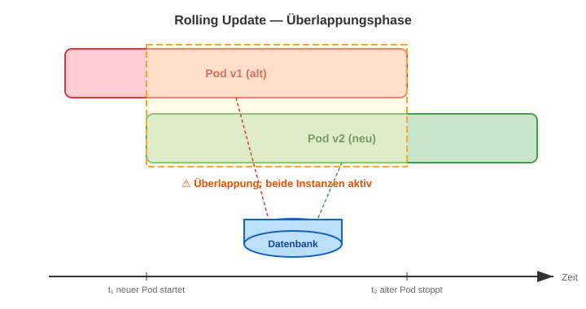
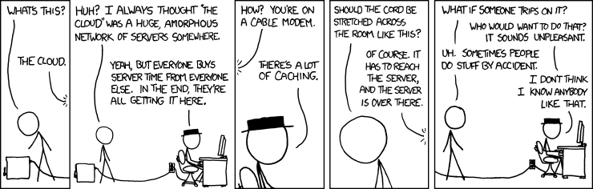

# Modul 16 - Zustand, Koordination und Resilienz

## DDD-Anwendungen auf Kubernetes: Wo lebt die Wahrheit?

Geschätzte Dauer: ca. 75 Minuten

---

## Lernziele

- Den Unterschied zwischen JVM-lokalem und persistiertem Zustand erkennen
- Verstehen, welche Folgen ein Redeployment in Kubernetes hat
- Fachlichen Zustand von technischem Hilfszustand unterscheiden
- Backpressure als fachliches Konzept modellieren — ohne sofort eine technische Lösung zu nennen
- OOM-gefährliche Datenbankzugriffe erkennen und absichern
- Optimistic-Locking-Konflikte fachlich beschreiben und Auflösungsstrategien modellieren

---
<style scoped>section { font-size: 1.7em; }</style>

## Eine Geschichte — bevor wir mit Code beginnen

> **Montag, 9:47 Uhr.**
> Das Team deployed Version 1.4.2.
> Alles grün. Keine Fehlermeldungen.
>
> **Dienstag, 11:03 Uhr.**
> Ein Antragsteller beschwert sich: sein Antrag wurde zweimal bestätigt.
> Derselbe Förderantrag, zwei Auszahlungsbenachrichtigungen.
> Das System hat nichts protokolliert. Kein Fehler. Kein Alert.

Was ist passiert?

---

## Die stille Annahme

In einem einzelnen Java-Prozess ist alles klar:

```
Ein Prozess → ein Heap → ein Zustand → eine Wahrheit
```

Diese Annahme ist in Java-Lehrbüchern korrekt.

Sie ist auch **in Kubernetes regelmäßig falsch** —
und zwar genau dann, wenn man es am wenigsten erwartet: **beim Deployment**.

---

## Was wirklich passiert: Rolling Update



> Zwischen Start des neuen Pods und Ende des alten:
> **Zwei vollwertige Instanzen, eine Datenbank, gleichzeitig.**
> Dieses Fenster dauert typisch 15–60 Sekunden.

---
<style scoped>section { font-size: 1.6em; }</style>

## Was stirbt mit dem Pod?

| Konstrukt | Was man meint | Was es wirklich ist |
|-----------|---------------|---------------------|
| `HashMap` im Service | „Globaler Cache" | Leer nach Neustart, unsichtbar für Pod B |
| `synchronized void` | „Nur ein Thread gleichzeitig" | Nur ein Thread *in dieser JVM* — Pod B ignoriert das |
| `static boolean running` | „Der Job läuft gerade" | Nur in *diesem Pod* — Pod B startet denselben Job |
| `ReentrantLock` | „Serialisierter Zugriff" | Serialisiert zwischen Threads *einer JVM*, nicht zwischen Pods |
| `@Scheduled` ohne Koordination | „Job läuft einmal" | Läuft auf **jedem Pod** — parallel und unkoordiniert |

> **Merksatz:** Was im Heap lebt, stirbt mit dem Pod.
> Kein Neustart, kein anderer Pod, kein Rolling Update sieht diesen Zustand.

---

## Das ist kein Java-Problem



> *"Warum funktioniert es auf meinem Laptop?"*
>
> Weil auf deinem Laptop nur **eine Instanz** läuft.
>
> — xkcd 908: The Cloud

Kubernetes ist nicht das Problem.
Kubernetes macht das Problem **sichtbar**, das vorher versteckt war.

---
<style scoped>section { font-size: 1.7em; }</style>

## Fachliche Frage: Wo ist der Zustand der Domäne?

Bevor wir über Technologie reden — die Fachfrage zuerst:

> **Wer ist der Hüter des Zustands einer AntragsMappe?**

- Wenn zwei Sachbearbeiterinnen gleichzeitig arbeiten — **wer hat Recht?**
- Wenn ein Pod abstürzt — **wo stand der Prozess?**
- Wenn das System deployed wird — **was gilt danach noch?**

Diese Fragen sind **nicht technisch**.
Sie sind **fachlich** — und müssen fachlich beantwortet werden,
bevor eine Zeile Code geschrieben wird.

---

## Grundwahrheit vs. Spiegel

```
┌─────────────────────────────────────────────────┐
│  Grundwahrheit (Source of Truth)                │
│                                                 │
│  Datenbank: AntragsMappe mit Status, Version,   │
│             Flurstücken, Ereignissen             │
└─────────────────────────────────────────────────┘
          ▲              ▲              ▲
          │ liest        │ liest        │ liest
          │              │              │
┌─────────┴──┐  ┌────────┴──┐  ┌───────┴───┐
│   Pod A    │  │   Pod B   │  │  Pod C    │
│ (JVM)      │  │ (JVM)     │  │ (JVM)     │
│ Cache =    │  │ Cache =   │  │ Cache =   │
│ Spiegel    │  │ Spiegel   │  │ Spiegel   │
└────────────┘  └───────────┘  └───────────┘
```

> Ein Cache ist ein **Spiegel** — er kann veralten, zerbrechen und gelogen haben.
> Die Datenbank ist die **einzige Instanz**, die alle Pods gleichzeitig kennen.

---
<style scoped>section { font-size: 1.8em; }</style>

## Drei Kategorien von Zustand

| Kategorie | Beispiel | Wo? | Konsequenz bei Verlust |
|-----------|----------|-----|------------------------|
| **Fachlicher Zustand** | Status einer AntragsMappe | Datenbank | Datenverlust — inakzeptabel |
| **Koordinationszustand** | „Job läuft gerade" | Datenbank (extern) | Doppelausführung — riskant |
| **Hilfszustand** | Gecachte Stammdaten | JVM (Cache) | Veraltet — kontrollierbar |

> Regel: Nur **Hilfszustand** darf in der JVM leben —
> und nur dann, wenn er als **veralterbar** modelliert ist.

---

## Das Szenario: Zwei Pods, ein geplanter Job

```
9:00 Uhr: @Scheduled löst aus

Pod A: "Ich starte den Bescheid-Versand-Job"
Pod B: "Ich starte den Bescheid-Versand-Job"

Pod A: verarbeitet Bescheid #4711 → versendet Benachrichtigung
Pod B: verarbeitet Bescheid #4711 → versendet Benachrichtigung

Antragsteller: erhält zwei Bescheide
```

**Fachliche Frage:**
Was ist das schlimmste, was dabei passieren kann?
Was ist die minimale Absicherung, die die Fachlichkeit erfordert?

---
<style scoped>section { font-size: 1.5em; }</style>

## Fachliche Klassifikation von Jobs

Nicht jeder Job ist gleich riskant. Die Frage ist immer:
**Was passiert, wenn er zweimal gleichzeitig läuft?**

| Job | Risiko bei Doppelausführung | Muss koordiniert werden? |
|-----|----------------------------|--------------------------|
| Stammdaten-Cache leeren | Kein Datenschaden | Nein — idempotent |
| Externe Daten replizieren | Doppelter Schreibaufwand | Empfohlen |
| Bescheide / Benachrichtigungen versenden | **Amtliches Dokument zweimal** | **Ja — kritisch** |
| Auszahlungsaufträge anlegen | **Doppelzahlung** | **Ja — kritisch** |
| Health-Metriken loggen | Gewünscht: jede Instanz separat | Nein — bewusst |

> **Gutes Design:** Die Entscheidung, *keinen* Koordinations-Mechanismus einzusetzen,
> ist genauso bewusst dokumentiert wie die Entscheidung, einen zu verwenden.

---
<style scoped>section { font-size: 1.7em; }</style>

## Koordination gehört in die Datenbank

```java
// Koordination in der JVM — stirbt mit dem Pod:
private static boolean jobRunning = false;  // ❌

// Koordination in der Datenbank — überlebt Neustart und Pod-Wechsel:
@Scheduled(fixedDelay = 60_000)
@SchedulerLock(name = "bescheidVersand", lockAtMostFor = "30m")
@Transactional
public void bescheidVersand() {
    // Cluster-weit läuft dieser Job genau einmal.
    // Stirbt der Pod: Lock läuft nach 30 Minuten automatisch ab.
    // Kein manuelles Cleanup nötig.
    bescheidVersandService.verarbeiteOffeneBescheide();
}
```

> `lockAtMostFor` ist die **Totmannschalter-Garantie**:
> Auch wenn der Pod abstürzt, wird der Lock irgendwann freigegeben.
> Wert: mindestens so lang wie die maximale Ausführungsdauer des Jobs.

---

## Konfiguration: Koordination deaktivierbar machen

```java
@Configuration
@ConditionalOnProperty(
    value = "app.scheduling.enabled",
    havingValue = "true",
    matchIfMissing = true)
@EnableScheduling
@EnableSchedulerLock(
    defaultLockAtLeastFor = "30s",
    defaultLockAtMostFor = "2h")
public class SchedulingConfig {

    @Bean
    public LockProvider lockProvider(DataSource dataSource) {
        // Lock-Zustand liegt in der Datenbank, nicht im Heap.
        return new JdbcTemplateLockProvider(dataSource);
    }
}
```

> Für lokale Entwicklung: `app.scheduling.enabled=false` in `application-local.yml` —
> kein `@SchedulerLock` aktiv, kein DB-Zugriff für Scheduling nötig.

---
<style scoped>section { font-size: 1.7em; }</style>

## ThreadLocal: Der unsichtbare Zustand

`ThreadLocal` ist in einer einzelnen JVM nützlich —
für Request-Kontext (Mandanten-ID, Security-Principal).

**In Kubernetes wird er zum Problem:**

```java
// Typisches Muster — funktioniert, solange eine JVM läuft:
public class TenantContext {
    private static final ThreadLocal<String> CURRENT_TENANT =
        new ThreadLocal<>();

    public static void set(String tenantId) {
        CURRENT_TENANT.set(tenantId);
    }
    public static String get() {
        return CURRENT_TENANT.get();
    }
}
```

**Problem 1:** Virtual Threads teilen sich Carrier Threads — `ThreadLocal`-Werte können versehentlich geteilt werden (→ Security-Bug)

**Problem 2:** Mit `SecurityContextHolder` und ähnlichen Mechanismen: nie als persistenter Zustand verwenden — er ist **HTTP-Request-lokal**, nicht Pod-lokal.

---

## Was ist ein legitimer Cache?

```java
@Component
public class FoerderprogrammCache {

    private final FoerderprogrammRepository repository;

    // Legitimer Cache: hat eine TTL, wird explizit invalidiert
    @Cacheable(value = "foerderprogramme", key = "#programmId")
    public Foerderprogramm laden(String programmId) {
        return repository.findById(programmId).orElseThrow();
    }

    // Explizite Invalidierung bei Änderung
    @CacheEvict(value = "foerderprogramme", key = "#programm.id")
    public void aktualisieren(Foerderprogramm programm) {
        repository.save(programm);
    }
}
```

```yaml
# TTL: Cache-Einträge veralten nach 5 Minuten automatisch
spring:
  cache:
    caffeine:
      spec: maximumSize=500,expireAfterWrite=5m
```

> Cache = Spiegel mit Ablaufdatum. Die Datenbank ist immer aktueller.

---

## Fachliche Perspektive: Backpressure

**Eine Geschichte:**

> Es ist der 15. Mai — letzter Tag für die Einreichung von Förderanträgen.
> Alle 12.000 Betriebsinhaber in der Region schicken ihren Antrag heute.
>
> Das System war auf 200 gleichzeitige Anfragen ausgelegt.
>
> **Was soll das System tun?**

*Nehmt euch 2 Minuten: Was sind die Optionen?*
*Was wäre fachlich korrekt? Was schreibt die Verordnung vor?*
*Was ist für den Antragsteller am fairsten?*

---
<style scoped>section { font-size: 1.7em; }</style>

## Backpressure: Die vier Reaktionen

| Reaktion | Verhalten | Fachliche Konsequenz |
|----------|-----------|----------------------|
| **Stillschweigendes Versagen** | System nimmt Anfragen an, aber verarbeitet sie nicht | Antragsteller glaubt, eingereicht zu haben — hat er aber nicht |
| **Harter Abbruch** | Fehler 500 ohne Erklärung | Antragsteller weiß nicht, ob sein Antrag ankam |
| **Klare Ablehnung** | „System ausgelastet — bitte später versuchen" | Ehrlich — aber die Frist läuft ab |
| **Warteschlange** | „Ihr Antrag ist eingegangen und wird bearbeitet" | Korrekt und fair — aber welche Priorität? Nach Eingang? Nach Dringlichkeit? |

> Die Entscheidung ist **fachlich**, nicht technisch.
> Die Verordnung, der Antragsteller und der Gesetzgeber sind die Stakeholder —
> nicht der Entwickler.

---

## Backpressure fachlich modellieren: AntragsEingang als Bounded Context

```java
// Statt: Antrag direkt verarbeiten (synchron, OOM-Gefahr bei Last)
public void einreichen(AntragsMappe mappe) {
    // ❌ Synchrone Verarbeitung unter Last → Timeout, OOM
    fachlichePruefung.starten(mappe);
}

// Besser: Eingang und Verarbeitung trennen
public AntragseingangBestaetigung einreichen(
        AntragEinreichenCommand cmd) {
    // ✅ Eingang: sofort bestätigen und persistieren
    var eingang = AntragsEingang.erstellen(
        cmd.antragsmappeId(), Instant.now());
    eingangsRepository.save(eingang);

    // Domain Event: verarbeitung kann asynchron, rate-limited starten
    eventPublisher.publishEvent(new AntragseingangRegistriert(
        eingang.getId(), cmd.antragsmappeId(), eingang.getEingangszeitpunkt()));

    return new AntragseingangBestaetigung(
        eingang.getId(), eingang.getEingangszeitpunkt());
}
```

> Der **Eingang** ist ein eigenes Domänenkonzept — getrennt von der **Bearbeitung**.
> Das ermöglicht: Priorität, Quotierung, Eingangsbestätigung, Nachverfolgbarkeit.

---
<style scoped>section { font-size: 1.5em; }</style>

## OOM-Fallen: Wann lädt man zu viel?

```java
// ❌ Klassische OOM-Bombe: findAll() lädt alle Einträge in den Heap
public List<AntragsMappe> alleOffenenAntraege() {
    return repository.findAll(); // 500.000 Datensätze → OutOfMemoryError
}

// ❌ Auch gefährlich: unbeschränkte Suche
public List<AntragsMappe> sucheNachStatus(AntragStatus status) {
    return repository.findByStatus(status); // Könnte 200.000 sein
}
```

**Wann ist "alles laden" ein fachliches Problem?**

- Kein Bericht braucht wirklich alle Einträge auf einmal
- Kein Mensch liest 500.000 Zeilen
- Ein System, das ohne Limit arbeitet, **hat keine Vorstellung von seiner eigenen Größe**

---
<style scoped>section { font-size: 1.5em; }</style>

## OOM sicher: Pagination, Streaming, Chunking

```java
// ✅ Pagination: immer eine Seite — nie alles auf einmal
public Page<AntragsmappeKurzansicht> sucheNachStatus(
        AntragStatus status,
        Pageable pageable) {
    // Beispiel: PageRequest.of(0, 50, Sort.by("eingereichtAm").descending())
    return repository.findByStatus(status, pageable);
}

// ✅ Streaming für große Batches (Berichte, Exporte)
@Transactional(readOnly = true)
public void exportiereAlleAntrage(OutputStream output) {
    try (Stream<AntragsMappe> stream =
            repository.streamByStatusOrderByEingereichtAm(
                AntragStatus.EINGEREICHT)) {
        stream.forEach(mappe -> serialisiereZeile(output, mappe));
        // Stream: Datensätze einzeln aus DB — kein Heap-Aufbau
    }
}

// ✅ Batch-Verarbeitung: immer begrenzte Chunks
@Transactional
public int verarbeiteNaechstenBatch() {
    var batch = repository.findTopByStatusOrderByEingangszeitpunkt(
        AntragStatus.NEU, 100); // Maximal 100 auf einmal
    batch.forEach(this::verarbeite);
    return batch.size(); // 0 = fertig
}
```

---
<style scoped>section { font-size: 1.5em; }</style>

## Work-Queue: FOR UPDATE SKIP LOCKED

Bei parallelen Pods, die dieselbe Warteschlange abarbeiten:

```java
// Spring Data JPA: Atomares Claim-Muster
public interface AntragsEingangRepository extends JpaRepository<...> {

    // PostgreSQL: SELECT ... FOR UPDATE SKIP LOCKED
    // → Pod A und Pod B arbeiten verschiedene Einträge ab
    // → Kein Deadlock möglich
    @Query(value = """
        SELECT * FROM antrags_eingang
        WHERE status = 'NEU'
        ORDER BY eingangszeitpunkt
        FOR UPDATE SKIP LOCKED
        LIMIT :batchSize
        """, nativeQuery = true)
    List<AntragsEingangJpaEntity> claimNaechsteBatch(
        @Param("batchSize") int batchSize);
}
```

> Jeder Pod bearbeitet andere Einträge — ohne Kommunikation untereinander.
> Die Datenbank koordiniert, wer was bekommt.

---

## Fachliche Beschreibung: Was ist ein Konflikt?

**Das Szenario ohne technische Sprache:**

> Anna und Beate öffnen beide denselben Förderantrag DZ-BW-2024-0042.
>
> Anna sieht: Flurstücksfläche = 10,0 ha. Sie korrigiert auf 12,5 ha und speichert.
>
> Beate sieht noch die alte Ansicht: Flurstücksfläche = 10,0 ha.
> Sie ändert den Antragsstatus und will speichern.
>
> **Wessen Daten gelten?**
> **Hat das System die Pflicht, Beate darüber zu informieren?**
> **Was soll Beate dann tun?**

---
<style scoped>section { font-size: 1.7em; }</style>

## Vier fachliche Strategien bei einem Schreib-Konflikt

| Strategie | Verhalten | Fachliche Eignung |
|-----------|-----------|-------------------|
| **Last Write Wins** | Beate überschreibt Anna stillschweigend | Nur bei unkritischen, unabhängigen Feldern |
| **First Write Wins** | Beates Speichern wird abgelehnt | Wenn Konsistenz Vorrang hat |
| **Manuelles Merge** | System zeigt beide Versionen — Beate entscheidet | Wenn fachliche Domänenexpertise nötig ist |
| **Fachliche Feldtrennung** | Anna darf Fläche ändern, Beate darf Status ändern | Wenn Zuständigkeiten klar getrennt sind |

> Die richtige Strategie ist **fachlich entschieden** — nicht technisch.
> Evans: *"The domain experts know the consequences of conflicting changes
> far better than any developer."*

---

## Konflikt-Auflösung im Dialog mit dem Nutzer

```java
// Domain Model: Version als fachliches Konzept (ohne JPA-Annotation)
public class AntragsMappe {
    private final AntragId id;
    private int version; // Welchen Stand hat der Nutzer gesehen?

    public void aktualisieren(
            AntragsaktualisierungCommand cmd,
            int erwartetVersion) {
        if (this.version != erwartetVersion) {
            // Kein technischer Fehler — ein fachliches Ereignis:
            throw new AntragZwischenzeitlichGeaendertException(
                this.id,
                erwartetVersion,
                this.version);
        }
        // Fachliche Validierung...
        this.version++;
    }
}
```

> `AntragZwischenzeitlichGeaendertException` ist **Ubiquitous Language** —
> kein `OptimisticLockException`, kein HTTP 409.
> Die fachliche Ausnahme beschreibt das Ereignis aus Nutzersicht.

---
<style scoped>section { font-size: 1.5em; }</style>

## Konflikt-Kommunikation: Was sieht der Nutzer?

```java
// ❌ Schlechte Fehlermeldung (technische Sprache):
"OptimisticLockException: Row was updated or deleted by another transaction"

// ✅ Fachliche Fehlermeldung (Ubiquitous Language):
"Der Förderantrag DZ-BW-2024-0042 wurde zwischenzeitlich von einer anderen
Bearbeiterin geändert. Bitte laden Sie die aktuelle Version und prüfen
Sie, welche Ihrer Änderungen noch zutreffend sind."
```

```java
@ExceptionHandler(AntragZwischenzeitlichGeaendertException.class)
public ProblemDetail handleKonflikt(AntragZwischenzeitlichGeaendertException ex) {
    var problem = ProblemDetail.forStatusAndDetail(
        HttpStatus.CONFLICT,
        "Der Antrag %s wurde zwischenzeitlich geändert. "
        .formatted(ex.antragId()) +
        "Bitte die aktuelle Version laden und Änderungen erneut prüfen.");
    problem.setTitle("Antrag zwischenzeitlich geändert");
    problem.setProperty("aktuelleVersion", ex.aktuelleVersion());
    problem.setProperty("erwartetVersion", ex.erwartetVersion());
    return problem;
}
```

---

## Merge als fachlicher Prozess

Wenn der Nutzer nach einem Konflikt eine Entscheidung treffen muss, braucht er:

1. **Seinen eigenen Stand**: Was wollte er ändern?
2. **Den aktuellen Stand**: Was hat die andere Person geändert?
3. **Die Differenz**: Wo überschneiden sich die Änderungen?
4. **Eine klare Entscheidungsmöglichkeit**: Meine Änderung / andere Änderung / beides

```java
// Response bei Konflikt enthält nicht nur den Fehler,
// sondern auch den aktuellen Stand zum sofortigen Vergleich:
public record KonfliktResponse(
    String titel,
    String erklaerung,
    AntragsMappeDto aktuellerStand,  // Was gilt jetzt?
    int aktuelleVersion
) {}
```

> Gutes UX bei Konflikten ist **fachliches Design** —
> es respektiert die Expertise der Bearbeiterin.

---
<style scoped>section { font-size: 1.6em; }</style>

## PostgreSQL Advisory Lock: Pro-Entität koordinieren

Wenn zwei Bearbeiterinnen dieselbe Entität **nicht gleichzeitig** bearbeiten dürfen:

```java
@Transactional
public void exklusivBearbeiten(AntragId id, Runnable aktion) {
    // Lock ist an die Transaktion gebunden, nicht an die Verbindung
    // → kompatibel mit HikariCP Connection Pooling
    // → automatisch freigegeben wenn Transaktion endet (auch bei Exception)
    Boolean lockErworben = jdbcTemplate.queryForObject(
        "SELECT pg_try_advisory_xact_lock(hashtext(?))",
        Boolean.class,
        id.value().toString());

    if (!Boolean.TRUE.equals(lockErworben)) {
        throw new AntragGeradeInBearbeitungException(id);
    }
    aktion.run();
    // Lock wird automatisch mit der Transaktion freigegeben
}
```

> `AntragGeradeInBearbeitungException` — fachlicher Name, nicht `LockAcquisitionException`.
> Die fachliche Ausnahme beschreibt die Situation aus Nutzerperspektive.

---
<style scoped>section { font-size: 1.6em; }</style>

## Entscheidungsbaum: Welches Muster für welche Situation?

```
Frage 1: Muss der Zustand nach einem Pod-Neustart noch gelten?
  └─ Ja → in die Datenbank (Fachlicher Zustand / Koordinationszustand)
  └─ Nein → JVM-Cache mit TTL und Invalidierung ist okay

Frage 2: Ist es ein periodischer Job?
  └─ Soll cluster-weit einmal laufen → Distributed Lock (ShedLock / DB-basiert)
  └─ Soll auf jedem Pod laufen → kein Lock, aber explizit dokumentieren

Frage 3: Mehrere Pods arbeiten an derselben Menge Arbeit?
  └─ Parallel, keine Konflikte → FOR UPDATE SKIP LOCKED (Work-Queue)
  └─ Gleichzeitiger Zugriff auf dieselbe Entität → Advisory Lock oder Optimistic Locking

Frage 4: Gleichzeitige Schreibzugriffe auf dieselbe Entität?
  └─ "Last Write Wins" fachlich erlaubt → @Version (JPA Optimistic Locking)
  └─ Konflikt muss dem Nutzer gezeigt werden → @Version + fachliche Conflict Response
  └─ Gleichzeitiger Zugriff verboten → Advisory Lock (exklusive Bearbeitung)
```

---
<style scoped>section { font-size: 1.7em; }</style>

## Zusammenfassung: Die Datenbank ist die gemeinsame Wahrheit

| Konstrukt | Korrekte Einordnung |
|-----------|---------------------|
| Fachlicher Zustand (Antragsstatus, Flurstücke) | Datenbank — immer |
| Koordinationszustand (Job läuft, Lock aktiv) | Datenbank (ShedLock / Advisory Lock) |
| Hilfszustand (gecachte Stammdaten) | JVM-Cache mit TTL + Invalidierung |
| ThreadLocal / static | Nur für Request-Scope, nie als Daten-Speicher |
| synchronized / ReentrantLock | Nur für Thread-Safety in einer JVM |

> **Leitfrage vor jedem Design-Entscheid:**
> *"Was passiert mit diesem Zustand, wenn der Pod jetzt abstürzt?"*
> Wenn die Antwort "dann ist er weg" inakzeptabel ist → Datenbank.

---

## Kubernetes-Readiness: Checkliste für DDD-Anwendungen

1. **Kein Zustand im Heap**, der über einen Request hinausgeht
2. **Jeder `@Scheduled`-Job** hat entweder einen Distributed Lock
   oder einen expliziten Kommentar, warum keiner nötig ist
3. **`@Version` auf allen Aggregaten**, die von mehreren Nutzern bearbeitet werden
4. **Konflikt-Exceptions** haben fachliche Namen (Ubiquitous Language)
5. **Fehlerantworten** erklären den Konflikt und bieten den aktuellen Stand
6. **Caches** haben TTL + Invalidierungsstrategie
7. **Datenbankabfragen** haben Limits / Pagination — kein unbegrenztes `findAll()`
8. **`@Transactional`** auf Application Services — nicht auf Domain Objects

---

## Test: Kubernetes-Readiness verifizieren

```java
// Test 1: Konkurrierender Zugriff löst fachliche Exception aus
@SpringBootTest
class KonfliktHandlingTest {

    @Autowired AntragsMappeRepository repository;
    @Autowired AntragAktualisierenService service;

    @Test
    void gleichzeitige_aenderung_wird_als_fachlicher_konflikt_kommuniziert() {
        var mappe = AntragsMappeFixture.aktiv();
        repository.save(mappe);

        // Bearbeiterin A lädt Antrag (Version 0)
        var aktuelleVersion = mappe.getVersion();

        // Zwischenzeitlich: eine andere Änderung erhöht die Version
        repository.save(mappe.mitAktualisierterFlaeche(
            new BigDecimal("12.5")));

        // Bearbeiterin B versucht mit alter Version zu speichern
        var cmd = new AntragStatusAendernCommand(
            mappe.getId(), AntragStatus.EINGEREICHT, aktuelleVersion);

        // Ergebnis: fachliche Exception — nicht technischer Fehler
        assertThatThrownBy(() -> service.statusAendern(cmd))
            .isInstanceOf(AntragZwischenzeitlichGeaendertException.class)
            .hasMessageContaining(mappe.getId().value().toString());
    }
}
```

---

```java
// Test 2: Pagination verhindert OOM
@DataJpaTest
class PaginationTest {

    @Autowired AntragsMappeRepository repository;

    @BeforeEach
    void setUp() {
        // 1000 Anträge anlegen — mitFlurstueck() setzt Status IN_BEARBEITUNG
        IntStream.range(0, 1000).forEach(i ->
            repository.save(AntragsMappeFixture.mitFlurstueck()));
    }

    @Test
    void suche_gibt_nie_mehr_als_100_ergebnisse_zurueck() {
        var pageable = PageRequest.of(0, 100);
        var seite = repository.findByStatus(
            AntragStatus.IN_BEARBEITUNG, pageable);

        // Niemals mehr als Seitengröße
        assertThat(seite.getContent()).hasSizeLessThanOrEqualTo(100);
        // Gesamtanzahl ist bekannt — ohne alles zu laden
        assertThat(seite.getTotalElements()).isEqualTo(1000);
    }
}
```

---

## Reflexion: Prüft euer Verständnis

1. Was ist der Unterschied zwischen **fachlichem Zustand** und **Koordinationszustand**?
2. Warum funktioniert `synchronized` in Kubernetes nicht — und was ist die Alternative?
3. Wann ist "Last Write Wins" fachlich akzeptabel — und wann ist es ein Bug?

> Im Lab setzt ihr Optimistic Locking, Pagination und verteilte Job-Koordination um.

---

## Hands-on: Lab 13

### Aufgabe

1. **Konflikt-Test schreiben:** Test, der zwei gleichzeitige Schreibzugriffe simuliert und die fachliche `AntragZwischenzeitlichGeaendertException` verifikiert
2. **ProblemDetail erweitern:** `@RestControllerAdvice` um `AntragZwischenzeitlichGeaendertException` → HTTP 409 mit aktuellem Stand erweitern
3. **Pagination einbauen:** `findByStatus()` im Repository auf `Page<T>` umstellen
4. **Cache-TTL konfigurieren:** Stammdaten-Cache mit 5-Minuten-TTL konfigurieren
5. **Bonus:** `@SchedulerLock` für einen `@Scheduled`-Job einrichten und mit `ShedLock`-Integrationstest absichern

> Dauer: ca. 45 Minuten

---

## Diskussion

> *"Was passiert mit diesem Zustand, wenn der Pod jetzt abstürzt?"*
> Diese Frage ist ein Werkzeug — keine Checkliste.

**Über Koordination und Verantwortung:**

- Welche Zustandstypen habt ihr in euren Systemen — und wo leben sie heute?
- Wo habt ihr `@Scheduled`-Jobs ohne Koordination? Was wäre der worst case?
- Wie kommuniziert euer System heute einen Schreib-Konflikt an den Nutzer?
  Sieht der Nutzer eine verständliche Meldung — oder einen Stack Trace?

**Über fachliche Modellierung:**

- Wann ist "Last Write Wins" fachlich akzeptabel — und wann nicht?
- Was bedeutet "Zusammenführen" in eurer Domäne?
  Wer darf entscheiden, wenn zwei Änderungen kollidieren?
- Gibt es Entitäten in eurer Domäne, die **niemals** gleichzeitig bearbeitet
  werden dürfen — weil die Konsequenzen zu schwerwiegend wären?

**Über Backpressure als Domänenkonzept:**

- Hat eure Domäne ein Konzept für "maximale Kapazität"?
  Gibt es fachliche Obergrenzen — z.B. "max. 50 Anträge pro Stunde"?
- Wann ist eine Warteschlange fachlich das richtige Modell?
  Wann ist eine klare Ablehnung ehrlicher?

---

### Zum Nachlesen

- Fowler, „Patterns of Enterprise Application Architecture" (2002), S. 406: Optimistic Offline Lock
- Evans, „Domain-Driven Design" (2003), S. 128: Aggregate-Grenzen und Konsistenz
- PostgreSQL Docs: Advisory Locks — `pg_try_advisory_xact_lock`
- ShedLock auf GitHub: `lukas-krecan/ShedLock`
- Spring Data JPA: `@Lock`, `LockModeType.PESSIMISTIC_WRITE`, `FOR UPDATE SKIP LOCKED`
- Santana, „Domain-Driven Design with Java" (2026), Kap. 10: Reliable Event Publishing
